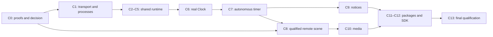

# Cascade Addon Runtime — Completion Implementation Plan

> **For agentic workers:** REQUIRED SUB-SKILL: Use superpowers:subagent-driven-development or superpowers:executing-plans to implement this plan task-by-task. Steps use checkbox (`- [ ]`) syntax for tracking. This document plans the remaining work; it does not start implementations or agents.

**Goal:** Complete the addon platform with a real, shared path for external developers and Cascade widgets, from installation to deactivation, with verified resource control.

**Architecture:** Keep the Contracts, Presentation, SDK, resolver and PublicationStore already implemented. Complete the runtime outside the graphics process, connect it first to Clock and FocusTimer, then to services and advanced scenes. The result of the platform proofs decides which launcher can enter the product; the updated boundary follows the [delegated-work limitation accepted by the user](../specs/2026-09-10-addon-control-policy.md), without reducing the other guarantees.

**Tech Stack:** Swift tools 6.2, new Swift 6 targets, existing Swift 5/MainActor engine, macOS 14, SwiftUI/AppKit, Foundation, verified public native APIs; Swift Testing and signed fixtures. Any small C supervisor uses only primitives proven in C0.

**Spec:** [approved architecture](../specs/2026-09-09-addon-runtime-design.md), [original plan](2026-09-09-addon-runtime.md), [P0 proofs](../verification/2026-09-09-addon-runtime-P0.md), [P1 implementation](../verification/2026-09-09-addon-runtime-P1.md).

## Global Constraints

- The `native-direct-control-v1` profile accepts the risk of work autonomously delegated to macOS outside the managed processes/services. The broker, the managed processes, their quotas, identities and actual exit stay entirely within the required scope.

- macOS 14 as the app's minimum. The deployment target is not raised implicitly.
- Fully native system: no WebAssembly, JavaScriptCore, general interpreter or third-party dependency without a new justification.
- Cascade must be open. The source app may be closed or absent if the addon's functions are self-sufficient.
- All future widgets, notices and activities developed by the team use the same SDK, manifest, REQUIRES, content/action model, catalog, lifecycle and resource control as external addons.
- Custom addon code is not loaded into the host's graphics process, including the team's addons. In-process substitutes are allowed only in tests.
- Visible content does not require a resident provider. The provider's expected exit does not end the publication.
- No per-addon polling, synchronous IPC wait on the MainActor or provider call in the display link. Queues and collections are bounded.
- Process freezing is excluded from ordinary v1 behavior; any separate experiment comes after measurements of IPC wait/restart.
- Preserve signing/TCC identity and existing visual/input behaviors during the migration; no automatic granting of macOS permissions.
- Quotas on values, queues, assets and disk are enforced before controlled storage/allocation. CPU and footprint of native code are observed thresholds, with a declared interval and possible temporary overshoot.
- Do not declare an OS, a publisher, a scene or a continuous profile supported without the respective proofs. Compiling for macOS 14 does not mean having run it on macOS 14.
- Preserve prior work. Commit only isolated and reviewed changes; no `git add .`, global reverts or commits of the user's files.
- At the end of the work, relaunch Cascade and verify that it starts. If the app code changes, first a successful build and an update of `/Applications/Cascade.app` through the project's scripts.

## Starting point and meaning of this plan

The last verified state of 9–10 September contains four implemented P1 blocks and 230 package tests passed with `--no-parallel` (91 added to the baseline). Those blocks are reused; the resolver is not rewritten and equivalent protocols are not recreated. The desktop/accessibility/energy checks and the integration with real processes remain.

P0 has two distinct results: ExtensionKit did not provide the required explicit stop of the headless provider; the direct child solves stop and metrics but allows the delegated launch of an app through Launch Services. The RemoteUI prototype is only compiled. These outcomes are C0's starting point, not tests to be turned artificially green.

This is the new entry point for the remaining execution. The 9 September subplans keep the detailed files, cases and requirements; the interface corrections and the order given here take precedence over their still-proposed signatures. The original P0–P4 boxes denote whole phases, so they must not be checked just because a portion compiles.

## Verified progress: 12 September

- **C0: original profile not admitted, follow-up investigation in progress.** The earlier proofs and the review confirm delegated work outside control, survival of the worker after the supervisor's death and missing authenticated invalidation after an executable change. [Decision and measurements](../verification/2026-09-10-addon-launcher-decision.md). No production adapter enabled. The user accepted the delegated-work risk: the product decision is resolved, while supervisor recovery and identity still require conforming proofs.
- **C0d: offline diagnostics approved, native proof suspended.** The new observer distinguishes actual exit, status, fallback and log loss; 35 new, 54 historical and 26 owner tests passed. The drain after a registration refusal was fixed and re-evaluated. The driver exits unconditionally with code 78 before creating products: the safety of tracing when the supervisor dies before attaching remains open. No native C0d compilation or execution, no new launcher admitted. [Verification and limit](../verification/2026-09-12-addon-managed-death.md). The C5c1 raster backing was implemented and approved separately; it does not enable the suspended launcher.
- **C1a implemented and reviewed:** negotiation of the protocol and the content schemas, admission of publications with canonical sessions, generation/sequence control and atomic batches. 41 targeted tests passed, 18 of them new; native transport still to be connected. The user's GlassLight change is preserved and reviewed; it needs no fixes. [Continuation](../verification/2026-09-10-addon-light-sessions.md).
- **C2 partial; C2b2 coordinator approved:** `AddonRuntime` composes publications, actions, services, dependencies, deadlines and reservations through the shared ResourceGovernor. The proofs cover authority after suspension, pending outcomes, exact returns, duplicate messages and independent completions. 104 targeted tests and 436 full serial tests passed; independent review concluded with no open findings. The coordinator is integrated in the verified build of 12 September; the connection to the transport and to real processes is not qualified. [Current verification](../verification/2026-09-12-addon-runtime-composition.md).
- **C3 partial:** host broker with opaque sessions, canonical permissions and bindings per feature/operation, interests independent of the connection, shared sources per compatible scope, shared revocation and expirations. Reservations use ResourceGovernor; launch/invocation decisions have single-use checks. The replay fix keeps outcomes per requestID within a bounded history, with space for the response reserved before the command. The 25 targeted tests pass and the review of the fixes concluded with no P1/P2 findings. The pure coordinator is now approved in C2b2; transport, event cache and proofs with two real providers remain to be integrated. [Services](../../addons/services.md).
- **C4 partial:** ResourcePolicy/ResourceGovernor with reservations and release; AddonHealthStore with bounded state per version, quarantine after three violations in the five-minute window and restart tickets at 1/5/30 seconds, invalidated on deactivation or a new session. Native metrics, observed stop and the connection to the shared quotas/queue remain to be implemented.
- **C5 partial; C5b per-key backend approved:** versioned checkpoints and a distinct backend for values of 0–64 KiB per key, namespace per verified identity, shared quotas, atomic staging, separate cache and reconciliation. The recovery after a folder sync error was fixed and re-evaluated. 38 targeted tests and 474 full serial tests passed. Authenticated SDK transport, global startup barrier, assets/decoder and restoration of publications remain to be integrated. [Contract](../../addons/storage.md), [C5b verification](../verification/2026-09-12-addon-keyed-storage.md).
- **C5c1 approved:** immutable raster memory with real CGImages, shared quotas protected until the actual release and bounded draining. 37 targeted tests and 498 full serial tests passed. It does not yet include AssetState, decoder, SDK, authorizations or the connection to the renderer. [Contract](../../addons/assets.md), [C5c1 verification](../verification/2026-09-12-addon-raster-backing.md). Delivery stopped here at the user's request; the new request of 12 September resumes the work with the decoder below.
- **C5 decoder implemented and reviewed:** internal host import of PNG/JPEG with ImageIO/CoreGraphics, 1 MiB/1 MP, RGBA8 sRGB normalization, bounded concurrency and a protected temporary quota in the shared governor. The deferred-decoding and truncated-file cases reproduced during the review were fixed. 46 targeted tests and 507 full serial tests passed. It does not include AssetState, authenticated SDK, renderer or qualification of the decoder against hostile input. [Contract](../../addons/assets.md), [verification](../verification/2026-09-13-addon-image-decoder.md).
- **C5 canonical asset integration implemented and reviewed:** authenticated import/release per publication and connection, atomic pins with the publication state, retention of future timelines and images after the provider exits, lookup by revision and quotas until the real lifetime of the pixels. Regressions on deferred completions and removal at full quota were fixed. **536 serial tests passed**, 29 new; signed build, 350 identical inputs and relaunch verified (PID 69877). Internal APIs: public reuse across publications, SDK/transport, MainActor handoff and restoration remain open. [Contract](../../addons/assets.md), [verification](../verification/2026-09-13-addon-asset-integration.md).
- **C5 asset sharing and SDK contract implemented:** the user's decision applied with independent aliases on the same raster, immutable host partitions, canonical admission and revocation. The AssetHandle/AddonAssetClient and AddonContext.assets contracts are published, without declaring native transport. **552 serial tests passed**, 16 new; 356 identical inputs, signed build and relaunch verified (PID 73683). [Contract](../../addons/assets.md), [verification](../verification/2026-09-13-addon-asset-sharing.md).
- **C5 global storage barrier implemented:** AddonStorageCoordinator keeps checkpoint and per-key storage private, blocks access until both are reconciled and keeps the same quota ledger as the per-key backend across close and reopen. Eight new tests and independent review; **560 serial tests passed**, 358 identical inputs, signed build and relaunch verified (PID 76239). Weekly usage measured at 25%. [Verification](../verification/2026-09-13-addon-storage-barrier.md). The subsequent [archive choice](2026-09-13-addon-restoration-archive-decision.md) was resolved with SwiftData; this barrier does not yet cover its new archives.
- **SwiftData chosen and reproducible prototype verified:** the framework choice is resolved. Eleven scenarios in separate processes verify save/reopen, rollback, disabled autosave, BLOBs up to the size of a maximum publication/raster and 100 updates. Prototype and scripts approved by the review; 361 frozen inputs, signed build and relaunch verified (PID 78065), weekly usage measured at 27%. No change to the runtime/package relative to the 560-test baseline. The separate [policy on internal files](2026-09-13-addon-swiftdata-disk-policy-decision.md) was then explicitly approved: measure the overshoot, keep it counted and block subsequent writes. The limits on buffers controlled by the app stay preventive. [Verification and measurements](../verification/2026-09-13-addon-swiftdata-archive.md).
- **C12 partial:** real `cascade-addon validate` command, bounded reading and public guide. Scaffold, distributable examples and parity with real processes remain to be implemented.
- **C4a implemented and reviewed:** atomic reduction of state reserves and return of the unused capacity of results. History, replay protection and the release of processes only after observed exit remain unchanged. 42 targeted tests passed, seven new. [Current report](../verification/2026-09-10-addon-light-sessions.md).
- **Earlier lights/sessions verification:** 385 Swift tests passed (25 new cases, in addition to the 23 for the user's lights), reviews concluded with no open findings, 21 files integrated and 318 identical build inputs. Signed build succeeded, Applications link updated, normal shutdown and relaunch verified (PID 94732). [Report](../verification/2026-09-10-addon-light-sessions.md).
- **Earlier services/state verification:** 337 Swift tests passed (44 new cases in the increment), reviews concluded without P1/P2, 18 files integrated, 299 identical build inputs. Signed build succeeded, Applications link updated and app opening verified. [Report](../verification/2026-09-10-addon-services-storage.md).
- Historical verifications: first increment **248 Swift and 18 Python tests passed**; direct-v1 continuation **288 Swift and 36 Python tests passed**. The results of the services/state continuation are recorded in the [current report](../verification/2026-09-10-addon-services-storage.md), which distinguishes targeted tests from full verification. No B–E delivery is declared complete by these counts.

- **SwiftData storage, save, restoration and full inventory implemented and reviewed:** protected observed accounting, per-owner backend, bounded Foundation codec, pins/raster, consistent save, atomic restoration with replay blocking and concrete coordinator operations. **679 serial tests passed in 69 suites**, 381 identical inputs, 30 reviewed hashes, signed build and relaunch verified (PID 97296). Weekly usage 43%. The subsequent detection of significant changes is now delivered in the next item; bootstrap and native transport stay separate. [Plan](2026-09-13-addon-swiftdata-storage.md), [verification](../verification/2026-09-13-addon-swiftdata-runtime.md).
- **Save on significant changes implemented and reviewed:** fixed tracking per plugin, one write per call, alternation between owners and blocking of repeated attempts after an error. The commit acknowledges only the captured version and keeps any later changes. **694 serial tests passed in 70 suites**, 382 identical inputs, signed build and relaunch verified (PID 99945), weekly usage 45%. Bounded shutdown delivered in the next item; the app's event loop is still to be connected. [Verification](../verification/2026-09-13-addon-archive-event-flushing.md).
- **Bounded checkpoint at shutdown implemented and reviewed:** immediate revocation, private state for a single pass, distinction between a busy operation and a failed attempt, explicit cleanup and retention of known commits. **710 serial tests passed in 71 suites**, 383 identical inputs, signed build and relaunch verified (PID 2818), weekly usage 47%. Dedicated storage message format delivered in the next item; event-loop integration and native transport separate. [Verification](../verification/2026-09-13-addon-archive-shutdown.md).

- **Dedicated storage messages implemented and reviewed:** Foundation codec with exact UTF-8 keys, full 64 KiB values, 192 KiB frames and explicit 1.1 negotiation; current callers stay at 1.0. **723 serial tests passed in 73 suites**, 388 identical inputs, signed build and relaunch verified (PID 4658), weekly usage 48%. Concrete coordinator outcomes delivered in the next item; authenticated transport still separate. [Verification](../verification/2026-09-13-addon-keyed-storage-frames.md).

- **Storage operation outcomes implemented and reviewed:** refusals before the call, known success kept after close/cancellation, uncertain outcome without automatic retries and reads subject to the current authority. No new persistent state; backend and generic methods unchanged. **732 serial tests passed in 74 suites**, 389 identical inputs, signed build and relaunch verified (PID 6324), weekly usage 50%. Exact ownership of transport slots delivered in the next item. [Verification](../verification/2026-09-13-addon-keyed-storage-outcomes.md).

- **Transport slot ownership implemented and reviewed:** acknowledgements tied to the exact work, messages freed on receipt and entries kept until the actual cleanup, even when deferred. Original quotas preserved, 512 bytes of control added per process on the tested platform. **740 serial tests / 75 suites**, 390 identical inputs, signed build and relaunch verified (PID 8362), weekly usage 53%. Authenticated storage connection delivered in the next item. [Verification](../verification/2026-09-13-addon-runtime-slot-ownership.md).

- **Host storage connection implemented and reviewed:** canonical authority, declared and granted permissions, protected workspace, responses kept until the exact acknowledgement and known outcomes kept after cancellation. **765 serial tests / 76 suites**, 391 identical inputs, signed build and relaunch verified (PID 11511), weekly usage 55%. SDK request lifecycle delivered in the next item; native transport and bootstrap separate. [Verification](../verification/2026-09-13-addon-authenticated-storage-handler.md).

- **SDK storage lifecycle implemented and reviewed:** a single pending ticket, exact correlation, responses before the send acknowledgement, cancellation without freeing capacity still in use and close with an uncertain outcome for mutations. Reuses the existing contracts and keeps only scalar state. **781 serial tests / 77 suites**, 393 identical inputs, signed build and relaunch verified (PID 12667), weekly usage 56%. [Verification](../verification/2026-09-13-addon-sdk-storage-lifecycle.md). Choice on [asset transfer](../../../.scratch/cascade-product/issues/21-asset-transfer.md) obtained on 14 September; internal component delivered in the next item.

- **Asset frames and internal assembler implemented and reviewed:** 64 KiB blocks up to 1 MiB, Foundation and the existing ImageIO decoder, protected reservation, exact identity and non-renewable expiry. The race in the terminal refusal was fixed during review. **795 serial tests / 80 suites**, 400 identical inputs, signed build and relaunch verified (PID 28937), weekly quota 61% used. The authenticated transport integration and the SDK client remain; the native gate does not change. [Verification](../verification/2026-09-14-addon-asset-chunks.md).

- **SDK/runtime asset connection implemented and reviewed:** cumulative 1.2 negotiation, injected SDK channel with exact slots/receipts, canonical import/share/release and close with atomic finalization. Real admission/ImageIO/resources matrix, independent reviews and **883 tests / 83 suites passed**, 285 identical final inputs, signed build and relaunch verified (PID 50978). The OS/bootstrap transport and C0d remain unqualified. [Verification](../verification/2026-09-18-addon-asset-message-integration.md).

The [progress report](../verification/2026-09-10-addon-runtime-progress.md) distinguishes integrated code, proofs, limits and remaining work. Do not repeat C0 without new evidence or a product decision.

## Deliveries and dependencies

| Delivery | Task | Observable result | Prerequisites |
| --- | --- | --- | --- |
| A: feasibility decided | C0 | Qualified launcher or a report of the profile's impossibility with a concrete decision to take | Existing proofs |
| B: shared engine | C1–C5 | Identity, processes, deadlines, commands, services, quotas and state work together | C0 for real processes; pure work can advance earlier |
| C: first complete feature | C6–C7 | Clock and FocusTimer on the public path, also with the provider absent and the source app absent | C1–C5 |
| D: all our widgets | C8–C10 | Scenes, notices and media migrated without privileged paths | C6–C7; C8 for advanced media |
| E: distributable system | C11–C13 | Package management, external example, tools and final qualification | B–D |



C2–C5 can proceed on pure tests with the C1 interfaces, without embedding an experimental launcher. Documentation, value examples and validation tools can advance in parallel. If C0 stays blocked, work continues on these parts, but C6 is not simulated inside the graphics process.

## Alignment with the APIs that actually exist

| Element | Contract to keep |
| --- | --- |
| Content | `ContentNode` is a validated struct with a throwing factory; `ContentDocument` has a throwing initializer. Do not introduce a second, incompatible wire enum. |
| SDK | `AddonProvider.handle(_:context:) async throws -> ProviderOutput` exists. `AddonServiceClient` and `AddonStorageClient` are already declared in `CascadeAddonSDK/AddonContext.swift`; add concrete implementations, not duplicate protocols with the same names. |
| Services | `ServiceScope` is the wire struct `{ featureID, operation }`, not the enum given as an example in the old 02.3. Restrictions on account, network and files stay canonical host policies, associated with the grant, without trusting fields added by the provider. |
| REQUIRES | `ServiceBinding.featureID` distinguishes feature and root. The broker uses the current feature's binding, with a root fallback only if provided for and authorized. Two features with different majors stay distinct. |
| Permissions | Grant/Lease are values, not proofs of authorization. The broker looks up the canonical grant by ID and revalidates owner, feature, operation, expiry and connection generation. |
| Publications | `PublicationStore.accept(_:owner:)`, `snapshot(at:)`, `nextDeadline(after:)`, `remove(owner:)` and `expire(at:)` exist. Pending snapshots keep identity and timeline; omission means removal. |
| Host | `AddonPresentationBridge.apply(_:)` receives values and the action callback contains `PublicationID`, revision and `ActionDescriptor`. It does not import Runtime and does not own the provider. |
| Identity | Publication session, connection generation, work permit, visibility permit and asset revision are distinct. |

Every wire extension requires a coordinated update of decoder, schema, tests and documentation, with explicit negotiation. Do not change the isolation of the whole engine to Swift 6 during this feature.

## Verification common to every task

Every task inherits the cases and files of the linked subplan, adds the following clarifications and ends with a review of the diff. A missing dependency or a compilation error does not replace the required behavioral RED proof.

1. Add the listed cases to the task's suite and observe the relevant failure.
2. Implement only that boundary; run the targeted suite.
3. Run the real fixture when the requirement concerns processes, signatures, UI or resource consumption.
4. Record command, OS/hardware/signature, result, measured times and cases not run. Review and fix defects before moving on to the dependent parts.
5. Integrate only the task's files; isolated commit when the checkout allows it. Build and relaunch of the app in the deliveries that change it.

The integration scripts introduced below also save a JSON record per scenario with `schemaVersion: 1`, `scenario`, `checks`, `observations` and `unverified`. The booleans are derived from real observations/asserts, not prefilled by the test. Executable admission check, to be placed in `scripts/assert-addon-evidence.py` in C0:

```python
import json, sys
record = json.load(open(sys.argv[1]))
assert record.get("schemaVersion") == 1
assert record.get("scenario") == sys.argv[2]
assert record.get("unverified") == []
required = sys.argv[3:]
assert required, "At least one explicit check is required"
for check in required:
    assert record.get("checks", {}).get(check) is True, check
```

This check verifies the completeness of the report; it does not replace the proofs that produce it. Missing files, skipped cases and read errors do not count as PASS. The current negative P0 tests keep exiting with an error until the restriction is real.

## C0: Close the platform unknowns with a finite decision

**Detail:** [P0, tasks 00.1–00.3](2026-09-09-addon-runtime-00-platform.md).

**Files:** modify `Prototypes/AddonPlatform/DirectChild/Supervisor.c`, `Worker.c`, `run.py`, `README.md`, `Host/ProbeHost.swift`, `Tests/run_lifecycle.py` and `scripts/test-addon-direct-child.sh`; create `scripts/assert-addon-evidence.py`, `Prototypes/AddonPlatform/Tests/CompletionEvidenceTests.py` and `docs/superpowers/verification/2026-09-10-addon-launcher-decision.md`.

**Interface produced:** a documented decision with launcher, precise public APIs, proven OSes, sandbox profile, identity and stop/metrics mode, delegated work admitted or denied, supervisor cost and measured reuse window. No production class is enabled by a manifest declaration.

- [x] Repeat `test-addon-direct-child.sh`, `test-addon-platform.sh --case lifecycle` and `--case application-stop`, keeping the counterexamples. Classify the headless case as an absent NSRunningApplication handle, without faking a call to forceTerminate.
- [x] Search the public APIs and the available macOS versions for a restriction applicable **before** the untrusted code, or a verifiable means to own and stop the delegated execution too. Before writing each variant, note the API, its availability and which exact red test it should change.
- [x] For each review pass, try at most two variants grounded in new evidence; further hypotheses require new evidence, not repetitions. Variant priority: priority to the direct child, already measurable; an ExtensionKit variant only if a new API/version/documentation addresses the reproduced failure. No identical repetitions without a new hypothesis.
- [x] Keep the test of the harmless, nested and readable app, the positive checks without restrictions, the attempt to raise the limits and the exec substitution case. Add supervisor death and session invalidation after an executable change. Do not terminate processes identified only by name/PID.
- [x] Distinguish an opening of the source app explicitly authorized by the user from secondary work launched autonomously by the addon: the latter must not bypass the policy. Do not open the user's apps during tests; use signed, harmless fixtures.
- [x] Try at least 20 launch/stop sequences and compare 20 requests with immediate close and short reuse. Measure CPU, footprint, host+supervisor total and latency; choose reuse only if it improves the result. Guardrails for the individual fixtures: external deadline 5 s and at most 64 MiB of additional allocation.
- [x] Validate the report check with unit cases: false check, missing check, different scenario, unverified case and a fully valid record. Run `python3 -m unittest discover -s Prototypes/AddonPlatform/Tests -p 'CompletionEvidenceTests.py'`.
- [x] Write the verdict: **admitted** only with the required stop, identity, metrics and containment demonstrated; **blocked** otherwise. In the second case, document exactly which guarantee an alternative proposal would change and request a decision on that change before enabling it. No implicit reduction, change of language or silent exclusion of scenes.

**Historical outcome of the strict profile:** the `launcher-admission` record stays negative, including `delegatedWorkControlled=false`; the boxes above describe the investigation already concluded.

**Authorized follow-up:** apply the [decision on direct control](../specs/2026-09-10-addon-control-policy.md). The delegated-work risk is accepted and requires no further confirmation. Before C1:

- [ ] Resolve and prove the worker's exit also on the supervisor's death, preserving safe identity and the fixture guardrails.
- [ ] Implement and prove authentic identity/sessions after exec, including late messages, unauthorized peers and actual invalidation.
- [ ] Produce and validate the new `launcher-admission-direct-v1` record, `policyID: native-direct-control-v1`, `acceptedLimitations: [autonomousOSDelegation]`; require `managedStop`, `hostExitCleanup`, `hostCrashCleanup`, `supervisorDeathStopsWorker`, `identitySafe`, `sessionInvalidatedAfterExec`, `cpuReadable`, `footprintReadable` all true, with mandatory unverified cases still blocking.
- [ ] Keep the delegated-work counterexample and the earlier FAIL separate. Do not treat the policy change as a passed test; qualify only the OSes/publishers actually proven.

**New C0 investigation:** the [direct-v1 report](../verification/2026-09-10-addon-direct-v1.md) keeps an isolated positive proof of message identity after exec. The launchd cleanup fails for managed processes that change group/session; the integrated launcher stays not admitted. The distinction between guardrail and actual stop, and the retention of reports during cleanup errors, were fixed and reviewed.

**Further C0 proof:** the public `PT_TRACE_ME` control initializes on the local configuration with no observed changes to the public protection, signing or sandbox bits. Two baselines and one tracing case, six normal exits observed; no worker exec or stop on supervisor death proven yet. The results verifier was fixed and re-evaluated: 25 tests passed, original evidence still positive. The [actions/tracing continuation](../verification/2026-09-10-addon-actions-tracing.md) keeps this local evidence separate from the still-negative admission.

**Subsequent C0 localization:** the controlled substitution observes the new identity but fails before the Worker's entry. The comparison without tracing fails as well; a correlated crash report localizes this second failure in the App Sandbox initialization. All ten processes of the last proof exited, 54 offline tests and independent review passed. The evidence and the unknown results stay preserved. The subsequent separate proof with trusted SDK bootstrap, a distinct identity per owner and a Worker that inherits the sandbox completed four cases with eight normal exits, isolation and data continuity observed. 54 historical tests and 26 prototype tests pass; review concluded. The [12 September report](../verification/2026-09-12-addon-owner-bootstrap.md) keeps the limits: fixed local code, supervisor death and production launcher still to be qualified. [Current report](../verification/2026-09-10-addon-actions-tracing.md).

**Diagnostic preparation of 18 September:** the [offline bootstrap model](../verification/2026-09-18-addon-bootstrap-abort-offline.md) passes 31 tests and independent review. It verifies only parsing/deadline and the consistency of synthetic observations; it does not close C0, runs no native proofs and keeps the C0d gate.

## C1: Transport, identity and production processes

**Dependencies:** C0 admitted for the real adapter. **Detail:** [02.1](2026-09-09-addon-runtime-02-execution.md).

**Files:** create `CascadeKit/Sources/CascadeTransport/AddonConnection.swift`, `WireEnvelope.swift`, `PeerVerifier.swift`; `CascadeKit/Sources/CascadeRuntime/Processes/AddonProcessLaunching.swift`, `NativeAddonLauncher.swift`, `ProcessIdentity.swift`, `AddonProcessPool.swift`; `CascadeKit/Sources/CascadeAddonSDK/AddonProviderEntrypoint.swift`; `CascadeKit/Tests/CascadeRuntimeIntegrationTests/ProcessConnectionTests.swift`; `scripts/test-addon-runtime.sh`. Modify `CascadeKit/Package.swift` and the signed targets in `Cascade.xcodeproj/project.pbxproj`. The concrete adapter's file follows the launcher chosen in C0, without keeping two production loaders.

**Planned interfaces:**

```swift
enum DeliveryReceipt: Sendable {
    case sent(UUID)
    case accepted(UUID)
}
protocol AddonConnection: Sendable {
    var deliveryReceipts: AsyncStream<DeliveryReceipt> { get }
    func send(_ event: AddonEvent) async throws -> ProviderOutput
    func close() async
}
protocol AddonProcessLaunching: Sendable {
    func start(_ addon: InstalledAddon) async throws -> RunningAddon
    func stop(_ running: RunningAddon, reason: StopReason) async throws
}
```

`DeliveryReceipt` is defined in `CascadeKit/Sources/CascadeTransport/AddonConnection.swift`; its UUID is the one of the request in the envelope, not an ID generated by the provider. The stream has finite capacity: saturation of acks/outcomes closes the session with an explicit error, without silently losing commands. C2 records sending and acceptance separately from the result. `RunningAddon`, defined in `Processes/ProcessIdentity.swift`, contains `ProcessIdentity`, `ConnectionGeneration` and `any AddonConnection`; `ProcessIdentity` contains the verified identity, digest and the process's birth identifier. The handle able to stop the process stays in the launcher and does not cross the addon protocol. `WireEnvelope` contains schema/version, generation, sequence, message type and bounded payload; the counts include the outer envelope.

- [ ] Add real tests for a new generation, fake owner, unknown version, valid signature but unauthorized peer, and binary replaced between verification and launch.
- [ ] Implement handshake and admission before events; validate `ProviderOutput.validateContext` and negotiated sessions before the PublicationStore. No endpoint chosen by the provider confers identity or authorization.
- [ ] Implement credits, separation of commands/state and limits before the allocations controllable by the transport. A frame over 512 KiB or a send without credit revokes the session and stops the process; rejecting it after having accumulated it is not enough.
- [ ] Make the SDK entrypoint really executable outside the host. If C0 selects a direct supervisor, use a shared supervisor for the pool where proven, counting its cost; the fixture's model of one supervisor per worker is not the product default.
- [ ] Run ProcessConnectionTests and `scripts/test-addon-runtime.sh`; the `process-connection` record must satisfy `authenticatedPeer`, `freshGeneration`, `oldGenerationRejected`, `oversizeRejected`, `actualExit`, `noOrphanAfterHostCrash`.

### C1a: pure boundary implementable before the launcher

The library supports protocol 1.0 and content schemas 1/2. A closed, bounded offer
negotiates the compatible intersection; the requirements of the verified manifest stay
canonical. The negotiated schemas must be applied to all representations and timelines,
including schema 2 documents without lights. The host's connections have opaque handles,
fresh generations, checked sequences and authorized publication IDs; admission happens in
the same actor as the PublicationStore batch, with no suspensions between check and
commit. Closing the provider keeps content/history; removing the owner also revokes the
connection. This work does not conclude C1 and does not simulate transport, signing or
processes.

Additional files: `CascadeContracts/ProtocolOffer.swift`,
`CascadeRuntime/Admission/ProtocolNegotiator.swift`, `PublicationSessionRegistry.swift`,
`ProtocolOfferTests.swift`, `ProtocolAdmissionTests.swift` and `docs/addons/sessions.md`;
integration in `ProviderOutput.validateContext` and `PublicationStore`.

## C2: Scheduler, commands and durable publications

**Dependencies:** C1 interfaces; a real C1 process before declaring the task integrated. **Detail:** [02.2](2026-09-09-addon-runtime-02-execution.md).

**Files:** create `CascadeKit/Sources/CascadeRuntime/AddonRuntime.swift`, `Scheduling/AddonScheduler.swift`, `Scheduling/DeadlineQueue.swift`, `Actions/ActionDispatcher.swift`, `Actions/ActionJournal.swift`; tests `AddonSchedulerTests.swift`, `ActionDispatcherTests.swift`, `PublicationLifecycleTests.swift`, `TestClock.swift` in `CascadeKit/Tests/CascadeRuntimeTests/`; `ProviderExitTests.swift` in `CascadeKit/Tests/CascadeRuntimeIntegrationTests/`. Extend `Publications/PublicationStore.swift` only for atomic admission of multiple outputs and the necessary stale state.

**Interfaces:** `AddonRuntime.dispatch(_ request: ActionRequest) async -> ActionOutcome`, `refresh(_ id: PublicationID) async throws`, `disable(_ id: AddonID) async`, `stop() async`; injected dependencies PublicationStore, launcher, Resolution, C3 broker and clock. The test clock separates `wallNow: Date` from `monotonicNow: Duration`, with independent advances. There is a single deadline queue. Monotonic deadlines are not restored as valid after a restart/new generation: Date and state persist, while leases and tokens are recreated. Do not confuse the Mach CPU counters with work deadlines.

- [ ] Test provider finished → publication present → action → new process/generation → same session/incremented revision; reply from the old generation ignored.
- [ ] Implement separate process/job/publication states and send snapshots to the bridge only when the content changes or a useful deadline arrives. The provider's normal exit revokes neither the publication nor the interest in services.
- [ ] Use a single deadline queue; test a civil-time jump, sleep past a deadline, hidden clock and no burst of backlogged ticks.
- [ ] Admit 1 heavy job/addon and 2 global, at most 4 pending commands/addon. Reject or coalesce by type, give priority to actions with bounded waiting and preserve command outcomes. Journal: 128 requests/10 minutes/addon.
- [ ] Test two actions on the same revision, timeout after send, disconnection before/after ack, stop during checkpoint, partially invalid multiple output and disable with future publications. A non-idempotent action with an uncertain outcome is not retried automatically.
- [ ] Run the three pure suites and ProviderExitTests with a real process. The `publication-lifecycle` record requires `providerAbsentContentVisible`, `singleRestartOnAction`, `lateReplyIgnored`, `disableRemovesFutureContent`, `noDuplicateExternalEffect`.

### C2a: authorization and coordination of pure commands

- [x] Verify manifest/resolution/feature assigned by the host and action/input published in the current representation or timeline; reject context that is unavailable, stale or hidden for privacy.
- [x] Compose the existing journal and scheduler with rollback of only the new admission, single-use consumption and synchronous recheck before sending.
- [x] Count journal, reserved results, jobs and metadata within a single local limit of 8 MiB; keep the quota/slot of still-active jobs even past the history's expiry.
- [x] Test replay, revocation, deadlines, changed revision, late outcomes and reuse of the requestID after the exact exit of the old job. 36 targeted tests passed; recovery of the outcome after removal of the publication fixed and re-evaluated, minor style findings noted for the final review.
- [ ] Connect the actor that owns the canonical state, the shared ResourceGovernor, transport and real processes. The pure component's tickets are not proofs of native identity and do not complete C2.

### C2b: state ownership and shared reservation

- [x] Extract the existing rules into an internal, synchronous `PublicationState`, keeping `PublicationStore` as the public actor that delegates to the same implementation. No duplicated registry or revision state. 45 targeted tests and independent review passed; two minor comment/style fixes noted for the final polish.
- [x] Add an atomic change of only the existing `.state` reservation, checking owner/ID and the expected current size, aggregate limits and the fixed metadata quota. 55 targeted tests (8 new) and independent review passed. It serves to reserve growth before storing new data without freeing the old reserve; it does not replace the review of the operation owned by the runtime.
- [x] Compose these foundations in `AddonRuntime`, with a single canonical authority, ResourceGovernor shared with the broker, reservations before admission and recheck after each suspension. Recover already stored outcomes without new reservations; keep end of job and process exit distinct. 104 targeted tests and 436 full serial tests, review approved; integration in the app and native qualification separate.
- [ ] Connect the qualified transport and launcher and repeat the proofs with real processes. The pure proofs do not complete the C2 qualification.

## C3: Shared services and effective permissions

**Increment of 18 September:** [complete services client and host path for controls/sources/events](../verification/2026-09-18-addon-service-subscriptions-host-sdk.md) delivered: 1084 tests/96 suites, final review PASS, Release, signed build and relaunch verified. Protocol 1.4 requires the complete cumulative canonical assembly; default 1.0 and legacy 0–3 stay preserved. The internal verifications do not replace native transport and two real providers: C3 stays open.

**Dependencies:** C2 for event delivery; pure rule tests independent of C0. **Detail:** [02.3](2026-09-09-addon-runtime-02-execution.md).

**Files:** create `CascadeKit/Sources/CascadeRuntime/Services/ServiceBroker.swift`, `ServiceRegistry.swift`, `ServiceBindingStore.swift`, `LeaseStore.swift`, `PermissionStore.swift`; implementations `CascadeKit/Sources/CascadeAddonSDK/Services/TransportServiceClient.swift` and `Storage/TransportStorageClient.swift`; tests `ServiceBrokerTests.swift`, `PermissionRevocationTests.swift` in `CascadeKit/Tests/CascadeRuntimeTests/`; `docs/addons/services.md`.

**Interfaces:** keep the existing `AddonServiceClient.invoke(_:grant:)`, `subscribe(requirementID:grant:)`, `unsubscribe(subscriptionID:)`. The broker internally receives the authenticated session ID resolved by the transport and looks up owner/generation in the host registry; no consumer chosen by the payload. Acquisition through `OperationRequest.requestService(requirementID:scope:)`; invocation through `ServiceInvocation` and the canonical grant ID. This replaces the undefined `ServiceRequest` and the ServiceScope enum hypothesized in the old 02.3.

- [ ] Test two compatible consumers: one source started, first release without stop, last release with stop. Incompatible accounts or scopes do not share caches.
- [ ] Separate host interest and connection token: an event with the provider absent wakes it once; a new connection receives new grants. Disable/revocation also remove the interest.
- [ ] Test two features of the same addon with different versions of the same service, stolen grant, different operation, expiry and previous generation. Use `ServiceBinding.featureID` and the cross-publisher consent already present in the resolver.
- [ ] Implement A→B→C chains without holding work permits that prevent the provider from starting; beyond capacity, reject early with `resourceDenied`, without deadlock. Processes, memory and delegated cost through the broker stay accounted for.
- [ ] Re-evaluate only the dependents affected by installation, revocation or loss of a service, using system events; preserve independent features and do not switch providers mid-session without a new authorized binding.
- [ ] Run ServiceBrokerTests/PermissionRevocationTests and two real providers when C1 is available. The `shared-services` record requires `singleSource`, `accountsSeparated`, `featureBindingPreserved`, `revocationEnforced`, `chainWithoutDeadlock`.

## C4: Quotas, observation and recovery from failures

**RAM profile of 23 September, internal implementation verified:** [attribution to the owner](../../../.scratch/cascade-product/issues/64-addon-memory-attribution.md) and [progressive 64/96 MiB profile](../../../.scratch/cascade-product/issues/65-addon-provider-memory-policy.md) approved. In sequence: [classify episodes](../../../.scratch/cascade-product/issues/66-provider-memory-episodes.md), then [compose health and admissions](../../../.scratch/cascade-product/issues/67-runtime-provider-memory.md), with PASS reviews, 1,222 tests/115 suites and [signed delivery with verified launch](../verification/2026-09-23-addon-provider-memory.md). No UI/audio profile or native launcher enabled.

**Transitive CPU and retry continuation of 22 September:** registry, coordinator, broker and runtime compose concurrent canonical interests and the provenance of contributors. The pure recovery uses host-classified exit, current demand, 1/5/30 backoff and single-use consumption in the shared deadline; wake/stop/disable also cancel the suspended decisions. Root and independent Sol reviews PASS, 230 final targeted tests and 1,209 full tests/113 suites. [Verification and delivery of the tranche](../verification/2026-09-22-addon-transitive-cpu.md). The new frontier is [the attribution of observed memory](../../../.scratch/cascade-product/issues/64-addon-memory-attribution.md); no invented RAM policy. Native binding, signals and stop remain open: the pure tests do not satisfy `actualStopObserved`, native `identityChecked` or `idleSupervisorDisarmed`.

**Delegated CPU continuation of 22 September:** [conservative accounting of recipients](../verification/2026-09-22-addon-delegated-cpu.md) implemented in the coordinator by Sol medium and reviewed by root/Sol, 126 targeted tests and 1,161 full tests/105 suites PASS, signed build and updated relaunch verified. Exact bindings, atomic preflight, deduplication and pre-existing persistent accounts; no physical duplication. The broker/runtime producer stays separate and waits for [the rule for service chains](../../../.scratch/cascade-product/issues/57-addon-transitive-cpu-attribution.md). Launcher blocked.

**Admissions and deadlines continuation of 21 September:** [temporary refusal and shared loop](../verification/2026-09-21-addon-cpu-admission.md) implemented by Sol/Terra medium with root and independent reviews PASS. New requests refused until a measured positive credit, without replay; already admitted work preserved. Fifth metrics aggregate, disarm and wake reset with protection against stale reads. 1,153 tests/104 suites PASS; signed build and updated launch verified. Next choice: [CPU attribution of services to consumers](../../../.scratch/cascade-product/issues/55-addon-delegated-cpu-attribution.md). Launcher, OS connection and native stop stay separate.

**Continuation of 21 September:** [CPU classification and health](../verification/2026-09-21-addon-cpu-violations.md) implemented and reviewed, 100 targeted tests and 1,135 full tests in 101 suites PASS. One violation per new consumption beyond credit and per round; the runtime discards stale results, keeps debt/history across providers and records the internal quarantine at the third incident. The observational cleanup goes through the shared path for deadlines too. Sanctions, app/deadline connection and native qualification remain; the next point is [when to reopen new jobs](../../../.scratch/cascade-product/issues/52-addon-cpu-reduced-admission.md).

**CPU credit continuation of 20 September:** [shared credit and accounting in the coordinator](../verification/2026-09-20-addon-cpu-credit.md) implemented and reviewed: 100 ms initial, recharge 5 ms/s, accounts kept across jobs and provider restarts. 71 targeted tests and 1,122 full tests PASS. Incomplete measurements and errors stay explicit; the [definition of distinct violations](../../../.scratch/cascade-product/issues/49-addon-cpu-violation-counting.md) was approved on 21 September: it counts new consumption beyond credit, once per addon and round, excluding mere residual debt. The launcher stays blocked.

**Increment of 20 September:** [shared observational coordinator](../verification/2026-09-20-addon-process-metrics-coordinator.md) delivered: 47 metrics tests, 1,098 full tests, reviews and signed build with verified relaunch. Periodic deadline at most 1 Hz, bounded set and disarm, without autonomous timers. Native binding, host wakeup, classification and enforcement stay separate; [CPU burst semantics](../../../.scratch/cascade-product/issues/46-addon-cpu-burst-policy.md) approved subsequently: shared credit of 100 ms, recharge 5 ms/s, kept across jobs and provider restarts.

**Increment of 18 September:** [libproc reading and CPU reducer](../verification/2026-09-18-addon-process-metrics.md) implemented and reviewed, 929 tests / 85 suites PASS and signed delivery. No sampler/enforcement connected. The subsequent [independent CPU calibration](../verification/2026-09-18-addon-process-cpu-calibration.md) is PASS on macOS 27 arm64/self-process; native qualifications and other platforms stay open.

**Dependencies:** pure rules independent of C0; real C1 metrics and stop. **Detail:** [02.4](2026-09-09-addon-runtime-02-execution.md).

**Files:** create `CascadeKit/Sources/CascadeRuntime/Resources/ResourcePolicy.swift`, `ResourceGovernor.swift`, `ProcessMetricsReader.swift`, `AddonHealthStore.swift`; `ResourceGovernorTests.swift`, `QuarantineTests.swift` in `CascadeKit/Tests/CascadeRuntimeTests/`; `ResourceAbuseTests.swift` in `CascadeKit/Tests/CascadeRuntimeIntegrationTests/`; `scripts/test-addon-resources.sh`.

**Interfaces:** ResourceGovernor reserves/releases application resources; it observes ProcessMetrics associated with the C1 identity and returns `keep`, `reduce`, `stop` or `quarantine`. Reservations are host-owned and released on error/cancellation. Policies and their limits are defined in 02.4 and in the table below, without choosing quotas by name/publisher.

- [ ] Test the same fixture as bundled and external: the same admissions, revocations and thresholds.
- [ ] Apply the maximums already approved; also count tombstones, journal, queues, caches, supervisor and temporary decode memory. Do not preallocate the budget for every installed addon.
- [ ] Sample all active processes together, initially at most 1 Hz, plus at job start/end and on memory pressure. Disarm when there are no processes. Validate the reader's CPU units with an independent measurement.
- [ ] Test missing metric, changed identity, flooding, memory within the fixture guardrail and CPU loop. Missing does not mean zero. An overshoot must not block the MainActor or the rest of the addons.
- [ ] Apply quarantine after 3 moderate violations in 5 minutes; crash retry at 1/5/30 s only with current demand. Retry and supervision use the shared queues, are cancelled on disable and do not recreate processes after stop.
- [ ] Run the suites and `test-addon-resources.sh`. The `resource-control` record requires `samePolicyForTeamAndExternal`, `reservationsReleased`, `floodBounded`, `identityChecked`, `actualStopObserved`, `idleSupervisorDisarmed`; report detection latency and overshoot in the observations.

### C4a: reduction of already admitted reservations

Add to ResourceGovernor an atomic reduction of only the `.state` reservations, with
canonical owner and ID unchanged, without growth, new entry or removal of the metadata
quota. The broker keeps the maximum reserve until the terminal outcome, then reduces it to
the cost actually stored. Requests, outcomes, duplicate protection and deadlines do not
change. Process reservations stay until the observed exit. Also verify full budget,
revocation, expiry and concurrent cleanup without deleting other owners' quotas.

## C5: On-disk state and assets with a lifetime independent of the process

**Increment of 18 September:** [message-based SDK storage client](../verification/2026-09-18-addon-storage-message-client.md) implemented and reviewed, 955 tests / 87 suites PASS, examples updated and signed delivery. The production channel and the admission of allocations in the integration stay separate. The global boxes are not closed by this increment.

**Approved portions:** C5a checkpoints/migrations, C5b per-key backend and C5c1 raster backing, plus the subsequent internal message paths and SDK storage/asset clients. The boxes below stay open because they include production integration, restoration and the lifetime of resources in the presentation. C5b uses `AddonKeyedStorage`, `KeyedStorageRecord`, `KeyedStorageDirectory` and resizable disk reservations in the shared governor; it does not extend the checkpoint. Canonical sessions/permissions, storage framing and global reconciliation are implemented in the internal components; bootstrap and native channel remain to be connected.

**Dependencies:** C4 for reservations; filesystem/codec testable before C0. **Detail:** [02.5](2026-09-09-addon-runtime-02-execution.md).

**Files:** create `CascadeKit/Sources/CascadeRuntime/Storage/AddonStateStore.swift`, `StateMigration.swift`, `AssetStore.swift`, `AssetDecoder.swift`; `AddonStateStoreTests.swift`, `AssetStoreTests.swift`, `StateMigrationTests.swift` in `CascadeKit/Tests/CascadeRuntimeTests/`. Connect C3's TransportStorageClient and `Core/AddonPresentation/SnapshotSupport.swift` without reads in the factories.

**Interfaces:** keep SDK `read(key:)`, `write(_:key:)`, `remove(key:)`; the client is already bound to the authenticated owner. Internally `AddonStateStore.read(owner:)` and `write(_:schemaVersion:owner:)` operate on versioned state. `AssetStore.importAsset(_:owner:)` returns an AssetHandle with owner, ID, dimensions, bytes and asset revision; not a path. Resolution for the renderer is already scoped to the publication.

- [ ] Test interruption between staging and replacement, future version, corrupt file, path traversal, symlink and failed migration; the old state must stay readable or be disabled with an explicit reason.
- [ ] Apply disk quota and atomic writes; separate cache deletion from deletion of user data. Persistence on significant events, not per frame or timer tick.
- [ ] Decode off the MainActor, with bounded concurrency and a reservation before the buffer. Reject images over 1 MiB compressed/1 megapixel and disallowed formats/metadata. Any isolated decoder uses the qualified launcher and counts toward resources.
- [ ] Test an asset still visible after the provider exits, release after the last reference, owner revocation, separate private caches and restoration of publications. Do not replay past commands/notices or renew the maximum 8-hour anchor.
- [ ] Run AddonStateStoreTests/AssetStoreTests/StateMigrationTests. The `storage-assets` record requires `atomicRecovery`, `ownerIsolation`, `quotasEnforced`, `assetSurvivesProviderExit`, `revokedHandleRejected`, `noNoticeReplay`.

## C6: Clock: first complete path inside Cascade

**Source increment of 20 September:** [StandaloneClock](../verification/2026-09-20-standalone-clock-source.md) compiles independently and uses only the public SDK; 3 Swift tests, 21 checker tests and 5 build fixtures PASS, with root review. Audit extended to 4 packages. No integration in the app or native qualification: the C6 boxes stay open.

**Dependencies:** C0–C5 integrated. **Detail:** [03.1](2026-09-09-addon-runtime-03-adoption.md).

**Files:** create `Cascade/AddonRuntimeComposition.swift`, `Cascade/Addons/BundledAddonCatalog.swift`, `Addons/Clock/Manifest.json`, `ClockProvider.swift`, `Info.plist`; `CascadeKit/Tests/CascadeRuntimeIntegrationTests/BundledClockTests.swift`; `scripts/check-addon-boundaries.sh`. Modify `Cascade/CascadeServices.swift` (current Clock registration), the Xcode project and the connection to the bridge. Remove `Cascade/Features/ClockWidget.swift` only after the verified migration.

**Interfaces:** an initial catalog of only signed packages distributed with the app, verified by the C1 PeerVerifier and turned into InstalledAddon; no provider factory in the host. C11 extends this catalog with installation/update, without duplicating the admission path. The bridge callback creates an ActionRequest and calls AddonRuntime, never the provider directly.

- [ ] Write BundledClockTests with a distinct process, publication received, provider actually exited and clock still present.
- [ ] Connect `PublicationStore.snapshot(at:)` to the bridge and `nextDeadline(after:)` to the C2 queue, including pending snapshots; no view polling loop.
- [ ] Replace `notch.register(ClockWidget())` with activation of the Clock package and keep the existing appearance, locale and interactions.
- [ ] Test disable, time zone change, sleep/wake and a long notch closure; no process per tick and no clock view retained by caches when hidden.
- [ ] Run boundary check, BundledClockTests, bridge suites and desktop proof. Record `bundled-clock`: `differentPID`, `providerExitObserved`, `clockContinues`, `disableRemovesContent`, `noHiddenTickIPC`. Build, relaunch and comparison with the previous Clock before migrating other widgets.

## C7: Autonomous FocusTimer and first real external addon

**Source increment of 18 September:** [StandaloneFocus](../verification/2026-09-18-standalone-focus-source.md), 37 tests and independent public build PASS, review completed. It is a source library: signed container, host integration and full native proof remain to be run.


**Dependencies:** C6. **Detail:** [03.2](2026-09-09-addon-runtime-03-adoption.md).

**Files:** create `Addons/FocusTimer/Manifest.json`, `FocusTimerProvider.swift`, `FocusCore/FocusSession.swift`; `Examples/StandaloneFocus/Package.swift`, `README.md`, `Sources/StandaloneFocusProvider/`; `CascadeKit/Tests/CascadeRuntimeIntegrationTests/StandaloneFocusTests.swift`; `scripts/test-addon-standalone.sh`. The signed project/container uses the format chosen in C0.

**Interfaces:** FocusSession keeps ID, state, deadline and revision. Public actions start/pause/resume/end; the same AddonProvider and the same admission as Clock. The container includes the necessary shared code: no library looked up in the source app.

- [ ] Test start → provider exit → pause with new generation → resume → expiry. A single final effect and no resident provider to draw the countdown.
- [ ] Build StandaloneFocus outside the checkout using exclusively the public SDK products; the example app's source must not provide hidden dependencies.
- [ ] Test the source app closed and never installed, with only the openInSourceApp feature blocked. No automatic install/launch produced by REQUIRES.
- [ ] Test expiry during sleep and while Cascade is closed; on restart, restore the valid state without declaring work executed while Cascade was closed.
- [ ] Run StandaloneFocusTests and the standalone script; record `standalone-focus`: `sourceAppAbsent`, `publicSDKOnly`, `timerWithoutProvider`, `newGenerationOnAction`, `singleExpiry`, `hostExitCleanup`. This is the first complete usable delivery of the ordinary platform, not the end of the whole project.

## C8: Qualify and integrate the remote SwiftUI scene

**Dependencies:** C0 for lifecycle/control; C1–C5 and C7 for integration. The prototype proof can be carried out earlier, separately. **Detail:** [00.3](2026-09-09-addon-runtime-00-platform.md) and the scene part of [03.4](2026-09-09-addon-runtime-03-adoption.md).

**Files:** complete `Prototypes/AddonPlatform/RemoteUI/Host/ProbeHost.swift`, `Provider/ProbeProvider.swift`, `Shared/ProbeMessage.swift`, `README.md`; create `CascadeKit/Sources/CascadeContracts/RemoteSceneDescriptor.swift`, `CascadeKit/Sources/CascadeRuntime/Presentation/RemoteSceneCoordinator.swift`, `CascadeKit/Sources/CascadeKit/Core/AddonPresentation/RemoteSceneContainer.swift`; `CascadeKit/Tests/CascadeRuntimeIntegrationTests/RemoteSceneLifecycleTests.swift`; `scripts/test-addon-scenes.sh`.

**Interfaces:** RemoteSceneDescriptor contains sceneID, PublicationID, version and ordinary fallback; `RemoteSceneCoordinator.open(_:) async throws -> SceneSession`, `close(_ sessionID: UUID) async`. SceneSession has ID, identity and visibility lease; a single-use opening token bound to owner/publication/generation. No arbitrary endpoint sent by the UI is mounted.

- [ ] Complete in the prototype the counter observed by the host through the authenticated channel: a local @State change alone does not pass the test.
- [ ] Test activation, click, menu, focus/keyboard, resize, clipping and transparency in the non-activating panel. Record VoiceOver and accessibility preferences separately.
- [ ] Use a UI control path with a reliable external interruption. Do not repeat the channel that left the selector read blocked for hours; a tool limit is to be recorded as unverified, not as an ExtensionKit defect or a test success.
- [ ] Test scene crash/hang, revocation during mount, rapid open/close and the old generation's reply. Host always responsive, fallback visible, at most one scene and no undue revocation of an independent job.
- [ ] Only after the PASS, move the adapter into RemoteSceneContainer and connect visibility/resources. Run RemoteSceneLifecycleTests and the scene script; record `remote-scene`: `authenticatedScene`, `clickObservedByHost`, `hiddenSceneReleased`, `crashFallback`, `hostResponsive`, `independentJobPreserved`. Manual qualification stays a separate release requirement.

## C9: Migrate power, volume and Bluetooth

**Dependencies:** C7; C8 only if a behavior really requires a remote scene. **Detail:** [03.3](2026-09-09-addon-runtime-03-adoption.md).

**Files:** create `Addons/SystemNotices/Manifest.json`, `ChargingProvider.swift`, `VolumeProvider.swift`, `BluetoothProvider.swift`, resources/localizations; `Cascade/Addons/SystemServiceRegistration.swift`; tests `SystemNoticeAddonTests.swift`, `SharedSystemServiceTests.swift` in `CascadeKit/Tests/CascadeRuntimeIntegrationTests/`. Migrate the corresponding files in `Cascade/Features/`, the adapters in `Cascade/Integrations/Power/`, `Volume/`, `Bluetooth/` and the registrations in CascadeServices.

**Interfaces:** versioned services `system.power`, `system.volume`, `system.bluetooth`; reading and modifying actions have distinct operations/grants. One source for each set of compatible consumers.

- [ ] First run and record the existing regressions for power, volume, Bluetooth, presentation and audio routing.
- [ ] Migrate one provider at a time; preserve duration, privacy, priority, localizations and notch arbitration. A missing Bluetooth dependency blocks only Bluetooth.
- [ ] If a necessary ordinary component is missing, add it to the public schema/SDK/renderer and test it before use; no special views or quotas by widget ID. Any imageSequence keeps the limits proposed in 03.3 and is verified with Reduce Motion.
- [ ] Run the two new suites and the existing scripts `scripts/test-power.sh`, `test-volume.sh`, `test-bluetooth.sh`, `test-bluetooth-presentation.sh`, `test-bluetooth-audio-route.sh`; record unavailable hardware. Narrow the legacy allowlist after each migration.
- [ ] Record `system-notices`: `singleMonitorPerSource`, `remainingConsumerUnaffected`, `lastInterestStopsSource`, `independentFeatureSurvives`, `privacyPreserved`; build/relaunch and desktop comparison for the migrated block.

## C10: Migrate media and qualify the continuous profile

**Dependencies:** C8, C3–C5. **Detail:** media part of [03.4](2026-09-09-addon-runtime-03-adoption.md) and measurements [04.3](2026-09-09-addon-runtime-04-release.md).

**Files:** create `Addons/Media/Manifest.json`, `MediaProvider.swift`, `MediaExpandedScene.swift`, test `CascadeKit/Tests/CascadeRuntimeIntegrationTests/MediaAddonTests.swift`; migrate media/slider/artwork/picker from `Cascade/Features/` and adapters in `Cascade/Integrations/Media/` and `Audio/` according to 03.4.

**Interfaces:** public services `media.metadata`, `media.playbackControl`, `audio.spectrum`; the audio capture/analysis lease follows visible demand, distinct from the interest in metadata. Ordinary progress with a time base and revision, without per-frame IPC.

- [ ] Keep the current regressions before the migration and test metadata, artwork, pause, progress and output change.
- [ ] Migrate compact content to the public model and advanced interactions to the C8 scene; keep a useful fallback and private account scopes.
- [ ] Test two compatible audio consumers with a single capture; hiding the last surface must stop analysis and samples without turning off independent interests.
- [ ] Measure the continuous profile and buffers/frequencies before public enablement. No exemption for the team's media player and no automatic application of the event-driven thresholds to continuous UI/audio.
- [ ] Run MediaAddonTests, scene tests and `scripts/test-now-playing.sh`, `test-audio-spectrum.sh`, `test-music-artwork.sh`, `test-music-progress.sh`. Record `media-addon`: `publicPathOnly`, `sharedCapture`, `hiddenAnalysisStopped`, `ordinaryProgressWithoutIPC`, `continuousProfileQualified`; manual keyboard/menu/slider/VoiceOver verification, build and relaunch.

## C11: External catalog, installation, update and recovery

**Dependencies:** C1–C5 and the format decided in C0. It can advance before C9/C10 are finished; the final qualification requires them. **Detail:** [04.1](2026-09-09-addon-runtime-04-release.md).

**Files:** create `CascadeKit/Sources/CascadeRuntime/Catalog/AddonCatalog.swift`, `PackageVerifier.swift`, `AddonUpdateCoordinator.swift`, `CatalogReconciler.swift`; `AddonCatalogTests.swift`, `AddonUpdateTests.swift`, `CatalogReconciliationTests.swift` in `CascadeKit/Tests/CascadeRuntimeTests/`; `Cascade/Features/Settings/AddonsSettingsView.swift`; `scripts/test-addon-installation.sh`; `docs/addons/distribution.md`.

**Interfaces:** `inspect(_ location: URL) async throws -> VerifiedPackage`, `enable(_ id: AddonID) async throws`, `disable(_ id: AddonID) async`; `prepare(_ package: VerifiedPackage) async throws -> UpdatePlan`, `apply(_ plan: UpdatePlan) async throws`. VerifiedPackage keeps manifest, verified identity, digest, origin and authorized path; it cannot be obtained from an unverified manifest. UpdatePlan makes explicit the new permissions, dependents, migrations and the recovery allowed by the distributor. It reuses the same C1/C6 admission.

- [ ] Test changed signature, replaced bundle, duplicate ID, standalone copy/full app and disabled package. Do not silently choose another publisher.
- [ ] Use event-driven discovery and a bounded initial reconciliation; 100 installed, inactive addons do not start 100 processes or individual scanning timers.
- [ ] Implement update with verification, bounded checkpoint, staging and reopening of the session; old generations/actions do not pass automatically to the new binary. Restore only if technically allowed by the format and the data.
- [ ] Show in Settings the publisher, origin, permissions, blocked features with reason, observed consumption and quarantine in understandable language.
- [ ] Run the catalog/update/reconciliation suites and the installation script; record `installation-update`: `tamperedPackageRejected`, `identityRecheckedAtLaunch`, `newPermissionsNotImplicit`, `failedMigrationRecoverable`, `duplicatesExplicit`, `inactiveCatalogWithoutProcesses`.

## C12: Distributable SDK, tools and independent examples

**Increment of 18 September:** [SDK boundary check](../verification/2026-09-18-addon-sdk-boundary-check.md) and [mandatory integration into the official build](../verification/2026-09-18-addon-required-sdk-build-check.md) delivered and reviewed; audit of 3 packages/9 targets/88 sources/132 imports and positive signed build. The boxes for parity with real addons stay open.

**Dependencies:** C7 and C11 for the complete proof; documentation/validation can advance earlier. **Detail:** [04.2](2026-09-09-addon-runtime-04-release.md).

**Files:** create `CascadeKit/Sources/CascadeAddonTool/main.swift`, `ManifestValidationCommand.swift`, `ScaffoldCommand.swift`; `CascadeKit/Tests/CascadeAddonToolTests/AddonToolTests.swift`; `CascadeKit/Tests/CascadeRuntimeIntegrationTests/SDKParityTests.swift`; `Examples/ServiceConsumer/`; `docs/addons/README.md`, `quickstart.md`, `compatibility.md`, `performance.md`, `testing.md`. Update Package.swift, the protocol/services/lifecycle/distribution guides and the boundary script.

**Interfaces:** the `cascade-addon validate` and `cascade-addon init --name --destination` commands reuse the existing contract validators. The scaffold requires a real signing identity assigned by the developer, without inventing credentials or overwriting non-empty directories.

- [x] Test validation with a readable error, non-empty directory, a generated project that compiles and no shell execution from the manifest. [SDK source delivery of 18 September](../verification/2026-09-18-addon-sdk-scaffold.md): 896 tests/84 suites PASS, independent project compiled; addon signing and packaging still distinct.
- [x] Build StandaloneFocus and ServiceConsumer in independent checkouts, without private imports or hidden references to the project's local sources. [Focus source](../verification/2026-09-18-standalone-focus-source.md): 37 tests; [services source](../verification/2026-09-18-service-consumer-source.md): 16 tests; reviews PASS and an explicit local public dependency. Signed containers, remote SDK and native parity stay separate.
- [ ] Test REQUIRES between two addons: service present/absent, incompatible major, cycle, revocation and disabled provider. Document installed versus open app, and included code versus external service. The [source connection of the manifests to the resolver](../verification/2026-09-18-service-consumer-manifest-resolution.md) passes 7 tests/8 cases with independent review; the box stays open for the path with real addons.
- [ ] Run the same fixture bundled and external with identical grants; the same outcome for resources, signatures, revocations and lifecycle. The check of target dependencies and imports must prevent new private widget registrations.
- [ ] Run AddonToolTests, SDKParityTests and boundary check; record `sdk-parity`: `independentBuild`, `generatedProjectBuilds`, `sameAdmissionPolicy`, `sameResourcePolicy`, `sameRevocation`, `noPrivateAddonImports`. Update CODE_STYLE.md, PRODUCT.md and the architectural contracts only with APIs actually implemented.

## C13: Qualification and closure of the feature

**Dependencies:** all the previous deliveries. **Detail:** [04.3](2026-09-09-addon-runtime-04-release.md).

**Files:** create `scripts/benchmark-addon-runtime.sh`, `scripts/test-addon-e2e.sh`, `CascadeKit/Tests/CascadeRuntimeIntegrationTests/AddonEndToEndTests.swift`, `docs/addons/resource-profiles.md`, `docs/superpowers/verification/2026-09-10-addon-runtime-completion.md`.

- [ ] Run real scenarios: no addons; 100 installed and inactive; Clock/timer with the provider absent; 20 requests beyond capacity; shared services; visible/hidden scene; revocation; update/removal; host closed/crash; blocked/flooding addon; restart.
- [ ] Measure observable memory/CPU/wakeups and the total cost of host+supervisor+provider+scenes+services. Scenarios of at least 60 s after warm-up, repeated 3 times; power and battery when available. At least 30 samples for warm/cold/scene latency, declaring the uncertainty of the extreme percentiles; at least 1,000 measured callbacks to evaluate p95/p99 of the work introduced on the MainActor.
- [ ] Test 100 open/close and enable/disable cycles. No process, interest, capture or monotonic growth attributable to retained resources after the release window.
- [ ] Qualify VoiceOver, keyboard, Reduce Motion/Transparency, locked screen, monitor change, time zone and sleep/wake. Test the OSes declared supported, including the conditions on the macOS minimum, and signatures from different publishers; missing availability stays a release limitation.
- [ ] Run all package suites, real integrations, boundary check and the regressions of the migrated functions. The old count of 230 is a baseline, neither the target nor a certification of the new phases.
- [ ] Build with the official script, verify signature, Applications link and relaunch with a new PID/path. Prepare a local release candidate; external publication only in the corresponding release assignment.
- [ ] Conclude only with an `addon-completion` record that satisfies `externalAddonWorks`, `teamWidgetsUsePublicPath`, `standaloneWorksWithoutSourceApp`, `durableContentWithoutProvider`, `remoteUIQualified`, `resourceProfilesQualified`, `faultRecoveryQualified`, `supportedPlatformMatrixQualified` and with recorded manual verifications.

## Reference limits to apply and measure

Initial values from the specification; the observed thresholds are not benchmarks already obtained.

| Area | Maximums / candidates |
| --- | --- |
| Content | 64 KiB, depth 8, 128 nodes, strings 4 KiB |
| Envelope | 512 KiB total, 16 publications, 16 operations, action 4 KiB, checkpoint 64 KiB |
| Timeline / state | 32 entries and 256 KiB/instance; 8 MiB of global host state |
| Instances / updates | 16 instances/addon; 1 pending snapshot/instance; 2/s compact, 10/s expanded, burst 4, aggregates 20/s addon and 40/s global |
| Activities / notices | 4 activities/addon and 16 global; activity anchor 8 hours; notice backlog 8, at most 10 s, burst 3/addon in 10 s |
| Work / processes | 1 heavy job/addon and 2 global; 4 pending commands/addon; 3 providers and 1 scene; 256 MiB aggregate admission budget |
| Event-driven CPU | Shared credit of 100 ms CPU, recharge 5 ms/s, not recreated by jobs/restarts; separate continuous profile |
| Footprint | Provider target 64 MiB/observed threshold 96; total addon remote UI 128/192 MiB, without adding a second free quota |
| Assets / disk | Assets 8 MiB/addon and 32 global; image 1 MiB compressed and 1 megapixel; disk state 10 MiB and cache 20 MiB/addon, 100 MiB global |
| Latencies | Ack 100 ms, ordinary response and cold launch 2 s, cooperative stop 500 ms; past the deadline the measured actual stop stays mandatory |
| MainActor | Introduced work p95 <1 ms and p99 <2 ms on the reference device; collect adequate samples |

## Coverage check and completion criterion

| Requirement | Task that concludes it |
| --- | --- |
| Signing, isolation, stop, delegated work | C0–C1, C4, C13 |
| Publication without provider, actions, sleep/wake | C2, C5–C7 |
| REQUIRES, features/versions, permissions and shared services | C3, C7, C9, C11–C12 |
| Application quotas, CPU/RAM, crash, quarantine | C4–C5, C10, C13 |
| Ordinary and advanced SwiftUI, accessibility | P1 kept; C6, C8–C10, C13 |
| All team widgets on the same SDK | C6–C10, C12 |
| Autonomous addon and independent project | C7, C11–C12 |
| Installation, update, recovery and documentation | C5, C11–C12 |
| Demonstrated efficiency and declared compatibility | C0, C10, C13 |

- [x] A concluded: explicit platform outcome. A blocked outcome closes the current investigation but does **not** qualify the launcher.
- [ ] B concluded: shared runtime verified with real processes too.
- [ ] C concluded: Clock and autonomous timer usable through the public path.
- [ ] D concluded: complete migrations, qualified scenes and bypasses removed.
- [ ] E concluded: packages, SDK and release candidate pass the proofs and measurements.

The feature is finished only when B–E are concluded with a launcher admitted in A. The decision on delegated work was taken explicitly; C0 must still demonstrate the other guarantees of the updated profile. Any further incompatibilities must be evaluated separately: this acceptance does not cover them. The work order avoids losing the pure work that is already useful or presenting a prototype as a complete product.


