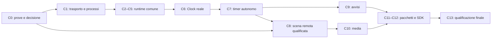

# Cascade Addon Runtime — Completion Implementation Plan

> **For agentic workers:** REQUIRED SUB-SKILL: Use superpowers:subagent-driven-development or superpowers:executing-plans to implement this plan task-by-task. Steps use checkbox (`- [ ]`) syntax for tracking. Questo documento pianifica il lavoro residuo; non avvia implementazioni o agenti.

**Goal:** Concludere la piattaforma addon con un percorso reale e comune per sviluppatori esterni e widget Cascade, dall'installazione alla disattivazione, con controllo delle risorse verificato.

**Architecture:** Conservare Contracts, Presentation, SDK, resolver e PublicationStore già implementati. Completare il runtime fuori dal processo grafico, collegarlo prima a Clock e FocusTimer, poi ai servizi e alle scene avanzate. Il risultato delle prove di piattaforma decide quale launcher può entrare nel prodotto; il confine aggiornato segue la [limitazione sul lavoro delegato accettata dall'utente](../specs/2026-09-10-addon-control-policy.md), senza ridurre le altre garanzie.

**Tech Stack:** Swift tools 6.2, nuovi target Swift 6, motore esistente Swift 5/MainActor, macOS 14, SwiftUI/AppKit, Foundation, API native pubbliche verificate; Swift Testing e fixture firmate. Un eventuale piccolo supervisore C usa soltanto primitive provate in C0.

**Spec:** [architettura approvata](../specs/2026-09-09-addon-runtime-design.md), [piano originale](2026-09-09-addon-runtime.md), [prove P0](../verification/2026-09-09-addon-runtime-P0.md), [implementazione P1](../verification/2026-09-09-addon-runtime-P1.md).

## Global Constraints

- Il profilo `native-direct-control-v1` accetta il rischio del lavoro autonomamente delegato a macOS fuori dai processi/servizi gestiti. Il broker, i processi gestiti, le loro quote, identità e uscita effettiva restano interamente nel perimetro richiesto.

- macOS 14 come minimo dell'app. Non si alza implicitamente il deployment target.
- Sistema interamente nativo: nessun WebAssembly, JavaScriptCore, interprete generale o dipendenza terza senza motivazione nuova.
- Cascade deve essere aperta. L'app sorgente può essere chiusa o assente se le funzioni dell'addon sono autosufficienti.
- Tutti i futuri widget, avvisi e attività sviluppati dal team usano lo stesso SDK, manifest, REQUIRES, modello di contenuti/azioni, catalogo, lifecycle e controllo delle risorse degli addon esterni.
- Il codice personalizzato degli addon non viene caricato nel processo grafico dell'host, inclusi gli addon del team. Sostituti in-process ammessi solo nei test.
- Un contenuto visibile non richiede un provider residente. La chiusura prevista del provider non conclude la pubblicazione.
- Nessun polling per addon, attesa IPC sincrona sul MainActor o chiamata al provider nel display link. Code e collezioni hanno limiti.
- Congelamento dei processi escluso dal comportamento ordinario v1; eventuale esperimento separato dopo misure di attesa IPC/riavvio.
- Preservare identità di firma/TCC e comportamenti visivi/di input esistenti durante la migrazione; nessuna concessione automatica dei permessi macOS.
- Le quote su valori, code, asset e disco sono applicate prima della conservazione/allocazione controllata. CPU e footprint del codice nativo sono soglie osservate, con intervallo e possibile superamento temporaneo dichiarati.
- Non dichiarare supportato un OS, un editore, una scena o un profilo continuo senza le rispettive prove. Compilare per macOS 14 non significa averlo eseguito su macOS 14.
- Conservare il lavoro pregresso. Commit solo di modifiche isolate e revisionate; niente `git add .`, ripristini globali o commit dei file dell'utente.
- Al termine dell'intervento riavviare Cascade e verificarne l'avvio. Se cambia il codice app, prima build riuscita e aggiornamento di `/Applications/Cascade.app` tramite gli script del progetto.

## Punto di partenza e significato di questo piano

L'ultimo stato verificato del 9–10 settembre contiene quattro blocchi P1 implementati e 230 test del package passati con `--no-parallel` (91 aggiunti alla baseline). Si riusano quei blocchi; non si riscrive il resolver né si ricreano protocolli equivalenti. Restano le verifiche desktop/accessibilità/energia e l'integrazione con processi reali.

P0 ha due risultati distinti: ExtensionKit non ha fornito l'arresto esplicito richiesto del provider headless; il figlio diretto risolve arresto e metriche ma permette l'avvio delegato di una app tramite Launch Services. Il prototipo RemoteUI è soltanto compilato. Questi esiti sono il punto di partenza di C0, non test da trasformare artificialmente in verdi.

Questo è il nuovo ingresso per l'esecuzione residua. I sottopiani del 9 settembre conservano file, casi e requisiti dettagliati; le correzioni di interfaccia e l'ordine qui indicati prevalgono sulle loro firme ancora proposte. Le caselle P0–P4 originali indicano fasi intere, quindi non vanno spuntate solo perché una porzione compila.

## Avanzamento verificato — 12 settembre

- **C0: profilo originale non ammesso, indagine successiva in corso.** Le prove precedenti e la revisione confermano lavoro delegato fuori controllo, sopravvivenza del worker alla morte del supervisore e mancata invalidazione autenticata dopo cambio eseguibile. [Decisione e misure](../verification/2026-09-10-addon-launcher-decision.md). Nessun adapter produttivo abilitato. L'utente ha accettato il rischio del lavoro delegato: la decisione di prodotto è risolta, mentre recupero del supervisore e identità richiedono ancora prove conformi.
- **C0d: diagnostica offline approvata, prova nativa sospesa.** Il nuovo osservatore distingue uscita effettiva, status, fallback e perdita dei log; 35 test nuovi, 54 storici e 26 owner passati. Corretto e rivalutato il drenaggio dopo rifiuto della registrazione. Il driver esce incondizionatamente con codice 78 prima di creare prodotti: resta aperta la sicurezza del tracing quando il supervisore muore prima dell’aggancio. Nessuna compilazione o esecuzione nativa C0d, nessun nuovo launcher ammesso. [Verifica e limite](../verification/2026-09-12-addon-managed-death.md). Il backing raster C5c1 è stato implementato e approvato separatamente; non abilita il launcher sospeso.
- **C1a implementato e revisionato:** negoziazione del protocollo e degli schemi del contenuto, ammissione delle pubblicazioni con sessioni canoniche, controllo di generazione/sequenza e batch atomici. 41 test mirati passati, di cui 18 nuovi; trasporto nativo ancora da collegare. La modifica GlassLight dell'utente è preservata e revisionata; non richiede correzioni. [Continuazione](../verification/2026-09-10-addon-light-sessions.md).
- **C2 parziale; coordinatore C2b2 approvato:** `AddonRuntime` compone pubblicazioni, azioni, servizi, dipendenze, scadenze e prenotazioni tramite il ResourceGovernor comune. Le prove coprono autorità dopo sospensione, esiti in attesa, restituzioni esatte, messaggi duplicati e completamenti indipendenti.104 test mirati e436 test completi seriali passati; revisione indipendente conclusa senza rilievi aperti. Il coordinatore è integrato nella build verificata del 12 settembre; il collegamento al trasporto e ai processi reali non è qualificato. [Verifica corrente](../verification/2026-09-12-addon-runtime-composition.md).
- **C3 parziale:** broker host con sessioni opache, permessi e binding canonici per feature/operazione, interessi indipendenti dalla connessione, sorgenti condivise per scope compatibile, revoca e scadenze comuni. Le prenotazioni usano ResourceGovernor; le decisioni di avvio/invocazione hanno controlli monouso. La correzione del replay conserva gli esiti per requestID entro una cronologia limitata, con spazio per la risposta riservato prima del comando. I 25 test mirati passano e la revisione delle correzioni è conclusa senza rilievi P1/P2. Il coordinatore puro è ora approvato in C2b2; trasporto, cache degli eventi e prove con due provider reali restano da integrare. [Servizi](../../addons/services.md).
- **C4 parziale:** ResourcePolicy/ResourceGovernor con prenotazioni e rilascio; AddonHealthStore con stato limitato per versione, quarantena dopo tre violazioni nella finestra di cinque minuti e ticket di riavvio a 1/5/30 secondi, invalidati su disattivazione o nuova sessione. Metriche native, arresto osservato e collegamento a quote/coda comuni restano da implementare.
- **C5 parziale; backend per chiave C5b approvato:** checkpoint versionati e backend distinto per valori da 0–64 KiB per chiave, namespace per identità verificata, quote condivise, staging atomico, cache separata e riconciliazione. Corretto e rivalutato il recupero dopo errore di sincronizzazione delle cartelle.38 test mirati e474 test completi seriali passati. Trasporto SDK autenticato, barriera globale di avvio, asset/decoder e ripristino delle pubblicazioni restano da integrare. [Contratto](../../addons/storage.md), [verifica C5b](../verification/2026-09-12-addon-keyed-storage.md).
- **C5c1 approvato:** memoria raster immutabile con veri CGImage, quote condivise protette fino al rilascio effettivo e drenaggio limitato. 37 test mirati e 498 test completi seriali passati. Non comprende ancora AssetState, decoder, SDK, autorizzazioni o collegamento al renderer. [Contratto](../../addons/assets.md), [verifica C5c1](../verification/2026-09-12-addon-raster-backing.md). La consegna si è fermata qui su richiesta dell’utente; la nuova richiesta del 12 settembre riprende il lavoro con il decoder seguente.
- **Decoder C5 implementato e revisionato:** importazione host interna PNG/JPEG con ImageIO/CoreGraphics, 1 MiB/1 MP, normalizzazione RGBA8 sRGB, concorrenza limitata e quota temporanea protetta nel governor comune. Corretti i casi di decodifica differita e file troncati riprodotti durante la revisione. 46 test mirati e 507 test seriali completi passati. Non include AssetState, SDK autenticato, renderer o qualificazione del decoder contro input ostili. [Contratto](../../addons/assets.md), [verifica](../verification/2026-09-13-addon-image-decoder.md).
- **Integrazione canonica asset C5 implementata e revisionata:** import/rilascio autenticati per pubblicazione e connessione, pin atomici con lo stato delle pubblicazioni, conservazione delle timeline future e immagini dopo uscita del provider, lookup per revisione e quote fino alla durata reale dei pixel. Corrette regressioni su completamenti differiti e rimozione a quota piena. **536 test seriali passati**, 29 nuovi; build firmata, 350 input identici e riavvio verificato (PID 69877). API interne: riuso pubblico fra pubblicazioni, SDK/trasporto, handoff MainActor e ripristino restano aperti. [Contratto](../../addons/assets.md), [verifica](../verification/2026-09-13-addon-asset-integration.md).
- **Condivisione asset C5 e contratto SDK implementati:** decisione dell’utente applicata con alias indipendenti sullo stesso raster, partizioni host immutabili, ammissione e revoca canoniche. Pubblicati i contratti AssetHandle/AddonAssetClient e AddonContext.assets, senza dichiarare trasporto nativo. **552 test seriali passati**, 16 nuovi; 356 input identici, build firmata e riavvio verificato (PID 73683). [Contratto](../../addons/assets.md), [verifica](../verification/2026-09-13-addon-asset-sharing.md).
- **Barriera globale storage C5 implementata:** AddonStorageCoordinator mantiene privati checkpoint e storage per chiave, blocca l'accesso finché entrambi sono riconciliati e conserva lo stesso registro delle quote del backend per chiave attraverso chiusura e riapertura. Otto test nuovi e revisione indipendente; **560 test seriali passati**, 358 input identici, build firmata e riavvio verificato (PID 76239). Consumo settimanale rilevato 25%. [Verifica](../verification/2026-09-13-addon-storage-barrier.md). La successiva [scelta dell’archivio](2026-09-13-addon-restoration-archive-decision.md) è stata risolta con SwiftData; questa barriera non comprende ancora i suoi nuovi archivi.
- **SwiftData scelto e prototipo riproducibile verificato:** la scelta del framework è risolta. Undici scenari in processi separati verificano salvataggio/riapertura, rollback, autosave disabilitato, BLOB fino alle dimensioni di una pubblicazione/raster massimi e 100 aggiornamenti. Prototipo e script approvati dalla revisione; 361 input congelati, build firmata e riavvio verificato (PID 78065), consumo settimanale rilevato 27%. Nessuna modifica al runtime/package rispetto alla baseline di 560 test. La distinta [politica sui file interni](2026-09-13-addon-swiftdata-disk-policy-decision.md) è stata poi approvata esplicitamente: misurare il superamento, mantenerlo conteggiato e bloccare le scritture successive. I limiti sui buffer controllati dall’app restano preventivi. [Verifica e misure](../verification/2026-09-13-addon-swiftdata-archive.md).
- **C12 parziale:** comando reale `cascade-addon validate`, lettura limitata e guida pubblica. Scaffold, esempi distribuibili e parità con processi reali restano da implementare.
- **C4a implementato e revisionato:** riduzione atomica delle riserve di stato e restituzione della capacità inutilizzata dei risultati. Rimangono invariati cronologia, protezione dal replay e rilascio dei processi solo dopo uscita osservata. 42 test mirati passati, sette nuovi. [Rapporto corrente](../verification/2026-09-10-addon-light-sessions.md).
- **Verifica precedente luci/sessioni:**385 test Swift passati (25 nuovi casi, oltre ai23 delle luci dell’utente), revisioni concluse senza rilievi aperti,21 file integrati e318 input di build identici. Build firmata riuscita, collegamento Applications aggiornato, chiusura normale e riavvio verificato (PID94732). [Rapporto](../verification/2026-09-10-addon-light-sessions.md).
- **Verifica precedente servizi/stato:**337 test Swift passati (44 nuovi casi dell'incremento), revisioni concluse senza P1/P2,18 file integrati,299 input di build identici. Build firmata riuscita, collegamento Applications aggiornato e apertura dell'app verificata. [Rapporto](../verification/2026-09-10-addon-services-storage.md).
- Verifiche storiche: primo incremento **248 test Swift e 18 Python passati**; continuazione direct-v1 **288 test Swift e 36 Python passati**. I risultati della continuazione servizi/stato sono registrati nel [rapporto corrente](../verification/2026-09-10-addon-services-storage.md), che distingue test mirati e verifica completa. Nessuna consegna B–E è dichiarata completa da questi conteggi.

- **Storage SwiftData, salvataggio, ripristino e inventario completo implementati e revisionati:** contabilità osservata protetta, backend per proprietario, codec Foundation limitato, pin/raster, salvataggio coerente, ripristino atomico con blocco dei replay e operazioni concrete del coordinatore. **679 test seriali passati in 69 suite**, 381 input identici, 30 hash revisionati, build firmata e riavvio verificato (PID 97296). Consumo settimanale 43%. Il successivo rilevamento delle modifiche significative è ora consegnato nel punto seguente; bootstrap e trasporto nativo restano separati. [Piano](2026-09-13-addon-swiftdata-storage.md), [verifica](../verification/2026-09-13-addon-swiftdata-runtime.md).
- **Salvataggio su modifiche significative implementato e revisionato:** tracciamento fisso per plugin, una scrittura per chiamata, alternanza tra proprietari e blocco dei tentativi ripetuti dopo errore. Il commit riconosce solo la versione catturata e conserva eventuali modifiche successive. **694 test seriali passati in 70 suite**, 382 input identici, build firmata e riavvio verificato (PID 99945), consumo settimanale 45%. Chiusura limitata consegnata nel punto seguente; ciclo eventi dell’app ancora da collegare. [Verifica](../verification/2026-09-13-addon-archive-event-flushing.md).
- **Checkpoint limitato alla chiusura implementato e revisionato:** revoca immediata, stato privato per una sola passata, distinzione tra operazione occupata e tentativo fallito, pulizia esplicita e conservazione dei commit noti. **710 test seriali passati in 71 suite**, 383 input identici, build firmata e riavvio verificato (PID 2818), consumo settimanale 47%. Formato dedicato dei messaggi storage consegnato nel punto seguente; integrazione del ciclo eventi e trasporto nativo separati. [Verifica](../verification/2026-09-13-addon-archive-shutdown.md).

- **Messaggi dedicati storage implementati e revisionati:** codec Foundation con chiavi UTF-8 esatte, valori completi da 64 KiB, frame da 192 KiB e negoziazione 1.1 esplicita; i chiamanti attuali restano 1.0. **723 test seriali passati in 73 suite**, 388 input identici, build firmata e riavvio verificato (PID 4658), consumo settimanale 48%. Esiti concreti del coordinatore consegnati nel punto seguente; trasporto autenticato ancora separato. [Verifica](../verification/2026-09-13-addon-keyed-storage-frames.md).

- **Esiti delle operazioni storage implementati e revisionati:** rifiuti prima della chiamata, successo noto conservato dopo chiusura/cancellazione, esito incerto senza tentativi automatici e letture soggette ad autorità corrente. Nessun nuovo stato permanente; backend e metodi generici invariati. **732 test seriali passati in 74 suite**, 389 input identici, build firmata e riavvio verificato (PID 6324), consumo settimanale 50%. Proprietà esatta degli spazi di trasporto consegnata nel punto seguente. [Verifica](../verification/2026-09-13-addon-keyed-storage-outcomes.md).

- **Proprietà degli spazi di trasporto implementata e revisionata:** conferme associate al lavoro esatto, messaggi liberati alla ricezione e ingressi mantenuti fino alla reale pulizia, anche differita. Quote originali conservate,512 byte di controllo aggiunti per processo sulla piattaforma testata. **740 test seriali/75 suite**,390 input identici, build firmata e riavvio verificato (PID 8362), consumo settimanale 53%. Collegamento storage autenticato consegnato nel punto seguente. [Verifica](../verification/2026-09-13-addon-runtime-slot-ownership.md).

- **Collegamento host storage implementato e revisionato:** autorità canonica, permessi dichiarati e concessi, workspace protetto, risposte conservate fino alla conferma esatta ed esiti noti mantenuti dopo cancellazione. **765 test seriali / 76 suite**, 391 input identici, build firmata e riavvio verificato (PID 11511), consumo settimanale 55%. Ciclo SDK delle richieste consegnato nel punto seguente; trasporto nativo e bootstrap separati. [Verifica](../verification/2026-09-13-addon-authenticated-storage-handler.md).

- **Ciclo SDK storage implementato e revisionato:** un solo ticket pendente, correlazione esatta, risposte prima della conferma d’invio, cancellazione senza liberare capacità ancora occupata e chiusura con esito incerto delle mutazioni. Riusa i contratti esistenti e conserva solo stato scalare. **781 test seriali / 77 suite**, 393 input identici, build firmata e riavvio verificato (PID 12667), consumo settimanale 56%. [Verifica](../verification/2026-09-13-addon-sdk-storage-lifecycle.md). Scelta sul [trasferimento asset](../../../.scratch/cascade-product/issues/21-asset-transfer.md) acquisita il 14 settembre; componente interno consegnato nel punto seguente.

- **Frame asset e assemblatore interno implementati e revisionati:** blocchi da64KiB fino a1MiB, Foundation e decoder ImageIO esistenti, prenotazione protetta, identità esatta e scadenza non rinnovabile. Corretta in revisione la race nel rifiuto terminale. **795 test seriali /80 suite**,400 input identici, build firmata e riavvio verificato (PID28937), quota settimanale61% utilizzata. Restano integrazione del trasporto autenticato e client SDK; il gate nativo non cambia. [Verifica](../verification/2026-09-14-addon-asset-chunks.md).

- **Collegamento asset SDK/runtime implementato e revisionato:** negoziazione cumulativa 1.2, canale SDK iniettato con slot/receipt esatti, import/share/release canonici e chiusura con finalizzazione atomica. Matrice reale ammissione/ImageIO/risorse, revisioni indipendenti e **883 test / 83 suite passati**, 285 input finali identici, build firmata e riavvio verificato (PID 50978). Il trasporto OS/bootstrap e C0d restano non qualificati. [Verifica](../verification/2026-09-18-addon-asset-message-integration.md).

Il [rapporto di avanzamento](../verification/2026-09-10-addon-runtime-progress.md) distingue codice integrato, prove, limiti e lavoro residuo. Non ripetere C0 senza una nuova evidenza o decisione di prodotto.

## Consegne e dipendenze

| Consegna | Task | Risultato osservabile | Prerequisiti |
| --- | --- | --- | --- |
| A — fattibilità decisa | C0 | Launcher qualificato oppure rapporto di impossibilità del profilo con decisione concreta da prendere | Prove esistenti |
| B — motore comune | C1–C5 | Identità, processi, scadenze, comandi, servizi, quote e stato funzionano insieme | C0 per processi reali; lavoro puro può avanzare prima |
| C — prima feature completa | C6–C7 | Clock e FocusTimer su percorso pubblico, anche con provider assente e app sorgente assente | C1–C5 |
| D — tutti i nostri widget | C8–C10 | Scene, avvisi e media migrati senza percorsi privilegiati | C6–C7; C8 per media avanzato |
| E — sistema distribuibile | C11–C13 | Gestione pacchetti, esempio esterno, strumenti e qualificazione finale | B–D |



C2–C5 possono procedere sui test puri con le interfacce C1, senza incorporare un launcher sperimentale. Documentazione, esempi di valori e strumenti di validazione possono avanzare in parallelo. Se C0 rimane bloccato, si continua su queste parti, ma C6 non viene simulato dentro il processo grafico.

## Allineamento alle API realmente esistenti

| Elemento | Contratto da mantenere |
| --- | --- |
| Contenuto | `ContentNode` è uno struct validato con factory throwing; `ContentDocument` ha initializer throwing. Non introdurre un secondo enum wire incompatibile. |
| SDK | `AddonProvider.handle(_:context:) async throws -> ProviderOutput` esiste. `AddonServiceClient` e `AddonStorageClient` sono già dichiarati in `CascadeAddonSDK/AddonContext.swift`; aggiungere implementazioni concrete, non protocolli omonimi duplicati. |
| Servizi | `ServiceScope` è lo struct wire `{ featureID, operation }`, non l'enum esemplificato nel vecchio 02.3. Restrizioni su account, rete e file restano policy canoniche dell'host, associate al grant, senza fidarsi di campi aggiunti dal provider. |
| REQUIRES | `ServiceBinding.featureID` distingue feature e radice. Il broker usa il binding della feature corrente, con fallback radice solo se previsto e autorizzato. Due feature con major diversi restano distinte. |
| Permessi | Grant/Lease sono valori, non prove di autorizzazione. Il broker cerca il grant canonico per ID e riconvalida proprietario, feature, operazione, scadenza e generazione della connessione. |
| Pubblicazioni | `PublicationStore.accept(_:owner:)`, `snapshot(at:)`, `nextDeadline(after:)`, `remove(owner:)` ed `expire(at:)` esistono. Snapshot in attesa mantengono identità e timeline; omissione significa rimozione. |
| Host | `AddonPresentationBridge.apply(_:)` riceve valori e il callback azione contiene `PublicationID`, revisione e `ActionDescriptor`. Non importa Runtime e non possiede il provider. |
| Identità | Sessione di pubblicazione, generazione di connessione, permesso di lavoro, permesso di visibilità e revisione degli asset sono distinti. |

Ogni ampliamento wire richiede aggiornamento coordinato di decoder, schema, test e documentazione, con negoziazione esplicita. Non cambiare l'isolamento dell'intero motore a Swift 6 durante questa feature.

## Verifica comune a ogni task

Ogni task eredita i casi e i file del sottopiano collegato, aggiunge le precisazioni seguenti e termina con revisione del diff. Una dipendenza mancante o un errore di compilazione non sostituisce la prova comportamentale RED richiesta.

1. Aggiungere i casi indicati nella suite del task e osservare il fallimento pertinente.
2. Implementare solo quel confine; eseguire la suite mirata.
3. Eseguire la fixture reale quando il requisito riguarda processi, firme, UI o consumi.
4. Registrare comando, OS/hardware/firma, risultato, tempi misurati e casi non eseguiti. Revisionare e correggere i difetti prima di proseguire alle parti dipendenti.
5. Integrare i soli file del task; commit isolato quando il checkout lo permette. Build e riavvio dell'app nelle consegne che la modificano.

Gli script di integrazione introdotti sotto salvano anche un record JSON per scenario con `schemaVersion: 1`, `scenario`, `checks`, `observations` e `unverified`. I booleani sono derivati da osservazioni/assert reali, non precompilati dal test. Controllo di ammissione eseguibile, da inserire in `scripts/assert-addon-evidence.py` in C0:

```python
import json, sys
record = json.load(open(sys.argv[1]))
assert record.get("schemaVersion") == 1
assert record.get("scenario") == sys.argv[2]
assert record.get("unverified") == []
required = sys.argv[3:]
assert required, "Serve almeno una verifica esplicita"
for check in required:
    assert record.get("checks", {}).get(check) is True, check
```

Questo controllo verifica la completezza del report; non sostituisce le prove che lo producono. File mancanti, casi saltati ed errori di lettura non valgono come PASS. I test negativi attuali P0 continuano a uscire con errore finché la restrizione non è reale.

## C0 — Chiudere le incognite di piattaforma con una decisione finita

**Dettaglio:** [P0, task 00.1–00.3](2026-09-09-addon-runtime-00-platform.md).

**Files:** modificare `Prototypes/AddonPlatform/DirectChild/Supervisor.c`, `Worker.c`, `run.py`, `README.md`, `Host/ProbeHost.swift`, `Tests/run_lifecycle.py` e `scripts/test-addon-direct-child.sh`; creare `scripts/assert-addon-evidence.py`, `Prototypes/AddonPlatform/Tests/CompletionEvidenceTests.py` e `docs/superpowers/verification/2026-09-10-addon-launcher-decision.md`.

**Interfaccia prodotta:** una decisione documentata con launcher, API pubbliche precise, OS provati, profilo sandbox, identità e modalità di arresto/metriche, lavoro delegato ammesso o negato, costo del supervisore e finestra di riuso misurata. Nessuna classe di produzione viene abilitata da una dichiarazione del manifest.

- [x] Ripetere `test-addon-direct-child.sh`, `test-addon-platform.sh --case lifecycle` e `--case application-stop`, conservando i controesempi. Classificare il caso headless come handle NSRunningApplication assente, senza fingere una chiamata a forceTerminate.
- [x] Cercare nelle API pubbliche e nelle versioni macOS disponibili una restrizione applicabile **prima** del codice non fidato o un mezzo verificabile per possedere e fermare anche l'esecuzione delegata. Prima di scrivere ogni variante annotare l'API, la disponibilità e quale preciso test rosso dovrebbe cambiare.
- [x] Per ciascun passaggio di revisione provare al massimo due varianti fondate su nuove evidenze; ulteriori ipotesi richiedono nuova evidenza, non ripetizioni. Priorità delle varianti: priorità al figlio diretto già misurabile; una variante ExtensionKit solo se nuova API/versione/documentazione affronta il fallimento riprodotto. Niente ripetizioni identiche senza una nuova ipotesi.
- [x] Conservare il test dell'app innocua annidata e leggibile, i controlli positivi senza restrizioni, il tentativo di rialzo dei limiti e il caso di sostituzione con exec. Aggiungere morte del supervisore e invalidazione della sessione dopo cambio di eseguibile. Non terminare processi individuati soltanto per nome/PID.
- [x] Distinguere un'apertura dell'app sorgente esplicitamente autorizzata dall'utente da lavoro secondario avviato autonomamente dall'addon: il secondo non deve aggirare la policy. Non aprire app dell'utente durante i test; usare fixture firmate e innocue.
- [x] Provare almeno 20 sequenze avvio/stop e confrontare 20 richieste con chiusura immediata e breve riuso. Misurare CPU, footprint, totale host+supervisore e latenza; scegliere il riuso solo se migliora il risultato. Guardrail delle singole fixture: deadline esterna 5 s e al massimo 64 MiB di allocazione aggiuntiva.
- [x] Validare il controllo dei report con casi unitari: check falso, check mancante, scenario diverso, caso non verificato e record interamente valido. Eseguire `python3 -m unittest discover -s Prototypes/AddonPlatform/Tests -p 'CompletionEvidenceTests.py'`.
- [x] Scrivere il verdetto: **ammesso** solo con arresto, identità, metriche e contenimento richiesti dimostrati; **bloccato** altrimenti. Nel secondo caso documentare esattamente quale garanzia cambierebbe con una proposta alternativa e richiedere una decisione su quella modifica prima di abilitarla. Nessuna riduzione implicita, cambio di linguaggio o esclusione silenziosa delle scene.

**Uscita storica del profilo rigoroso:** il record `launcher-admission` resta negativo, inclusa `delegatedWorkControlled=false`; le caselle precedenti descrivono l'indagine già conclusa.

**Seguito autorizzato:** applicare la [decisione sul controllo diretto](../specs/2026-09-10-addon-control-policy.md). Il rischio sul lavoro delegato è accettato e non richiede un'altra conferma. Prima di C1:

- [ ] Risolvere e provare l'uscita del worker anche alla morte del supervisore, preservando identità sicura e guardrail della fixture.
- [ ] Implementare e provare identità/sessioni autentiche dopo exec, inclusi messaggi tardivi, peer non autorizzati e invalidazione effettiva.
- [ ] Produrre e validare il nuovo record `launcher-admission-direct-v1`, `policyID: native-direct-control-v1`, `acceptedLimitations: [autonomousOSDelegation]`; richiedere `managedStop`, `hostExitCleanup`, `hostCrashCleanup`, `supervisorDeathStopsWorker`, `identitySafe`, `sessionInvalidatedAfterExec`, `cpuReadable`, `footprintReadable` tutte vere, con casi obbligatori non verificati ancora bloccanti.
- [ ] Conservare separatamente il controesempio sul lavoro delegato e il precedente FAIL. Non trattare il cambio di policy come un test passato; qualificare solo gli OS/editori realmente provati.

**Nuova indagine C0:** il [rapporto direct-v1](../verification/2026-09-10-addon-direct-v1.md) conserva una prova isolata positiva dell’identità dei messaggi dopo exec. La pulizia launchd fallisce per i processi gestiti che cambiano gruppo/sessione; il launcher integrato resta non ammesso. Corrette e revisionate la distinzione fra guardrail e arresto effettivo e la conservazione dei rapporti durante errori di pulizia.

**Ulteriore prova C0:** il controllo pubblico `PT_TRACE_ME` si inizializza sulla configurazione locale senza variazioni osservate dei bit pubblici di protezione, firma o sandbox. Due baseline e un caso di tracing, sei uscite normali osservate; nessun exec del worker o arresto per morte del supervisore ancora provato. Il verificatore dei risultati è stato corretto e rivalutato:25 test passati, evidenza originale ancora positiva. La [continuazione azioni/tracing](../verification/2026-09-10-addon-actions-tracing.md) mantiene separate questa evidenza locale e l’ammissione ancora negativa.

**Localizzazione successiva C0:** la sostituzione controllata osserva la nuova identità ma fallisce prima dell’ingresso del Worker. Il confronto senza tracing fallisce anch’esso; un rapporto di crash correlato localizza questo secondo guasto nell’inizializzazione App Sandbox. Tutti i dieci processi dell’ultima prova sono usciti,54 test offline e revisione indipendente passati. Le evidenze e i risultati sconosciuti restano conservati. La successiva prova separata con bootstrap SDK fidato, identità distinta per owner e Worker che eredita la sandbox ha completato quattro casi con otto uscite normali, isolamento e continuità dei dati osservati.54 test storici e26 test del prototipo passano; revisione conclusa. Il [rapporto del 12 settembre](../verification/2026-09-12-addon-owner-bootstrap.md) conserva i limiti: codice fisso locale, morte del supervisore e launcher produttivo ancora da qualificare. [Rapporto corrente](../verification/2026-09-10-addon-actions-tracing.md).

**Preparazione diagnostica del18settembre:** il [modello offline del bootstrap](../verification/2026-09-18-addon-bootstrap-abort-offline.md) passa31 test e revisione indipendente. Verifica solo parsing/deadline e coerenza di osservazioni sintetiche; non chiude C0, non esegue prove native e conserva il gate C0d.

## C1 — Trasporto, identità e processi produttivi

**Dipendenze:** C0 ammesso per l'adapter reale. **Dettaglio:** [02.1](2026-09-09-addon-runtime-02-execution.md).

**Files:** creare `CascadeKit/Sources/CascadeTransport/AddonConnection.swift`, `WireEnvelope.swift`, `PeerVerifier.swift`; `CascadeKit/Sources/CascadeRuntime/Processes/AddonProcessLaunching.swift`, `NativeAddonLauncher.swift`, `ProcessIdentity.swift`, `AddonProcessPool.swift`; `CascadeKit/Sources/CascadeAddonSDK/AddonProviderEntrypoint.swift`; `CascadeKit/Tests/CascadeRuntimeIntegrationTests/ProcessConnectionTests.swift`; `scripts/test-addon-runtime.sh`. Modificare `CascadeKit/Package.swift` e i target firmati in `Cascade.xcodeproj/project.pbxproj`. Il file dell'adapter concreto segue il launcher scelto in C0, senza mantenere due loader produttivi.

**Interfacce pianificate:**

```swift
enum DeliveryReceipt: Sendable {
    case sent(UUID)
    case accepted(UUID)
}
protocol AddonConnection: Sendable {
    var deliveryReceipts: AsyncStream<DeliveryReceipt> { get }
    func send(_ event: AddonEvent) async throws -> ProviderOutput
    func close() async
}
protocol AddonProcessLaunching: Sendable {
    func start(_ addon: InstalledAddon) async throws -> RunningAddon
    func stop(_ running: RunningAddon, reason: StopReason) async throws
}
```

`DeliveryReceipt` è definito in `CascadeKit/Sources/CascadeTransport/AddonConnection.swift`; il suo UUID è quello della richiesta nell’envelope, non un ID generato dal provider. Lo stream ha capacità finita: saturazione di ack/esiti chiude la sessione con errore esplicito, senza perdere comandi silenziosamente. C2 registra invio e accettazione separatamente dal risultato. `RunningAddon`, definito in `Processes/ProcessIdentity.swift`, contiene `ProcessIdentity`, `ConnectionGeneration` e `any AddonConnection`; `ProcessIdentity` contiene identità verificata, digest e identificatore di nascita del processo. L'handle capace di arrestare resta nel launcher e non attraversa il protocollo addon. `WireEnvelope` contiene schema/versione, generazione, sequenza, tipo di messaggio e payload limitato; i conteggi includono l'envelope esterno.

- [ ] Aggiungere test reali per nuova generazione, owner falso, versione sconosciuta, firma valida ma peer non autorizzato e binario sostituito fra verifica e avvio.
- [ ] Implementare handshake e admission prima degli eventi; validare `ProviderOutput.validateContext` e sessioni negoziate prima del PublicationStore. Nessun endpoint scelto dal provider conferisce identità o autorizzazione.
- [ ] Implementare crediti, separazione comandi/stato e limiti prima delle allocazioni controllabili dal trasporto. Un frame oltre 512 KiB o invio senza credito revoca la sessione e arresta il processo; non basta rifiutarlo dopo averlo accumulato.
- [ ] Rendere l'entrypoint SDK realmente eseguibile fuori dall'host. Se C0 seleziona un supervisore diretto, usare un supervisore comune per il pool ove provato, conteggiandone il costo; il modello con un supervisore per worker della fixture non è il default di prodotto.
- [ ] Eseguire ProcessConnectionTests e `scripts/test-addon-runtime.sh`; il record `process-connection` deve soddisfare `authenticatedPeer`, `freshGeneration`, `oldGenerationRejected`, `oversizeRejected`, `actualExit`, `noOrphanAfterHostCrash`.

### C1a — confine puro implementabile prima del launcher

La libreria supporta protocollo1.0 e schemi contenuto1/2. Un'offerta chiusa e limitata
negozia l'intersezione compatibile; i requisiti del manifest verificato restano canonici.
Gli schemi negoziati devono essere applicati a tutte le rappresentazioni e alle timeline,
compresi i documenti schema2 senza luci. Le connessioni dell'host hanno handle opachi,
generazioni fresche, sequenze controllate e ID di pubblicazione autorizzati; l'ammissione
avviene nello stesso actor del batch di PublicationStore, senza sospensioni fra controllo
e commit. Chiudere il provider conserva contenuti/storia; rimuovere l'owner revoca anche
la connessione. Questo lavoro non conclude C1 e non simula trasporto, firma o processi.

File aggiuntivi: `CascadeContracts/ProtocolOffer.swift`,
`CascadeRuntime/Admission/ProtocolNegotiator.swift`, `PublicationSessionRegistry.swift`,
`ProtocolOfferTests.swift`, `ProtocolAdmissionTests.swift` e `docs/addons/sessions.md`;
integrazione in `ProviderOutput.validateContext` e `PublicationStore`.

## C2 — Scheduler, comandi e pubblicazioni durevoli

**Dipendenze:** interfacce C1; processo reale C1 prima di dichiarare il task integrato. **Dettaglio:** [02.2](2026-09-09-addon-runtime-02-execution.md).

**Files:** creare `CascadeKit/Sources/CascadeRuntime/AddonRuntime.swift`, `Scheduling/AddonScheduler.swift`, `Scheduling/DeadlineQueue.swift`, `Actions/ActionDispatcher.swift`, `Actions/ActionJournal.swift`; test `AddonSchedulerTests.swift`, `ActionDispatcherTests.swift`, `PublicationLifecycleTests.swift`, `TestClock.swift` in `CascadeKit/Tests/CascadeRuntimeTests/`; `ProviderExitTests.swift` in `CascadeKit/Tests/CascadeRuntimeIntegrationTests/`. Estendere `Publications/PublicationStore.swift` solo per ammissione atomica di output multipli e stato obsoleto necessario.

**Interfacce:** `AddonRuntime.dispatch(_ request: ActionRequest) async -> ActionOutcome`, `refresh(_ id: PublicationID) async throws`, `disable(_ id: AddonID) async`, `stop() async`; dipendenze iniettate PublicationStore, launcher, Resolution, broker C3 e clock. Il clock di test separa `wallNow: Date` da `monotonicNow: Duration`, con avanzamenti indipendenti. La coda deadline è unica. Le scadenze monotone non vengono ripristinate come valide dopo riavvio/nuova generazione: persistono Date e stato, mentre lease e token vengono ricreati. Non confondere i contatori CPU Mach con le scadenze del lavoro.

- [ ] Testare provider concluso → pubblicazione presente → azione → nuovo processo/generazione → stessa sessione/revisione incrementata; risposta della vecchia generazione ignorata.
- [ ] Implementare stati processo/job/pubblicazione separati e invio di snapshot al bridge solo quando cambia il contenuto o arriva una deadline utile. La normale uscita del provider non revoca la pubblicazione né l'interesse ai servizi.
- [ ] Usare una sola coda di scadenze; provare salto dell'ora civile, sleep oltre una scadenza, clock nascosto e nessuna raffica di tick arretrati.
- [ ] Ammettere 1 job pesante/addon e 2 globali, massimo 4 comandi pendenti/addon. Rifiutare o accorpare secondo tipo, dare priorità alle azioni con attesa limitata e preservare esiti dei comandi. Journal: 128 richieste/10 minuti/addon.
- [ ] Testare due azioni sulla stessa revisione, timeout dopo invio, disconnessione prima/dopo ack, stop durante checkpoint, output multiplo parzialmente invalido e disable con pubblicazioni future. Un'azione non idempotente dall'esito incerto non viene ritentata automaticamente.
- [ ] Eseguire le tre suite pure e ProviderExitTests con processo reale. Il record `publication-lifecycle` richiede `providerAbsentContentVisible`, `singleRestartOnAction`, `lateReplyIgnored`, `disableRemovesFutureContent`, `noDuplicateExternalEffect`.

### C2a — autorizzazione e coordinamento dei comandi puri

- [x] Verificare manifest/resolution/feature assegnati dall’host e azione/input pubblicati nella rappresentazione o timeline corrente; rifiutare contesto non disponibile, obsoleto o oscurato per privacy.
- [x] Comporre il journal e lo scheduler esistenti con rollback della sola nuova ammissione, consumo monouso e ricontrollo sincrono prima dell’invio.
- [x] Contare journal, risultati riservati, lavori e metadati entro un solo limite locale di8MiB; conservare quota/posto dei lavori ancora attivi anche oltre la scadenza della cronologia.
- [x] Testare replay, revoca, scadenze, revisione cambiata, esiti tardivi e riuso del requestID dopo l’uscita esatta del vecchio lavoro.36 test mirati passati; recupero dell’esito dopo rimozione della pubblicazione corretto e rivalutato, rilievi minori di stile annotati per la revisione finale.
- [ ] Collegare l’actor proprietario dello stato canonico, ResourceGovernor comune, trasporto e processi reali. I ticket della componente pura non sono prove di identità native e non completano C2.

### C2b — proprietà dello stato e prenotazione comune

- [x] Estrarre le regole esistenti in `PublicationState` interno e sincrono, mantenendo `PublicationStore` come actor pubblico che delega alla stessa implementazione. Nessun registro o stato delle revisioni duplicato.45 test mirati e revisione indipendente superati; due correzioni minori di commento/stile annotate per la rifinitura finale.
- [x] Aggiungere una variazione atomica della sola prenotazione `.state` esistente, controllando owner/ID e dimensione attuale attesa, limiti aggregati e quota fissa dei metadati.55 test mirati (8 nuovi) e revisione indipendente superati. Serve a prenotare la crescita prima di conservare nuovi dati senza liberare la vecchia riserva; non sostituisce la revisione dell’operazione posseduta dal runtime.
- [x] Comporre queste basi in `AddonRuntime`, con autorità canonica unica, ResourceGovernor condiviso col broker, prenotazioni prima dell’ammissione e ricontrollo dopo ogni sospensione. Recuperare esiti già conservati senza nuove prenotazioni; mantenere distinti fine lavoro e uscita del processo.104 test mirati e436 test completi seriali, revisione approvata; integrazione nell'app e qualifica nativa separate.
- [ ] Collegare il trasporto e il launcher qualificati e ripetere le prove con processi reali. Le prove pure non completano la qualificazione C2.

## C3 — Servizi condivisi e permessi effettivi

**Incremento del 18 settembre:** [client servizi completo e percorso host controlli/sorgenti/eventi](../verification/2026-09-18-addon-service-subscriptions-host-sdk.md) consegnati:1084 test/96 suite, revisione finale PASS, Release, build firmata e riavvio verificato. Il protocollo1.4 richiede l’assemblaggio canonico cumulativo completo; default1.0 e legacy0–3 restano preservati. Le verifiche interne non sostituiscono trasporto nativo e due provider reali: C3 resta aperto.

**Dipendenze:** C2 per la consegna degli eventi; test di regole pure indipendenti da C0. **Dettaglio:** [02.3](2026-09-09-addon-runtime-02-execution.md).

**Files:** creare `CascadeKit/Sources/CascadeRuntime/Services/ServiceBroker.swift`, `ServiceRegistry.swift`, `ServiceBindingStore.swift`, `LeaseStore.swift`, `PermissionStore.swift`; implementazioni `CascadeKit/Sources/CascadeAddonSDK/Services/TransportServiceClient.swift` e `Storage/TransportStorageClient.swift`; test `ServiceBrokerTests.swift`, `PermissionRevocationTests.swift` in `CascadeKit/Tests/CascadeRuntimeTests/`; `docs/addons/services.md`.

**Interfacce:** mantenere `AddonServiceClient.invoke(_:grant:)`, `subscribe(requirementID:grant:)`, `unsubscribe(subscriptionID:)` esistenti. Il broker riceve internamente l'ID di sessione autenticata risolto dal trasporto e cerca owner/generazione nel registro host; nessun consumer scelto dal payload. Acquisizione tramite `OperationRequest.requestService(requirementID:scope:)`; invocazione tramite `ServiceInvocation` e ID del grant canonico. Questo sostituisce il `ServiceRequest` non definito e l'enum ServiceScope ipotizzati nel vecchio 02.3.

- [ ] Testare due consumer compatibili: una sorgente avviata, primo rilascio senza stop, ultimo rilascio con stop. Account o scope incompatibili non condividono cache.
- [ ] Separare interesse host e token della connessione: evento con provider assente lo risveglia una volta; nuova connessione riceve nuovi grant. Disable/revoca rimuovono anche l'interesse.
- [ ] Testare due feature dello stesso addon con versioni differenti dello stesso servizio, grant rubato, operazione diversa, scadenza e generazione precedente. Usare `ServiceBinding.featureID` e il consenso cross-publisher già presenti nel resolver.
- [ ] Implementare catene A→B→C senza trattenere permessi di lavoro che impediscono al provider di partire; oltre la capacità rifiutare prima con `resourceDenied`, senza stallo. Processi, memoria e costo delegato tramite il broker rimangono contabilizzati.
- [ ] Rivalutare solo i dipendenti interessati da installazione, revoca o perdita di un servizio, usando eventi di sistema; preservare le feature indipendenti e non cambiare provider a metà sessione senza un nuovo binding autorizzato.
- [ ] Eseguire ServiceBrokerTests/PermissionRevocationTests e due provider reali quando C1 è disponibile. Il record `shared-services` richiede `singleSource`, `accountsSeparated`, `featureBindingPreserved`, `revocationEnforced`, `chainWithoutDeadlock`.

## C4 — Quote, osservazione e recupero dai guasti

**Profilo RAM del23settembre — implementazione interna verificata:** [attribuzione al proprietario](../../../.scratch/cascade-product/issues/64-addon-memory-attribution.md) e [profilo progressivo64/96MiB](../../../.scratch/cascade-product/issues/65-addon-provider-memory-policy.md) approvati. In sequenza: [classificare episodi](../../../.scratch/cascade-product/issues/66-provider-memory-episodes.md), poi [comporre salute e ammissioni](../../../.scratch/cascade-product/issues/67-runtime-provider-memory.md), con revisioni PASS,1.222 test/115 suite e [consegna firmata con avvio verificato](../verification/2026-09-23-addon-provider-memory.md). Nessun profilo UI/audio o launcher nativo abilitato.

**Continuazione CPU transitiva e retry del22settembre:** registro, coordinatore, broker e runtime compongono interessi canonici contemporanei e provenienza dei contributori. Il recupero puro usa uscita host-classificata, domanda corrente, backoff1/5/30 e consumo monouso nella scadenza comune; wake/stop/disable annullano anche le decisioni sospese. Revisioni root/Sol indipendente PASS,230 test mirati finali e1.209 test completi/113 suite. [Verifica e consegna della tranche](../verification/2026-09-22-addon-transitive-cpu.md). La nuova frontiera è [l’attribuzione della memoria osservata](../../../.scratch/cascade-product/issues/64-addon-memory-attribution.md); nessuna policy RAM inventata. Restano aperti binding, segnali e arresto nativi: i test puri non soddisfano `actualStopObserved`, `identityChecked` nativo o `idleSupervisorDisarmed`.

**Continuazione CPU delegata del22settembre:** [contabilità conservativa dei destinatari](../verification/2026-09-22-addon-delegated-cpu.md) implementata nel coordinatore daSol medium e revisionata root/Sol,126 test mirati e1.161 test completi/105 suite PASS, build firmata e riavvio aggiornato verificati. Binding esatti, preflight atomico, deduplica e conti persistenti preesistenti; nessuna duplicazione fisica. Il producer broker/runtime resta separato e attende [la regola per le catene di servizi](../../../.scratch/cascade-product/issues/57-addon-transitive-cpu-attribution.md). Launcher bloccato.

**Continuazione ammissioni e scadenze del21settembre:** [rifiuto temporaneo e ciclo comune](../verification/2026-09-21-addon-cpu-admission.md) implementati da Sol/Terra medium con revisioni root e indipendenti PASS. Nuove richieste rifiutate fino a credito positivo misurato, senza replay; lavoro già ammesso conservato. Quinto aggregato metriche, disarmo e reset wake con protezione dalle letture obsolete.1.153 test/104 suite PASS; build firmata e avvio aggiornato verificati. Prossima scelta: [attribuzione CPU dei servizi ai consumatori](../../../.scratch/cascade-product/issues/55-addon-delegated-cpu-attribution.md). Launcher, collegamento OS e arresto nativo restano separati.

**Continuazione del 21 settembre:** [classificazione e salute CPU](../verification/2026-09-21-addon-cpu-violations.md) implementate e revisionate, 100 test mirati e 1.135 test completi in 101 suite PASS. Una violazione per nuovo consumo oltre credito e giro; il runtime scarta risultati obsoleti, conserva debito/storia fra provider e registra la quarantena interna al terzo incidente. La pulizia osservativa attraversa il percorso comune anche per deadline. Restano sanzioni, collegamento app/deadline e qualifica nativa; il prossimo punto è [quando riaprire i nuovi lavori](../../../.scratch/cascade-product/issues/52-addon-cpu-reduced-admission.md).

**Continuazione credito CPU del 20 settembre:** [credito condiviso e contabilità nel coordinatore](../verification/2026-09-20-addon-cpu-credit.md) implementati e revisionati: 100 ms iniziali, ricarica 5 ms/s, conti conservati fra job e riavvii provider. 71 test mirati e 1.122 test completi PASS. Misure incomplete ed errori restano espliciti; la [definizione delle violazioni distinte](../../../.scratch/cascade-product/issues/49-addon-cpu-violation-counting.md) è stata approvata il 21 settembre: conta nuovo consumo oltre credito, una volta per addon e giro, escludendo il solo debito residuo. Il launcher rimane bloccato.

**Incremento del 20 settembre:** [coordinatore osservativo comune](../verification/2026-09-20-addon-process-metrics-coordinator.md) consegnato:47 test metriche,1.098 test completi, revisioni e build firmata con riavvio verificato. Deadline periodico massimo1Hz, insieme limitato e disarmo, senza timer autonomi. Binding nativo, wakeup host, classificazione ed enforcement restano separati; [semantica burst CPU](../../../.scratch/cascade-product/issues/46-addon-cpu-burst-policy.md) approvata successivamente: credito condiviso 100 ms, ricarica 5 ms/s, conservato fra job e riavvii del provider.

**Incremento del 18 settembre:** [lettura libproc e riduttore CPU](../verification/2026-09-18-addon-process-metrics.md) implementati e revisionati, 929 test / 85 suite PASS e consegna firmata. Nessun campionatore/enforcement collegato. La successiva [calibrazione indipendente CPU](../verification/2026-09-18-addon-process-cpu-calibration.md) è PASS su macOS27 arm64/self-process; qualifiche native e altre piattaforme restano aperte.

**Dipendenze:** regole pure indipendenti da C0; metriche e stop reali C1. **Dettaglio:** [02.4](2026-09-09-addon-runtime-02-execution.md).

**Files:** creare `CascadeKit/Sources/CascadeRuntime/Resources/ResourcePolicy.swift`, `ResourceGovernor.swift`, `ProcessMetricsReader.swift`, `AddonHealthStore.swift`; `ResourceGovernorTests.swift`, `QuarantineTests.swift` in `CascadeKit/Tests/CascadeRuntimeTests/`; `ResourceAbuseTests.swift` in `CascadeKit/Tests/CascadeRuntimeIntegrationTests/`; `scripts/test-addon-resources.sh`.

**Interfacce:** ResourceGovernor prenota/rilascia risorse applicative; osserva ProcessMetrics associati all'identità C1 e restituisce `keep`, `reduce`, `stop` o `quarantine`. Le prenotazioni sono host-owned e liberate su errore/cancellazione. Policy e relativi limiti sono definiti nel 02.4 e nella tabella seguente, senza scegliere quote per nome/editore.

- [ ] Testare la stessa fixture come bundled ed external: medesime ammissioni, revoche e soglie.
- [ ] Applicare i massimi già approvati; conteggiare anche tombstone, journal, code, cache, supervisore e memoria temporanea di decode. Non preallocare il budget per ogni addon installato.
- [ ] Campionare tutti i processi attivi insieme, inizialmente massimo 1 Hz, oltre ad avvio/fine lavoro e pressione memoria. Disarmare senza processi. Convalidare unità CPU del lettore con una misura indipendente.
- [ ] Testare metrica assente, identità cambiata, flooding, memoria entro il guardrail della fixture e loop CPU. Missing non significa zero. Il superamento non deve bloccare MainActor né il resto degli addon.
- [ ] Applicare quarantena dopo 3 violazioni moderate in 5 minuti; retry crash 1/5/30 s solo con domanda attuale. Retry e supervisione usano le code comuni, si annullano al disable e non ricreano processi dopo stop.
- [ ] Eseguire le suite e `test-addon-resources.sh`. Il record `resource-control` richiede `samePolicyForTeamAndExternal`, `reservationsReleased`, `floodBounded`, `identityChecked`, `actualStopObserved`, `idleSupervisorDisarmed`; riportare latenza di rilevamento e overshoot nelle observations.

### C4a — riduzione delle prenotazioni già ammesse

Aggiungere a ResourceGovernor una riduzione atomica delle sole prenotazioni `.state`,
con owner e ID canonici invariati, senza crescita, nuovo ingresso o rimozione della quota
di metadati. Il broker conserva la riserva massima fino all'esito terminale, poi riduce al
costo effettivamente conservato. Richieste, esiti, protezione dai duplicati e scadenze non
cambiano. Le prenotazioni dei processi restano fino all'uscita osservata. Verificare anche
budget pieno, revoca, scadenza e cleanup concorrente senza cancellare quote altrui.

## C5 — Stato su disco e asset con durata indipendente dal processo

**Incremento del 18 settembre:** [client SDK storage a messaggi](../verification/2026-09-18-addon-storage-message-client.md) implementato e revisionato, 955 test / 87 suite PASS, esempi aggiornati e consegna firmata. Il canale produttivo e l’ammissione delle allocazioni nell’integrazione restano separati. Le caselle globali non sono chiuse da questo incremento.

**Porzioni approvate:** checkpoint/migrazioni C5a, backend per chiave C5b e backing raster C5c1, più i successivi percorsi interni a messaggi e client SDK storage/asset. Le caselle sotto restano aperte perché comprendono l’integrazione produttiva, il ripristino e la durata delle risorse nella presentazione. C5b usa `AddonKeyedStorage`, `KeyedStorageRecord`, `KeyedStorageDirectory` e prenotazioni disco ridimensionabili nel governor comune; non amplia il checkpoint. Sessioni/permessi canonici, cornice storage e riconciliazione globale sono implementati nei componenti interni; bootstrap e canale nativo restano da collegare.

**Dipendenze:** C4 per le prenotazioni; filesystem/codec testabili prima di C0. **Dettaglio:** [02.5](2026-09-09-addon-runtime-02-execution.md).

**Files:** creare `CascadeKit/Sources/CascadeRuntime/Storage/AddonStateStore.swift`, `StateMigration.swift`, `AssetStore.swift`, `AssetDecoder.swift`; `AddonStateStoreTests.swift`, `AssetStoreTests.swift`, `StateMigrationTests.swift` in `CascadeKit/Tests/CascadeRuntimeTests/`. Collegare TransportStorageClient di C3 e `Core/AddonPresentation/SnapshotSupport.swift` senza letture nelle factory.

**Interfacce:** mantenere SDK `read(key:)`, `write(_:key:)`, `remove(key:)`; il client è già legato all'owner autenticato. Internamente `AddonStateStore.read(owner:)` e `write(_:schemaVersion:owner:)` operano su stato versionato. `AssetStore.importAsset(_:owner:)` restituisce AssetHandle con owner, ID, dimensioni, byte e revisione dell'asset; non un percorso. La risoluzione per il renderer è già circoscritta alla pubblicazione.

- [ ] Testare interruzione fra staging e sostituzione, versione futura, file corrotto, path traversal, symlink e migrazione fallita; il vecchio stato deve restare leggibile o essere disabilitato con motivo esplicito.
- [ ] Applicare quota disco e scritture atomiche; separare cancellazione cache e cancellazione dati dell'utente. Persistenza su eventi significativi, non per frame o tick del timer.
- [ ] Decodificare fuori MainActor, con concorrenza limitata e riserva prima del buffer. Rifiutare immagini oltre 1 MiB compresso/1 megapixel e formati/metadati non ammessi. Un eventuale decoder isolato usa il launcher qualificato e conta nelle risorse.
- [ ] Testare asset ancora visibile dopo uscita del provider, liberazione dopo l'ultima referenza, revoca owner, cache private separate e ripristino di pubblicazioni. Non riprodurre comandi/avvisi passati o rinnovare l'ancora massima di 8 ore.
- [ ] Eseguire AddonStateStoreTests/AssetStoreTests/StateMigrationTests. Il record `storage-assets` richiede `atomicRecovery`, `ownerIsolation`, `quotasEnforced`, `assetSurvivesProviderExit`, `revokedHandleRejected`, `noNoticeReplay`.

## C6 — Clock: primo percorso completo dentro Cascade

**Incremento sorgente del 20 settembre:** [StandaloneClock](../verification/2026-09-20-standalone-clock-source.md) è compilabile indipendentemente e usa il solo SDK pubblico;3 test Swift,21 test del checker e5 fixture build PASS, con revisione root. Audit ampliato a4 package. Nessuna integrazione nell’app o qualifica nativa: le caselle C6 restano aperte.

**Dipendenze:** C0–C5 integrati. **Dettaglio:** [03.1](2026-09-09-addon-runtime-03-adoption.md).

**Files:** creare `Cascade/AddonRuntimeComposition.swift`, `Cascade/Addons/BundledAddonCatalog.swift`, `Addons/Clock/Manifest.json`, `ClockProvider.swift`, `Info.plist`; `CascadeKit/Tests/CascadeRuntimeIntegrationTests/BundledClockTests.swift`; `scripts/check-addon-boundaries.sh`. Modificare `Cascade/CascadeServices.swift` (registrazione Clock attuale), progetto Xcode e collegamento al bridge. Rimuovere `Cascade/Features/ClockWidget.swift` solo dopo la migrazione verificata.

**Interfacce:** catalogo iniziale di soli pacchetti firmati distribuiti con l'app, verificati dal PeerVerifier C1 e trasformati in InstalledAddon; nessuna factory di provider nell'host. C11 estende questo catalogo con installazione/aggiornamento, senza duplicare il percorso di admission. Il callback del bridge crea ActionRequest e chiama AddonRuntime, mai direttamente il provider.

- [ ] Scrivere BundledClockTests con processo distinto, pubblicazione ricevuta, provider realmente uscito e orologio ancora presente.
- [ ] Collegare `PublicationStore.snapshot(at:)` al bridge e `nextDeadline(after:)` alla coda C2, inclusi snapshot in attesa; niente loop di interrogazione della vista.
- [ ] Sostituire `notch.register(ClockWidget())` con attivazione del pacchetto Clock e mantenere aspetto, locale e interazioni esistenti.
- [ ] Testare disable, cambio fuso, sleep/wake e lunga chiusura del notch; nessun processo per ogni tick e nessuna vista clock trattenuta dalle cache quando nascosta.
- [ ] Eseguire boundary check, BundledClockTests, suite bridge e prova desktop. Record `bundled-clock`: `differentPID`, `providerExitObserved`, `clockContinues`, `disableRemovesContent`, `noHiddenTickIPC`. Build, riavvio e confronto con il Clock precedente prima di migrare altri widget.

## C7 — FocusTimer autonomo e primo addon esterno reale

**Incremento sorgente del 18 settembre:** [StandaloneFocus](../verification/2026-09-18-standalone-focus-source.md), 37 test e build pubblica indipendente PASS, revisione completata. È una libreria sorgente: contenitore firmato, integrazione host e prova nativa completa restano da eseguire.


**Dipendenze:** C6. **Dettaglio:** [03.2](2026-09-09-addon-runtime-03-adoption.md).

**Files:** creare `Addons/FocusTimer/Manifest.json`, `FocusTimerProvider.swift`, `FocusCore/FocusSession.swift`; `Examples/StandaloneFocus/Package.swift`, `README.md`, `Sources/StandaloneFocusProvider/`; `CascadeKit/Tests/CascadeRuntimeIntegrationTests/StandaloneFocusTests.swift`; `scripts/test-addon-standalone.sh`. Il progetto/contenitore firmato usa il formato scelto in C0.

**Interfacce:** FocusSession conserva ID, stato, deadline e revisione. Azioni pubbliche start/pause/resume/end; stesso AddonProvider e stessa admission di Clock. Il contenitore include il codice condiviso necessario: nessuna libreria cercata nell'app sorgente.

- [ ] Testare start → uscita provider → pause con nuova generazione → resume → scadenza. Un solo effetto conclusivo e nessun provider residente per disegnare il countdown.
- [ ] Costruire StandaloneFocus fuori dal checkout usando esclusivamente i prodotti pubblici SDK; la sorgente dell'app di esempio non deve fornire dipendenze nascoste.
- [ ] Provare app sorgente chiusa e mai installata, con la sola feature openInSourceApp bloccata. Nessun install/launch automatico prodotto da REQUIRES.
- [ ] Provare scadenza durante sleep e durante chiusura di Cascade; alla ripartenza ripristinare lo stato valido senza dichiarare lavoro eseguito quando Cascade era chiusa.
- [ ] Eseguire StandaloneFocusTests e script standalone; record `standalone-focus`: `sourceAppAbsent`, `publicSDKOnly`, `timerWithoutProvider`, `newGenerationOnAction`, `singleExpiry`, `hostExitCleanup`. Questa è la prima consegna utilizzabile completa della piattaforma ordinaria, non il termine dell'intero progetto.

## C8 — Qualificare e integrare la scena SwiftUI remota

**Dipendenze:** C0 per lifecycle/controllo; C1–C5 e C7 per integrazione. La prova del prototipo può essere svolta prima, separatamente. **Dettaglio:** [00.3](2026-09-09-addon-runtime-00-platform.md) e parte scena di [03.4](2026-09-09-addon-runtime-03-adoption.md).

**Files:** completare `Prototypes/AddonPlatform/RemoteUI/Host/ProbeHost.swift`, `Provider/ProbeProvider.swift`, `Shared/ProbeMessage.swift`, `README.md`; creare `CascadeKit/Sources/CascadeContracts/RemoteSceneDescriptor.swift`, `CascadeKit/Sources/CascadeRuntime/Presentation/RemoteSceneCoordinator.swift`, `CascadeKit/Sources/CascadeKit/Core/AddonPresentation/RemoteSceneContainer.swift`; `CascadeKit/Tests/CascadeRuntimeIntegrationTests/RemoteSceneLifecycleTests.swift`; `scripts/test-addon-scenes.sh`.

**Interfacce:** RemoteSceneDescriptor contiene sceneID, PublicationID, versione e fallback ordinario; `RemoteSceneCoordinator.open(_:) async throws -> SceneSession`, `close(_ sessionID: UUID) async`. SceneSession ha ID, identità e lease di visibilità; token di apertura monouso associato a owner/pubblicazione/generazione. Nessun endpoint arbitrario inviato dalla UI viene montato.

- [ ] Completare nel prototipo il contatore osservato dall'host attraverso il canale autenticato: il solo cambiamento locale di @State non supera il test.
- [ ] Provare attivazione, click, menu, focus/tastiera, resize, clipping e trasparenza nel pannello non attivante. Registrare separatamente VoiceOver e preferenze di accessibilità.
- [ ] Usare un percorso di controllo UI con interruzione esterna affidabile. Non ripetere il canale che ha lasciato bloccata la lettura del selettore per ore; un limite dello strumento va registrato come non verificato, non come difetto di ExtensionKit o successo del test.
- [ ] Provare crash/blocco della scena, revoca durante mount, apertura/chiusura rapida e risposta della generazione vecchia. Host sempre reattivo, fallback visibile, al massimo una scena e nessuna revoca indebita di un lavoro indipendente.
- [ ] Soltanto dopo il PASS portare l'adapter in RemoteSceneContainer e collegare visibilità/risorse. Eseguire RemoteSceneLifecycleTests e script scene; record `remote-scene`: `authenticatedScene`, `clickObservedByHost`, `hiddenSceneReleased`, `crashFallback`, `hostResponsive`, `independentJobPreserved`. La qualifica manuale resta requisito separato del rilascio.

## C9 — Migrare alimentazione, volume e Bluetooth

**Dipendenze:** C7; C8 solo se un comportamento richiede realmente scena remota. **Dettaglio:** [03.3](2026-09-09-addon-runtime-03-adoption.md).

**Files:** creare `Addons/SystemNotices/Manifest.json`, `ChargingProvider.swift`, `VolumeProvider.swift`, `BluetoothProvider.swift`, risorse/localizzazioni; `Cascade/Addons/SystemServiceRegistration.swift`; test `SystemNoticeAddonTests.swift`, `SharedSystemServiceTests.swift` in `CascadeKit/Tests/CascadeRuntimeIntegrationTests/`. Migrare i corrispondenti file in `Cascade/Features/`, gli adapter in `Cascade/Integrations/Power/`, `Volume/`, `Bluetooth/` e le registrazioni in CascadeServices.

**Interfacce:** servizi versionati `system.power`, `system.volume`, `system.bluetooth`; lettura e azioni di modifica hanno operazioni/grant distinti. Una sorgente per ciascun insieme di consumatori compatibili.

- [ ] Eseguire e registrare prima le regressioni esistenti di alimentazione, volume, Bluetooth, presentazione e routing audio.
- [ ] Migrare un provider per volta; preservare durata, privacy, priorità, localizzazioni e arbitraggio del notch. Dipendenza Bluetooth mancante blocca soltanto Bluetooth.
- [ ] Se manca un componente ordinario necessario, aggiungerlo a schema/SDK/renderer pubblico e testarlo prima dell'uso; niente viste o quote speciali per ID del widget. L'eventuale imageSequence conserva i limiti proposti nel 03.3 e viene verificata con Reduce Motion.
- [ ] Eseguire le due suite nuove e gli script esistenti `scripts/test-power.sh`, `test-volume.sh`, `test-bluetooth.sh`, `test-bluetooth-presentation.sh`, `test-bluetooth-audio-route.sh`; registrare hardware non disponibile. Restringere l'allowlist legacy dopo ogni migrazione.
- [ ] Record `system-notices`: `singleMonitorPerSource`, `remainingConsumerUnaffected`, `lastInterestStopsSource`, `independentFeatureSurvives`, `privacyPreserved`; build/riavvio e confronto desktop per il blocco migrato.

## C10 — Migrare media e qualificare il profilo continuo

**Dipendenze:** C8, C3–C5. **Dettaglio:** parte media di [03.4](2026-09-09-addon-runtime-03-adoption.md) e misure [04.3](2026-09-09-addon-runtime-04-release.md).

**Files:** creare `Addons/Media/Manifest.json`, `MediaProvider.swift`, `MediaExpandedScene.swift`, test `CascadeKit/Tests/CascadeRuntimeIntegrationTests/MediaAddonTests.swift`; migrare media/slider/artwork/picker da `Cascade/Features/` e adapter in `Cascade/Integrations/Media/` e `Audio/` secondo 03.4.

**Interfacce:** servizi pubblici `media.metadata`, `media.playbackControl`, `audio.spectrum`; il lease della cattura/analisi audio segue la domanda visibile, distinto dall'interesse ai metadati. Progresso ordinario con base temporale e revisione, senza IPC per frame.

- [ ] Conservare le regressioni attuali prima della migrazione e testare metadati, artwork, pausa, avanzamento e cambio uscita.
- [ ] Migrare contenuto compatto al modello pubblico e interazioni avanzate alla scena C8; mantenere fallback utile e scope privati degli account.
- [ ] Testare due consumer audio compatibili con una sola cattura; nascondere l'ultima superficie deve fermare analisi e campioni senza spegnere interessi indipendenti.
- [ ] Misurare profilo continuo e buffer/frequenze prima dell'abilitazione pubblica. Nessuna esenzione del media player del team e nessuna applicazione automatica delle soglie event-driven alla UI/audio continui.
- [ ] Eseguire MediaAddonTests, scene test e `scripts/test-now-playing.sh`, `test-audio-spectrum.sh`, `test-music-artwork.sh`, `test-music-progress.sh`. Record `media-addon`: `publicPathOnly`, `sharedCapture`, `hiddenAnalysisStopped`, `ordinaryProgressWithoutIPC`, `continuousProfileQualified`; verifica manuale tastiera/menu/slider/VoiceOver, build e riavvio.

## C11 — Catalogo esterno, installazione, aggiornamento e recupero

**Dipendenze:** C1–C5 e formato deciso in C0. Può avanzare prima del termine di C9/C10; la qualifica finale li richiede. **Dettaglio:** [04.1](2026-09-09-addon-runtime-04-release.md).

**Files:** creare `CascadeKit/Sources/CascadeRuntime/Catalog/AddonCatalog.swift`, `PackageVerifier.swift`, `AddonUpdateCoordinator.swift`, `CatalogReconciler.swift`; `AddonCatalogTests.swift`, `AddonUpdateTests.swift`, `CatalogReconciliationTests.swift` in `CascadeKit/Tests/CascadeRuntimeTests/`; `Cascade/Features/Settings/AddonsSettingsView.swift`; `scripts/test-addon-installation.sh`; `docs/addons/distribution.md`.

**Interfacce:** `inspect(_ location: URL) async throws -> VerifiedPackage`, `enable(_ id: AddonID) async throws`, `disable(_ id: AddonID) async`; `prepare(_ package: VerifiedPackage) async throws -> UpdatePlan`, `apply(_ plan: UpdatePlan) async throws`. VerifiedPackage conserva manifest, identità verificata, digest, origine e percorso autorizzato; non è ottenibile da un manifest non verificato. UpdatePlan esplicita permessi nuovi, dipendenti, migrazioni e recupero consentito dal distributore. Riusa la stessa admission C1/C6.

- [ ] Testare firma cambiata, bundle sostituito, ID duplicato, copia standalone/app completa e pacchetto disabilitato. Non scegliere silenziosamente un altro editore.
- [ ] Usare discovery per eventi e riconciliazione iniziale limitata; 100 addon installati e inattivi non avviano 100 processi né timer di scansione individuali.
- [ ] Implementare update con verifica, checkpoint limitato, staging e riapertura della sessione; vecchie generazioni/azioni non passano automaticamente al nuovo binario. Ripristino solo se tecnicamente ammesso dal formato e dai dati.
- [ ] Mostrare nelle impostazioni editore, origine, permessi, feature bloccate con motivo, consumo osservato e quarantena in linguaggio comprensibile.
- [ ] Eseguire suite catalogo/update/riconciliazione e script installazione; record `installation-update`: `tamperedPackageRejected`, `identityRecheckedAtLaunch`, `newPermissionsNotImplicit`, `failedMigrationRecoverable`, `duplicatesExplicit`, `inactiveCatalogWithoutProcesses`.

## C12 — SDK distribuibile, strumenti ed esempi indipendenti

**Incremento del 18 settembre:** [controllo dei confini SDK](../verification/2026-09-18-addon-sdk-boundary-check.md) e [integrazione obbligatoria nella build ufficiale](../verification/2026-09-18-addon-required-sdk-build-check.md) consegnati e revisionati; audit3 package/9 target/88 sorgenti/132 import e build firmata positiva. Le caselle di parità con addon reali restano aperte.

**Dipendenze:** C7 e C11 per prova completa; documentazione/validazione possono avanzare prima. **Dettaglio:** [04.2](2026-09-09-addon-runtime-04-release.md).

**Files:** creare `CascadeKit/Sources/CascadeAddonTool/main.swift`, `ManifestValidationCommand.swift`, `ScaffoldCommand.swift`; `CascadeKit/Tests/CascadeAddonToolTests/AddonToolTests.swift`; `CascadeKit/Tests/CascadeRuntimeIntegrationTests/SDKParityTests.swift`; `Examples/ServiceConsumer/`; `docs/addons/README.md`, `quickstart.md`, `compatibility.md`, `performance.md`, `testing.md`. Aggiornare Package.swift, guide di protocollo/servizi/lifecycle/distribuzione e script boundary.

**Interfacce:** comandi `cascade-addon validate` e `cascade-addon init --name --destination` riusano i validatori dei contratti esistenti. Lo scaffold richiede un'identità di firma reale assegnata dallo sviluppatore, senza inventare credenziali o sovrascrivere directory non vuote.

- [x] Testare validazione con errore leggibile, directory non vuota, progetto generato compilabile e nessuna esecuzione di shell dal manifest. [Consegna sorgente SDK del18settembre](../verification/2026-09-18-addon-sdk-scaffold.md):896test/84suite PASS, progetto indipendente compilato; firma e packaging addon ancora distinti.
- [x] Costruire StandaloneFocus e ServiceConsumer in checkout indipendenti, senza import privati o riferimenti nascosti a sorgenti locali del progetto. [Focus sorgente](../verification/2026-09-18-standalone-focus-source.md): 37 test; [servizi sorgente](../verification/2026-09-18-service-consumer-source.md): 16 test; revisioni PASS e dipendenza pubblica locale esplicita. Contenitori firmati, SDK remoto e parità nativa restano separati.
- [ ] Provare REQUIRES fra due addon: servizio presente/assente, major incompatibile, ciclo, revoca e provider disabilitato. Documentare app installata versus aperta e codice incluso versus servizio esterno. Il [collegamento sorgente dei manifest al resolver](../verification/2026-09-18-service-consumer-manifest-resolution.md) passa7 test/8 casi con revisione indipendente; la casella resta aperta per il percorso con addon reali.
- [ ] Eseguire la stessa fixture bundled ed external con identici grant; stesso esito per risorse, firme, revoche e lifecycle. Il controllo delle dipendenze dei target e degli import deve impedire nuove registrazioni private di widget.
- [ ] Eseguire AddonToolTests, SDKParityTests e boundary check; record `sdk-parity`: `independentBuild`, `generatedProjectBuilds`, `sameAdmissionPolicy`, `sameResourcePolicy`, `sameRevocation`, `noPrivateAddonImports`. Aggiornare CODE_STYLE.md, PRODUCT.md e contratti architetturali solo con API effettivamente implementate.

## C13 — Qualificazione e chiusura della feature

**Dipendenze:** tutte le consegne precedenti. **Dettaglio:** [04.3](2026-09-09-addon-runtime-04-release.md).

**Files:** creare `scripts/benchmark-addon-runtime.sh`, `scripts/test-addon-e2e.sh`, `CascadeKit/Tests/CascadeRuntimeIntegrationTests/AddonEndToEndTests.swift`, `docs/addons/resource-profiles.md`, `docs/superpowers/verification/2026-09-10-addon-runtime-completion.md`.

- [ ] Eseguire scenari reali: nessun addon; 100 installati inattivi; Clock/timer con provider assente; 20 richieste oltre la capacità; servizi condivisi; scena visibile/nascosta; revoca; update/removal; host chiuso/crash; addon bloccato/flooding; ripartenza.
- [ ] Misurare memoria/CPU/wakeup osservabili e costo totale host+supervisore+provider+scene+servizi. Scenari di almeno 60 s dopo riscaldamento, ripetuti 3 volte; alimentazione e batteria quando disponibili. Almeno 30 campioni per latenza calda/fredda/scena, dichiarando l'incertezza dei percentili estremi; almeno 1.000 callback misurate per valutare p95/p99 del lavoro introdotto su MainActor.
- [ ] Provare 100 cicli apertura/chiusura e enable/disable. Nessun processo, interesse, cattura o crescita monotona attribuibile a risorse trattenute dopo la finestra di rilascio.
- [ ] Qualificare VoiceOver, tastiera, Reduce Motion/Transparency, schermo bloccato, cambio monitor, fuso e sleep/wake. Provare gli OS dichiarati supportati, incluse le condizioni sul minimo macOS, e firme di editori diversi; disponibilità mancante resta un limite del rilascio.
- [ ] Eseguire tutte le suite del package, integrazioni reali, boundary check e regressioni delle funzioni migrate. Il vecchio conteggio 230 è una baseline, non il target né una certificazione delle fasi nuove.
- [ ] Compilare con lo script ufficiale, verificare firma, collegamento Applications e riavvio con nuovo PID/percorso. Preparare una release candidate locale; pubblicazione esterna solo nel relativo incarico di rilascio.
- [ ] Concludere soltanto con record `addon-completion` che soddisfa `externalAddonWorks`, `teamWidgetsUsePublicPath`, `standaloneWorksWithoutSourceApp`, `durableContentWithoutProvider`, `remoteUIQualified`, `resourceProfilesQualified`, `faultRecoveryQualified`, `supportedPlatformMatrixQualified` e con verifiche manuali registrate.

## Limiti di riferimento da applicare e misurare

Valori iniziali della specifica; le soglie osservate non sono benchmark già ottenuti.

| Ambito | Massimi / candidati |
| --- | --- |
| Contenuti | 64 KiB, profondità 8, 128 nodi, stringhe 4 KiB |
| Envelope | 512 KiB totali, 16 pubblicazioni, 16 operazioni, azione 4 KiB, checkpoint 64 KiB |
| Timeline / stato | 32 voci e 256 KiB/istanza; 8 MiB di stato host globale |
| Istanze / update | 16 istanze/addon; 1 snapshot pendente/istanza; 2/s compatto, 10/s espanso, burst 4, aggregati 20/s addon e 40/s globale |
| Attività / avvisi | 4 attività/addon e 16 globali; ancora attività 8 ore; backlog avvisi 8, massimo 10 s, burst 3/addon in 10 s |
| Lavoro / processi | 1 job pesante/addon e 2 globali; 4 comandi pendenti/addon; 3 provider e 1 scena; 256 MiB budget di ammissione aggregato |
| CPU event-driven | Credito condiviso 100 ms CPU, ricarica 5 ms/s, non ricreato da job/riavvii; profilo continuo separato |
| Footprint | Provider obiettivo 64 MiB/soglia osservata 96; UI remota totale addon 128/192 MiB, senza sommare una seconda quota gratuita |
| Asset / disco | Asset 8 MiB/addon e 32 globali; immagine 1 MiB compressa e 1 megapixel; stato disco 10 MiB e cache 20 MiB/addon, 100 MiB globali |
| Latenze | Ack 100 ms, risposta ordinaria e avvio freddo 2 s, stop cooperativo 500 ms; oltre il termine resta obbligatorio l'arresto effettivo misurato |
| MainActor | Lavoro introdotto p95 <1 ms e p99 <2 ms sul dispositivo di riferimento; raccogliere campioni adeguati |

## Controllo di copertura e criterio di completamento

| Requisito | Task che lo conclude |
| --- | --- |
| Firma, isolamento, stop, lavoro delegato | C0–C1, C4, C13 |
| Pubblicazione senza provider, azioni, sleep/wake | C2, C5–C7 |
| REQUIRES, feature/versioni, permessi e servizi condivisi | C3, C7, C9, C11–C12 |
| Quote applicative, CPU/RAM, crash, quarantena | C4–C5, C10, C13 |
| SwiftUI ordinaria e avanzata, accessibilità | P1 conservata; C6, C8–C10, C13 |
| Tutti i widget del team sul medesimo SDK | C6–C10, C12 |
| Addon autonomo e progetto indipendente | C7, C11–C12 |
| Installazione, aggiornamento, recupero e documentazione | C5, C11–C12 |
| Efficienza dimostrata e compatibilità dichiarata | C0, C10, C13 |

- [x] A conclusa: esito di piattaforma esplicito. Un esito bloccato chiude l'indagine corrente ma **non** qualifica il launcher.
- [ ] B conclusa: runtime comune verificato anche con processi reali.
- [ ] C conclusa: Clock e timer autonomo utilizzabili attraverso il percorso pubblico.
- [ ] D conclusa: migrazioni complete, scene qualificate e bypass rimossi.
- [ ] E conclusa: pacchetti, SDK e release candidate superano prove e misure.

La feature è finita soltanto quando B–E sono concluse con launcher ammesso in A. La decisione sul lavoro delegato è stata presa esplicitamente; C0 deve ancora dimostrare le altre garanzie del profilo aggiornato. Eventuali ulteriori incompatibilità vanno valutate separatamente: questa accettazione non le copre. L'ordine di lavoro evita di perdere il lavoro puro già utile o di presentare un prototipo come prodotto completo.


