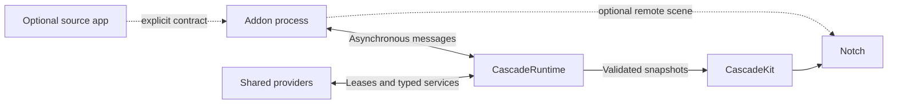

# Cascade: architecture for the SDK, addons and runtime

Date: 9 September 2026. Status: architecture approved in the conversation; execution plan requested. The API names and the numeric budgets remain proposals to be verified during implementation. This document declares no implementation phase completed.

Execution plan: [implementation of the addon system](../plans/2026-09-09-addon-runtime.md). This revision incorporates the WidgetKit-inspired model, the two SwiftUI modes and the obligation to use the system for the widgets developed by the Cascade team as well.

**Change approved on 10 September:** the [updated control boundary](2026-09-10-addon-control-policy.md) accepts the risk of work delegated autonomously to macOS. This decision prevails over the original requests for total containment; control of managed processes, permissions and all the other guarantees remain binding.

## 1. Confirmed requirement

An addon must be able to work with the source app closed and, if self-sufficient, even without the source app installed. Cascade must be open: there is no need for a general service that keeps addons running after it closes.

The addon includes the code, libraries and resources its own autonomous functions need. Any external dependencies are declared and verified. The presence of the source app can enable other functions, without becoming an implicit dependency of the whole addon.

CPU, memory, wakeups, graphics work and traffic must be part of the contract. The runtime must be able to deny work, revoke resources and isolate faults. A developer's declaration does not constitute a technical limit.

Assumptions kept from the project: macOS 14 as the app's minimum, Swift as the initial SDK, direct distribution as the candidate, native interface. The external format and the actual support of the various macOS versions require the proofs listed below. The deployment target is not raised implicitly.

### Mandatory parity for Cascade widgets

All future widgets, notices and activities developed by the team use the same SDK, manifest, REQUIRES, content/action model, catalog, lifecycle and resource control as external addons. Being built into the product changes the distribution channel; it does not grant alternative access to the engine or exemptions from quotas. Custom code follows the same isolation policy.

Native renderers and system adapters remain host services: they are shared infrastructure, not a second SDK reserved for our widgets. A team widget obtains a service through the same broker and the same grants as an external addon. Preconfigured grants for services distributed with Cascade must be explicit and revocable, with no authorization bypass.

The existing modules are a migration bounded by the plan, not a precedent for new exceptions. Clock is the first case; power, volume, Bluetooth and media follow. The new system is not ready for v1 until the team has used the public contracts in these cases and in a standalone addon compiled outside the host.

## 2. Where we are today

The analysis covers the working tree of 9 September, including changes and files not yet committed. The MCP graph does not contain this project; after querying it, the verification continued on the sources.

| Area | Current evidence | Assessment |
| --- | --- | --- |
| Separate library | `CascadeKit/Package.swift`: one product, one target, macOS 14, tools 6.2, language mode Swift 5, default MainActor isolation | Real internal boundary; not yet a versioned external SDK |
| Widgets | `NotchWidget`, `WidgetContext`, `WidgetHost` | Identity, grid, SwiftUI factory, activation and suspension; direct calls in the same process |
| Activities and notices | `NotchActivity`, `NotchLiveActivity`, `NotchTransientNotice`, `LiveActivityHost` | Distinct contracts, revisions, privacy, expirations, arbitration and revocable contexts |
| Presentation limits | Sessions up to 8 hours, notices up to 10 seconds, notice backlog limited to 8, up to two compact sources | Some policies already enforced by the code |
| Integrations | `CascadeServices`, monitor protocols, `NowPlayingProviding` | Sources separate from the views, but built and wired manually in the app |
| Updates | Several monitors use `AsyncStream` with a bounded buffer | Good local solutions; a uniform policy for third parties is missing |
| External addons | No manifest, catalog, resolver or external transport in the paths examined | To be implemented |
| Per-addon resources | No supervisor with CPU/memory quotas and process management | To be implemented |
| Distribution | Earlier research on ExtensionKit and binaries; tickets 05, 06, 16, 19 open | Feasibility studied, integrated proof missing |

Verification run: `swift test --filter 'LiveActivityHostTests|NotchActivityLifetimeTests'`, with Xcode beta and temporary cache/scratch. **26 tests in 2 suites passed**. It is not a verification of the whole app, of external addons or of resource consumption. Session log: `/private/tmp/cascade-addon-audit-tests.log`.

### Concrete gaps not to inherit into the SDK

- `AnyView` and `@MainActor` are a local contract, not an IPC format. An addon called directly can block Cascade.
- `suspend()` is cooperative and also has an empty default implementation. It does not forcibly interrupt timers, tasks or allocations.
- `WidgetContext` keeps a callback without revocation: removing it from the host's table does not make a copy retained by the widget inert. `LiveActivityContext` already has an explicit revocation.
- A widget invalidation triggers the page rebuild path; a per-widget revision that limits the work to the changed content is missing.
- Persistent activities are kept in an array with no admission quota per producer. The time limits do not limit the number of new sessions.
- The IDs and `sourceID` declared by the code are not authenticated identities. The future gateway must assign namespaces before calling the engine.
- `CODE_STYLE.md` also describes goals not yet implemented, such as work assigned by the context and measurement/eviction of the widget. The documentation does not prove the mechanism exists.

Conclusion: we have a presentation engine and usable internal contracts; the platform of independent addons still has to be built. A completion percentage would be arbitrary without fixing the v1 criteria.

## 3. Self-sufficiency of the binary

The proposed model is this; `FocusCore` is only an example, not existing code:

```text
                    FocusCore (the app's library, without UI)
                         /                     \
                 Complete Focus app       Focus addon for Cascade
                                          + Cascade adapter
                                          + required resources
```

The shared code can be linked statically, or distributed as a private library inside the addon's signed package. The addon does not look for frameworks inside the source app's installation and does not load its executable.

This makes sense if the function has all its inputs: a timer can be autonomous; a client of a remote service can be so after authentication; a command to a specific player requires that player. Including code does not automatically include credentials, the user's database, licenses, remote services or access to protected files.

The addon keeps its own data space and an authentication path when needed. If app and addon share data, they use an explicit contract, with permissions and migrations; they do not read the app's private paths assuming it exists. Any App Groups/Keychain sharing must be verified for signing and distribution and not assumed usable across different developers.

App and addon can include two copies of the shared code: we accept this disk cost for independence and updates. At run time only what is needed is launched; we do not create a resident shared service for each library.

## 4. Alternatives and approved choice

| Model | Advantage | Limit |
| --- | --- | --- |
| SwiftUI bundle loaded inside Cascade | Free-form UI and direct calls | A hang or crash affects the host; no safe eviction of the single module |
| Separate process with declarative data | Predictable UI, rendering governed by Cascade, measurable surface | Components and layout limited to the SDK's vocabulary |
| Separate process with ExtensionKit remote UI | The developer can write their own SwiftUI UI | More memory, GPU and complexity; compatibility, lifecycle and stop must be proven |

**Choice: native runtime, declarative presentations kept by the host, addon code in separate on-demand processes and remote SwiftUI UI as an additional verified capability.** The compact wings, the notices and the common elements use Cascade components; an expanded surface can request a remote scene. The provider's process must not stay alive only because its content is visible. We do not load custom addon code into Cascade's graphics process.

This keeps a path for custom SwiftUI without imposing its cost on every addon. The host process keeps the renderers and the common operations controlled by Cascade. A team addon cannot bypass this boundary by using a private in-process factory; in-process executors of addon code are allowed only as stand-ins in tests.

We do not introduce WebAssembly, JavaScriptCore or a general interpreter. We do not embed other apps' WidgetKit widgets in the notch: we take up the model of occasional content production and independent rendering, implementing our own contracts with public APIs.

ExtensionKit supports extension UI in a host through a distinct process. It does not make `AnyView` serializable. The project has already documented that several new extension point definition APIs require macOS 26: on the 14 minimum the legacy path and an actual verification are needed. [Apple: ExtensionKit](https://developer.apple.com/documentation/extensionkit), [extension support](https://developer.apple.com/documentation/extensionfoundation/adding-support-for-app-extensions-to-your-app).

## 5. Library and runtime boundaries

These are proposed logical modules. They can start as SwiftPM targets in the same repository: they do not require six projects or six processes.

| Module | Contains | Allowed dependencies |
| --- | --- | --- |
| `CascadeContracts` | Identity, manifest, versions, requirements, messages, snapshots, errors | `Sendable`, serializable values; no graphics engine |
| `CascadeAddonSDK` | Async facade for addons, publishers, commands, storage, leases | Contracts and transport adapters |
| `CascadePresentation` | Declarative models and authorized SwiftUI components | Contracts; SwiftUI only where needed |
| `CascadeTransport` | Connections, peer authentication, codecs, envelopes, interruptions | Contracts and native IPC APIs |
| `CascadeRuntime` | Catalog, resolver, scheduler, broker, quotas, supervision | Contracts/Transport; independent of windows and geometry |
| `CascadeKit` | Panel, layout, animations, rendering, adaptation of presentations | Contracts/Presentation; no references to the provider apps |
| Cascade app | Preferences, installation/enabling and composition of the modules | Runtime and CascadeKit |

The developer SDK must not import the notch engine or drag in Bluetooth/audio monitors. The processing interfaces are async and not globally isolated to the MainActor. Only the graphics adapter is. The migration to stricter concurrency checks happens per target, without blindly changing the language mode of the whole project.



## 6. Public contracts

Each addon is an identified package, not a single view. It can provide several widgets, activities, notices or services without UI, sharing a process when they belong to the same addon and trust domain. Addons from different publishers do not share a process.

| Proposed contract | Responsibility |
| --- | --- |
| `AddonDescriptor` | Identity, compatibility, entry point, functions and static requests |
| `AddonSession` | Session negotiated with Cascade, epoch, budget and revocable contexts |
| `AddonLifecycle` | Launch, checkpoint, idempotent stop and stop reasons |
| `ServiceProvider` / `ServiceClient` | Typed, versioned services obtained through the broker |
| `ActivityPublisher` | Creation, revision and conclusion of finite sessions |
| `NoticePublisher` | Short event distinct from the update of the same event |
| `WidgetPublisher` | Snapshot of the single instance and supported actions |
| `PresentationSession` | Visibility/family, dimensions, privacy and graphics context |
| `ActionHandler` | Typed intents, cancellation, result or error |
| `ResourceLease` | Temporary, revocable right to work, a subscription or an asset |

The transport carries values, never closures, pointers or Swift UI objects. The Swift facade uses strong types; the IPC uses explicit schemas. It is not assumed that `Codable` is automatically an XPC protocol: the codec and the adapter must be implemented and verified.

Minimum errors: `missingRequirement`, `versionConflict`, `permissionDenied`, `dependencyUnavailable`, `resolutionTooComplex`, `resourceDenied`, `rateLimited`, `deadlineExceeded`, `sessionRevoked`, `invalidPayload`, `outcomeUnknown`. The details include the function involved and an understandable remedy; not strings to be interpreted in code.

The table's names indicate responsibilities, not protocols to be created all separately. P1 makes these responsibilities concrete in AddonManifest, AddonProvider, ProviderOutput, Publication and service clients; the execution plan's vocabulary is the reference for the proposed signatures. The results of actions/service calls are correlated to the request and distinct from state publications.

## 7. Manifest and REQUIRES semantics

The manifest is a declarative document validated before execution. JSON is the initial proposal, to use native tools and a shared schema; the names below are a draft API. No shell, executable expression or install script.

### Three different things

1. **Bundled libraries:** resolved at the developer's build time; listed as the package inventory. They do not launch processes and do not enter the runtime resolver.
2. **Runtime services:** a capability published by Cascade or by an enabled addon. `REQUIRES` specifies contract/version; the broker connects an authorized provider.
3. **Conditions:** system version, protocol, presence or execution of an app, permissions. These enable or block a function; they do not install or open apps implicitly.

### Self-sufficient example

```json
{
  "manifestVersion": 1,
  "id": "com.example.focus.cascade",
  "version": "1.0.0",
  "compatibility": {
    "macOS": ">=14.0",
    "cascadeProtocol": { "major": 1, "minimumMinor": 0 }
  },
  "execution": {
    "owner": "cascade",
    "activation": "onDemand",
    "entryPoint": "provider"
  },
  "sourceApp": {
    "bundleID": "com.example.focus",
    "required": false
  },
  "bundledLibraries": [
    { "name": "FocusCore", "version": "1.3.0" }
  ],
  "REQUIRES": [
    { "kind": "hostCapability", "id": "cascade.activities", "version": ">=1.0.0 <2.0.0" },
    { "kind": "hostCapability", "id": "cascade.scheduler", "version": ">=1.0.0 <2.0.0" }
  ],
  "PROVIDES": [
    { "kind": "service", "id": "com.example.focus.sessions", "version": "1.0.0" }
  ],
  "features": [
    { "id": "localTimer", "REQUIRES": [] },
    {
      "id": "openInSourceApp",
      "REQUIRES": [
        { "kind": "application", "bundleID": "com.example.focus", "state": "installed" }
      ]
    }
  ],
  "permissions": [
    { "id": "storage.own", "scope": "addon" }
  ],
  "resources": {
    "profile": "eventDriven",
    "requestedMemoryMiB": 64,
    "maximumConcurrentWork": 1,
    "background": "scheduledDeadline"
  }
}
```

The timer uses the `FocusCore` included in the package and a runtime deadline. The absence of the app disables only `openInSourceApp`. App installed does not mean app open: an integration can declare `state: running` and become unavailable when the app closes, while an explicit user action can open the installed app.

A second addon can require `com.example.focus.sessions` as a service: it does not inherit Focus's binary or permissions. It requires an interface and obtains a limited handle. The data exposed by the service in turn require a grant to the consumer.

### Resolver rules

- The `REQUIRES` list is a conjunction: all requirements must be satisfied. Those at the root block the whole addon; those of a feature block only that feature.
- `PROVIDES` lists contracts and versions, not implementations to load. An unavailable feature cannot announce a service that depends on it.
- For explicit fallbacks a single level of `anyOf` with named alternatives is allowed. No recursive boolean language or executable conditions.
- A fallback can change the implementation, not falsify the result: without a player, "pause player" stays unavailable; without network, the cached data is marked stale.
- Package versions and contract versions are distinct. Explicit SemVer ranges; prereleases only if requested. Major/minor of the wire protocol are negotiated separately.
- Catalog of installed, verified and enabled packages only. No downloads, permission elevation or source app launch caused by the resolver.
- Deterministic choice: valid explicit user binding, then an already resolved binding that is still valid, then a compatible host provider, then a compatible candidate in the stable version/verified identity order. A publisher restriction in the requirement eliminates the candidates not allowed. The first choice among third parties with data access needs a specific grant.
- The result is saved with version, verified identity and package digest. No provider change during a session; updates produce a new atomic plan.
- A single active version per addon ID in v1. If two consumers require incompatible majors, the conflict is explained; two runtimes are not installed implicitly.
- Cycles rejected with a readable path; initial limits: 32 addons, 128 edges and depth 8 per dependency closure. Unbounded combinatorial search is avoided. The resolver runs off the MainActor and also accepts a work budget.
- Launch in topological order and release in reverse. Shared services stay active as long as a valid lease exists; if no consumer requires them, they stop.
- Disabling, removal or crash of a provider revoke the handles. Only the affected dependents are re-evaluated; the other functions continue. Waiting for a requirement does not use polling.

The "open in the app" function is not a dependency of the timer. This distinction is necessary to prevent an accessory option from making the addon unusable.

## 8. Distribution and discovery

Initial preference: a compiled and signed addon, distributed inside a container compatible with macOS extension registration. It can ship together with the full app or inside a **small container app dedicated to the addon alone**. In the second case the full source app is not installed.

This detail matters: ExtensionKit is not the same as dragging an arbitrary `.appex` into a folder. An independent distribution must still respect the packaging the system requires. Discovery and enabling happen through the supported path; the Cascade manifest is added to the platform's metadata. [Apple: building an extension](https://developer.apple.com/documentation/extensionfoundation/building-an-app-extension-to-support-a-host-app).

Two packages declaring the same addon require a single selection. The runtime prevents a standalone installation and the full app from producing duplicate activities or duplicate monitors. The signer's identity and the addon's logical identity must match the approved binding; an equal bundle ID is not enough.

A folder of `.cascadeaddon` packages with an isolated executable remains a distribution alternative to prove if the container does not meet the requirements. We do not make it a second v1 loader before demonstrating its signing, sandbox, discovery, IPC and stop.

An XPC service embedded in another app is not a generic public endpoint that Cascade can simply connect to by name. XPC is the transport; discovery and the right to launch are separate responsibilities. We do not plan persistent LaunchAgents: the requirement is Cascade open. [Apple: XPC and service types](https://developer.apple.com/documentation/xpc).

## 9. Lifecycle: independent UI and work

Addon states:

```text
discovered → disabled → resolving → ready → starting → active → stopping → ready
                            ↓                      ↓
                          blocked            failed / quarantined
```

`ready` means usable but without a process that is necessarily resident. Enabling does not mean continuous execution.

Each feature can declare one or more modes: occasional content, scheduled update, user action and continuous work. An addon can combine them. The content collection belongs to the host and has a lifetime distinct from the connection to the process: an expected exit of the provider is not the same as the end of the activity. Disabling, revocation of the publication, expiration and explicit end instead remove the content.

Cascade keeps snapshots, a bounded timeline, identifiable actions and references to the admitted assets. The process delivers these values and can terminate; a new action or an event restarts the provider if needed. The connection generation changes on restart and makes the old handles unusable, without automatically deleting a still valid publication owned by the host.

A late response from an earlier generation cannot overwrite the new state. After an unexpected crash the content's expiration and staleness policy apply, without replaying old notices. Actions that require fresh information stay unavailable until the provider revalidates them.

Three distinct lifetimes:

- **Installation:** metadata and configuration can remain on disk.
- **Work/provider:** active for a command, a needed subscription or a granted deadline, even without visible UI.
- **Presentation:** built when visible, revoked when hidden. The runtime can keep presenting a snapshot without keeping the provider alive.

Visibility: `hidden`, `compact`, `expanded`. The process receives only real transitions and input. A compact activity is visible even when the notch is not expanded: an indispensable source is not suspended by confusing the panel closing with the end of the task.

Timer example: we store expiration and state; the UI interpolates the remaining time when visible; the runtime arms a single shared deadline. The addon's process can terminate between launch and expiration. No IPC tick every second.

A process with no work can wait for messages during a short reuse window, then terminate. The window's duration is a measured policy, not a value set by the addon. Freezing with system primitives is not the v1 default behavior: any experiments require the absence of pending shared operations/resources and a measured benefit compared with IPC waiting and a new launch.

Music example: a shared subscription produces state changes; audio analysis obtains a distinct lease and only while the surface that uses it is visible. We do not duplicate the capture because two addons display the same data.

Each lease has an owner, purpose, monotonic expiration, maximum cost and generation token. Revocation or a session change also make late results inert. Leases are not renewed with periodic heartbeats: renewal requires a verifiable reason and the scheduler's approval.

An interest subscription can be owned by the host, with its own feature/session, grant, expiration and quota. It can survive the provider's expected exit to wake it on an admitted event; it does not keep a token of the old connection. The reconnection receives new tokens, while disabling or revocation also remove the interest. Likewise, the assets kept by a publication have their own revision, distinct from the process generation.

When Cascade closes: stop new admissions → revoke leases → time-bounded checkpoints → disconnection and stop of the managed processes. The stop after a host crash must depend on the platform's lifecycle or on a controlled supervisor, not only on the addon's good behavior. **This is a mandatory launcher proof**: no promise of independence from the source app's lifetime can bypass it.

Sleep, screen lock and energy saving reduce the grants. On wake, expirations and requirements are re-evaluated, without replaying old notices. Monotonic clock for operational durations; persistent timestamps and explicit rules to rebuild activities after a restart or a clock change.

## 10. IPC, updates and commands

Handshake: signed peer identity, verified addon ID, protocol versions, requested/offered capabilities, epoch and effective grants. The manifest data are compared with the signed artifact; they are not an authentication.

Full identity assigned by the runtime: `(publisher, addonID, instanceID, sessionID)`. No addon can choose another's namespace. Strictly increasing revisions per session and epoch: duplicates and old messages are discarded. A revision reset requires a new negotiated session.

Three channels with different rules:

| Channel | Delivery and limits |
| --- | --- |
| State | Full v1 snapshots, a single pending update per instance; the most recent revision wins; ack/credit prevent queue growth |
| Notices | Events with ID, TTL and quota; coalescing allowed, explicit discard when superseded or expired; no replay after disconnection |
| Commands | Request ID, deadline, cancellation and response; bounded queue; never silently dropped like a snapshot |

Arbitrary deltas are not needed in v1: they would require recovery of the missing revisions and additional complexity. A reconnection asks for a new snapshot and renews the bindings; it does not replay commands.

A transport ack does not prove that an action was completed. Repeatable commands declare idempotency and its window; non-idempotent ones are not retried automatically. If the process dies after the effect but before the response, we return `outcomeUnknown` and, when available, query the state. We do not promise generic exactly-once.

Validation and decoding off the MainActor. Limits before application parsing: size, depth, number of elements, strings and assets. No unbounded list. A process that ignores the credits loses the connection and is stopped by the verified supervision path. The application limits do not eliminate all the transport's preliminary allocations: the flooding test must measure these as well.

Images go through opaque handles assigned by the broker, with quotas on compressed bytes and decoded pixels. No arbitrary paths or repeated base64 in snapshots. Decoders off the graphics path, bounded concurrency, cache charged to the owner and release on revocation. For untrusted formats an isolated worker must be proven.

## 11. Resource contract

### What we enforce and what we measure

**Effective application limits:** number of activities, command queue, admitted updates, size of the accepted state, concurrent leases, managed storage, renderer cache and authorized assets. The broker can reject them before they generate further application work.

**Watched thresholds:** CPU, process footprint, wakeups and cost of the remote UI. They require reliable measurement and a means to stop the process; they are not guaranteed instantaneous ceilings. QoS is not a CPU quota, `Task.cancel()` does not interrupt non-cooperative code, an invalidated connection does not prove a process has exited.

We do not base the maximum-memory promise on a generic `setrlimit`: the documented CPU limit measures cumulative time and the RSS behavior is not equivalent to a hard modern memory quota. The usable APIs must be proven on the target versions. [Apple: setrlimit](https://developer.apple.com/library/archive/documentation/System/Conceptual/ManPages_iPhoneOS/man2/setrlimit.2.html).

The "strict" contract consists of up-front admission where we control the operation, isolation, observation and revocation elsewhere, plus a release gate on performance. It does not guarantee that arbitrary native code can never produce a spike before detection. If this requirement became absolute, a limited runtime/interpreter would have to be evaluated instead of free native addons: that would be a distinct product choice.

### Initial profile to measure

Values proposed for prototype and tests, **not benchmarks already obtained nor final thresholds**. The host policy can grant less than requested; the manifest cannot raise the maximums on its own.

| Resource | Initial proposal | Reaction |
| --- | --- | --- |
| Enabled addon with no demand | No addon process needed; no addon timer | Keep only metadata and bounded snapshots |
| Wire snapshot | 64 KiB; depth 8; 128 nodes; single string 4 KiB | Rejection before deep application parsing |
| Envelopes and results | 512 KiB total; at most 16 publications and 16 operations; action input 4 KiB, checkpoint 64 KiB | Rejection both by count and by bytes; assets transferred separately |
| Timelines and host state | 32 entries / 256 KiB per instance; 8 MiB global of kept state | Admission before retention; assets and disk have distinct quotas |
| Pending snapshots | 1 per instance; at most 16 declared instances per addon | Replace superseded state within the quota |
| Data updates | 2/s compact, 10/s expanded, burst up to 4 per instance | Coalescing; aggregate limit 20/s per addon and 40/s global |
| Activities | 4 admitted sessions per addon, 16 global | Reasoned rejection; priority assigned by the host |
| Notices | Global backlog 8, maximum duration 10 s, burst 3 per addon in 10 s | Explicit discard/coalescing |
| Work and commands | 1 heavy job per addon, 2 global; 4 pending commands per addon | Bounded wait or `resourceDenied` |
| Event-driven addon CPU | Shared addon credit: capacity 100 ms CPU, refill 5 ms/s; kept across jobs and provider restarts | Reduced grants; revocation for repeated violations |
| Event-driven provider memory | Internal profile: moderate above 64 MiB; severe above 96 MiB observed | Pause new admissions per episode; severe stop request, separate native qualification |
| Remote UI | Total addon footprint target 128 MiB; candidate threshold 192 MiB | Revoke the scene; if needed stop the addon |
| Processes and aggregate memory | 3 active providers at most; 1 remote scene; 256 MiB as admission budget | New work waits or is rejected |
| Renderer assets | 8 MiB per addon, 32 MiB global; 1 MiB compressed and 1 megapixel per image | Controlled downsample or rejection |
| Managed storage | 10 MiB state/configuration and 20 MiB cache per addon, 100 MiB global | Atomic write rejected or cache evicted |
| Latency | Action ack 100 ms, ordinary response 2 s, cold launch 2 s, cooperative stop 500 ms | Placeholder, timeout; no UI wait |
| Cascade MainActor | Addon work introduced by the adapter p95 <1 ms and p99 <2 ms on the reference device | Performance test blocking the release |

CPU means the process's user+system time, not a percentage of the whole machine. The 5 ms/s refill corresponds to 0.5% of a single core over the long run, with a maximum credit of 100 ms. The [decision of 20 September](../../../.scratch/cascade-product/issues/46-addon-cpu-burst-policy.md) replaces the earlier rigid sliding window and the per-job burst; the host keeps the account across jobs and provider restarts. It is not the profile for remote SwiftUI UI or continuous audio analysis: these require separate, visible-only profiles, measured before public admission. Until then they get no generic exemption.

The global budget counts processes only once, runtime, broker, assets and attributable delegated cost. A remote UI and its provider share the addon's budget: the 128 MiB are not a free addition to the 64. Shared services are measured once in the total; the work caused by consumers is also attributed to them to prevent them from offloading costs outside their own quota. The [conservative choice of 22 September](../../../.scratch/cascade-product/issues/55-addon-delegated-cpu-attribution.md) attributes the whole measured interval to each canonical consumer active in that interval, once per consumer and physical process; repeated interests do not multiply the same charge. It is not a precise per-request measure and can penalize a consumer for others' work. The [approved propagation along chains](../../../.scratch/cascade-product/issues/57-addon-transitive-cpu-attribution.md) includes the ancestors through simultaneously active canonical interests; multiple paths do not multiply the same charge and edges active at disjoint times do not create a chain. The observed thresholds can temporarily exceed the admission budget: the latter is an up-front decision, not a limit enforced by the kernel.

The [choice on observed memory](../../../.scratch/cascade-product/issues/64-addon-memory-attribution.md) instead assigns the RAM footprint only to the verified owner of the physical
process: it is not attributed to direct or transitive consumers of a shared service.
The subsequent [decision on the provider profile](../../../.scratch/cascade-product/issues/65-addon-provider-memory-policy.md) approves 64/96 MiB and the episodes described below for the internal runtime. The UI budget stays shared with the provider, as above: total target 128 MiB and candidate threshold 192 MiB. Calibration, episodes, recovery and actions of the UI profile require the planned measurements before they are defined; native measurement and stop remain prerequisites.

### Observation without creating an energy problem

No monitoring timer per addon. A single supervisor performs grouped sampling while there are active processes, initially at most once per second, in addition to measurements on job start/end and pressure events. When there are no addon processes, sampling stops. Supervisor cost included in the benchmark.

This introduces a detection interval: a CPU/RAM threshold cannot be described as instantaneous. Pressure events can bring the revocation forward. An unreadable metric or an unstoppable process prevents enabling that profile, instead of simulating a guarantee.

### Violations and recovery

Rate limit: immediate coalescing/rejection. Measured moderate overrun: reduction of the grants and release request. Three violations in five minutes: quarantine for that version, explicitly re-enableable. For event-driven CPU, the [decision on counting](../../../.scratch/cascade-product/issues/49-addon-cpu-violation-counting.md) counts at most one violation per addon and common round when new consumption beyond the available credit is measured: residual debt alone does not count, nor do several processes in the same round multiply the incidents. The [reduction approved on 21 September](../../../.scratch/cascade-product/issues/52-addon-cpu-reduced-admission.md) immediately rejects new event-driven jobs until a complete and reliable sample shows strictly positive credit; it does not require restoring all 100 ms. No new queue or automatic replay. Missing data/errors do not reopen, and the jobs already admitted keep their own deadlines. Stop threshold exceeded, flooding or crash: session closed and verified stop of the managed process, without blocking the notch.

For event-driven provider RAM, the [progressive profile approved on 23 September](../../../.scratch/cascade-product/issues/65-addon-provider-memory-policy.md) counts a moderate episode when a current physical measurement exceeds 64 MiB, up to 96 MiB inclusive. It closes new admissions of that owner only; a valid sample at 64 MiB or less closes the episode and removes only the RAM block. Staying above the threshold, a missing measurement and wake do not multiply incidents. A new verified process can produce a new episode, without resetting the per-version history. Above 96 MiB the expected-stop request prevails, without also counting a moderate in the same round or generating a crash retry. CPU and RAM have independent blocks and share the health history: at most one moderate per owner/round even if both register one. Quarantine not removed by recovery. No simulated cache release or new message to the provider: the first moderate intervention is rejecting new jobs; those already admitted keep their own deadlines. The physical reservations remain until the observed exit and the launcher stays blocked.

For transient crashes: retries at most after 1, 5 and 30 seconds, only if a valid demand remains; then quarantine. Retrying does not continue for hours. Sleep and stop cancel the retries. The technical ability to terminate a system extension must be demonstrated by the launcher; otherwise that path does not satisfy this proposal.

## 12. Permissions and trust boundaries

Declared permissions and effective grants are different. Capabilities, system APIs, entitlements, TCC and user consent intersect: the manifest does not bypass macOS.

The broker offers targeted APIs: read authorized audio state, execute a specific command, read selected files, make authorized network requests, access its own storage. It does not offer a universal proxy to the shell, the filesystem or Cascade's private APIs.

The signature is verified at installation, at binding and at connection through the peer identity provided by the system; not through a PID or a self-declared Team ID. Handles have scope, owner and generation, and are not arbitrarily transferable to other addons.

A provider does not lend its own permissions to the consumer: the broker verifies caller, destination, operation and grant at the time of the request. Third-party services do not receive files or data of other addons just because they satisfy `REQUIRES`.

Network/storage quotas are binding only for operations that pass through the broker and for accesses actually forbidden by the sandbox. A direct network entitlement does not become a domain whitelist thanks to the JSON. The standard profile must forbid the direct accesses it promises to govern; if packaging/entitlements do not allow it, the guarantee is explicitly reduced or the profile is rejected. "Signed" is not confused with "isolated".

Revocation of a permission: cancellation of the affected operations, invalidation of the leases and update of the feature's availability. The other autonomous functions stay active if safe.

Privacy: sensitive state is classified before rendering; text, accessibility, URLs and assets follow the same redaction. Commands are explicit intents; links are validated and require the user's action to open the source app. Logs without sensitive content, with bounded size and lifetime.

## 13. Rendering and perceived performance

### Two SwiftUI modes in the same addon

The ordinary mode uses a Swift builder from our SDK with components such as row, symbol, text, progress, countdown and button with an identified action. The builder produces a bounded serializable description; Cascade's renderer realizes it with real SwiftUI views. It does not serialize `AnyView`, `Button` closures or an arbitrary SwiftUI view. Preview and runtime must use the same renderer and the same limits.

The advanced mode uses a SwiftUI scene in the extension, hosted through ExtensionKit. The scene is acquired only for an admitted visible surface and released when not needed; any continuous work uses a separate lease. When the scene is absent the ordinary presentation or a bounded waiting state is shown. There is no promise to keep the scene's full behavior after its process ends.

A timeline is a finite list of presentations with dates and expiration: v1 limits it to 32 entries and 256 KiB per instance, counting all the bytes in the global host state budget. Countdown and clock are host time components and do not require 32 entries per minute. Actions and services remain typed messages; a photographic snapshot of the view does not replace accessibility and interactions.

The notch animates geometry and snapshots already validated. No remote call in the display link callback, no addon getter in the animation loop, no decoding on the MainActor. A slow addon shows the previous valid state or a placeholder.

The v1 declarative presentation offers text, symbol, bounded image, progress, deadline-based timer, status indicator and typed actions. A publication can contain the representations required by its family (widget, activity, notice), under the same identity and revision; distinct sessions are not created for the compact side and the extended view. Maximum depth/layout are part of the schema. It does not introduce HTML/JavaScript, arbitrary shaders or ungoverned continuous animations.

The migration verifies the existing visual sequences: if a public imageSequence component is needed, P3 limits its duration, frames, dimensions, visibility and total cost, also updating schema and tests. It grants neither arbitrary animations nor a factory reserved for the team's widget.

A remote scene is created only for an admitted and visible surface. For the expansion we can animate the container immediately and embed the content when ready: hover responsiveness does not depend on the process starting. Focus, menus, resize, transparency and accessibility are necessary proofs, not details deferred to the end.

Reduce Motion removes non-essential interpolations; Reduce Transparency and VoiceOver respect the existing contracts. The rendering of a timer's state can advance locally without new revisions from the provider.

## 14. Persistence, update and removal

Separate persistent configuration, ephemeral snapshot and evictable cache. Atomic writes, quotas before commit, versioned schema. Checkpoints on significant changes and on stop, not on every frame. The activity is not reactivated after a crash only because an old snapshot exists: it must still turn out to be valid.

Update: verify artifact and schema, resolve the whole plan, show any newly requested permissions, stop the old version, migrate a copy of the state and activate the new one. Keep the old artifact and old state until the outcome; do not promise rollback after a destructive migration without a compatible copy.

If the container is updated by an external mechanism and the old version is no longer available, Cascade can safely disable and keep the data; it cannot promise to restore a binary it does not own.

Removal: first revocation and re-evaluation of the dependents, then deletion of the managed package. User data deleted only through an explicit choice; cache always rebuildable. If the full app that physically contained the extension disappears, that copy of the addon disappears too: surviving uninstallation needs the standalone distribution, not just self-sufficient code.

## 15. Implementation path and completion criteria

These are verifiable phases and gates, not calendar estimates or an approved implementation plan.

### Phase 0: prove the execution boundary

Separate prototype with a test Cascade host and a self-sufficient timer addon in a minimal container. Verify macOS 14/15/26 according to availability, signing by different publishers when possible, discovery, enabling, async IPC, metrics reading and halting after stop, host crash and non-cooperative addon. Remote UI as a separate proof of the same transport.

Exit: reproducible evidence. If an OS version or a second signing identity is not available, the case stays unverified and is not declared supported. If the launcher does not allow sufficient control, we revise the launcher or the OS support before freezing the SDK.

### Phase 1: freeze the v0.1 contract

Manifest schema, identity, versions, snapshots, errors and host policy. Pure, deterministic resolver. Tests for cycles, conflicts, missing dependencies, per-feature optionals, persisted bindings and graph limits. SDK package compilable from an external project without importing the engine.

### Phase 2: runtime and broker

Leases, scheduler, credits, finite queues, global admission, storage and supervisor. Payload fuzzing, flooding, timeouts, late results, revocation, termination and bounded retries. No synchronous path to addons on the MainActor.

### Phase 3: rendering and adaptation of the existing code

Adapt `NotchWidget` and activities to runtime identity and snapshots. Unify revocation and per-widget invalidation. Gradually move the orchestration from `CascadeServices` to the runtime, keeping the engine's verified contracts and behaviors. Migrate a simple provider before audio/Bluetooth.

The migration uses the same SDK distributed to external developers. Creating new widgets directly against `NotchEngine`, `WidgetHost` or `NotchController` is forbidden. A dependency check and parity proofs between built-in and standalone addons make this rule verifiable.

### Phase 4: external developer and distribution

Addon template, manifest validator, test host, two independent examples: timer without source app and an addon that consumes its service via `REQUIRES`. Standalone installation, update, removal, collision with a built-in copy and explained permissions. Signing/wire protocol compatibility with old SDK and new host.

### Phase 5: measured budgets and v1 release

Thresholds calibrated on reference machines, AC power/battery, 60/120 Hz, visible/hidden activity, sleep/wake and memory pressure. Record build, OS, hardware, duration, baseline, p95/p99, footprint of all processes, CPU and wakeups. Diagnostic profiling must not falsify the release measurement.

Minimum acceptance matrix:

1. Source app absent, its cache and data unavailable: the standalone addon runs all the functions declared autonomous.
2. App installed but closed: no implicit launch; the explicit open command works.
3. Cascade closed normally or terminated abruptly: no managed addon work stays resident beyond the launcher's declared and verified limit.
4. 100 addons installed but inactive: no process per addon, no polling proportional to the installed ones.
5. Twenty simultaneous requests: concurrency, reserved memory and queues stay within limits; correct rejection reasons.
6. Two consumers of the same service: one shared source, release at the last lease; no doubling of the capture.
7. Dependency crash/revocation: dependent features degrade, autonomous functions and the notch stay usable.
8. CPU loop, RAM growth, flooding, deep/oversize payload and hostile decoder: no host hang; detection/stop measured with the documented residual limits.
9. One hundred open/close cycles: no monotonic growth of retained resources, no invalidation through a revoked context.
10. Incompatible update or failed migration: old version restored when available, otherwise addon disabled with data kept.
11. No heartbeat or polling by the addon at rest; cost of the supervisor alone measured when needed.
12. Remote UI: crash, focus, input, accessibility and resource consumption verified before offering this capability publicly.

## 16. Approved decisions and proofs still needed

Approved: autonomy from the source app with Cascade open; native system; ordinary content kept by the host; component-based Swift SDK with a SwiftUI renderer; advanced remote SwiftUI scenes; on-demand processes for custom code; shared services and per-feature REQUIRES; the same platform for the team's widgets and external ones; application limits and process supervision.

Still to be demonstrated: packaging and launcher on the target versions; signing and communication between distinct publishers; stop even after a host crash; metrics APIs actually available; behavior of remote scenes in the panel; measured thresholds and reuse window. An unverified case does not become supported by declaration and does not require reopening the product choices already approved. If a proof invalidates an approved constraint, the result and the concrete change needed are presented.

The [execution plan](../plans/2026-09-09-addon-runtime.md) orders these proofs before the production dependencies, includes the migration of the team's widgets and keeps all implementation tasks as not completed.

## Project references

- [Existing activity contracts](../../architecture/live-activity-contracts.md)
- [SwiftUI and extensions research](../../wayfinder/research/swiftui-extensions.md)
- [NotchWidget](../../../CascadeKit/Sources/CascadeKit/Core/Widgets/NotchWidget.swift)
- [WidgetContext](../../../CascadeKit/Sources/CascadeKit/Core/Widgets/WidgetContext.swift)
- [WidgetHost](../../../CascadeKit/Sources/CascadeKit/Core/Widgets/WidgetHost.swift)
- [LiveActivityHost](../../../CascadeKit/Sources/CascadeKit/Core/Activities/LiveActivityHost.swift)
- [CascadeServices](../../../Cascade/CascadeServices.swift)
- [Package](../../../CascadeKit/Package.swift)
