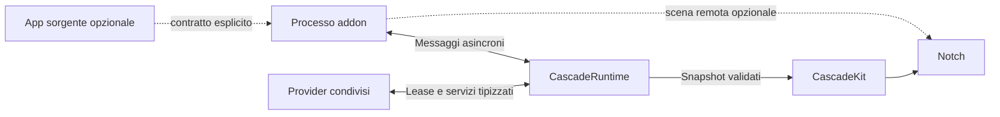

# Cascade — architettura per SDK, addon e runtime

Data: 9 settembre 2026. Stato: architettura approvata nella conversazione; piano esecutivo richiesto. I nomi delle API e i budget numerici restano proposte da verificare durante l'implementazione. Nessuna fase implementativa è dichiarata completata da questo documento.

Piano esecutivo: [implementazione del sistema addon](../plans/2026-09-09-addon-runtime.md). Questa revisione incorpora il modello ispirato a WidgetKit, le due modalità SwiftUI e l'obbligo di usare il sistema anche per i widget sviluppati dal team Cascade.

**Modifica approvata il 10 settembre:** il [confine di controllo aggiornato](2026-09-10-addon-control-policy.md) accetta il rischio del lavoro autonomamente delegato a macOS. Questa decisione prevale sulle richieste originarie di contenimento totale; restano vincolanti controllo dei processi gestiti, permessi e tutte le altre garanzie.

## 1. Requisito confermato

Un addon deve poter funzionare con l'app sorgente chiusa e, se autosufficiente, anche senza l'app sorgente installata. Cascade deve essere aperta: non serve un servizio generale che mantenga gli addon in esecuzione dopo la sua chiusura.

L'addon include il codice, le librerie e le risorse necessarie alle proprie funzioni autonome. Le eventuali dipendenze esterne vengono dichiarate e verificate. La presenza dell'app sorgente può abilitare altre funzioni, senza diventare una dipendenza implicita di tutto l'addon.

CPU, memoria, risvegli, lavoro grafico e traffico devono essere parte del contratto. Il runtime deve poter negare lavoro, revocare risorse e isolare guasti. Una dichiarazione dello sviluppatore non costituisce un limite tecnico.

Assunzioni conservate dal progetto: macOS 14 come minimo dell'app, Swift come SDK iniziale, distribuzione diretta candidata, interfaccia nativa. Il formato esterno e il supporto effettivo dei diversi macOS richiedono le prove indicate sotto. Non si alza implicitamente il deployment target.

### Parità obbligatoria per i widget Cascade

Tutti i futuri widget, avvisi e attività sviluppati dal team usano lo stesso SDK, manifest, REQUIRES, modello di contenuti/azioni, catalogo, lifecycle e controllo delle risorse degli addon esterni. L'origine incorporata nel prodotto cambia il canale di distribuzione, non concede un accesso alternativo al motore o esenzioni dalle quote. Il codice personalizzato segue la stessa politica di isolamento.

I renderer nativi e gli adapter di sistema rimangono servizi dell'host: sono infrastruttura condivisa, non un secondo SDK riservato ai nostri widget. Un widget del team ottiene un servizio tramite lo stesso broker e le stesse concessioni di un addon esterno. Le concessioni preconfigurate per servizi distribuiti con Cascade devono essere esplicite e revocabili, senza bypass dell'autorizzazione.

I moduli esistenti sono una migrazione delimitata dal piano, non un precedente per nuove eccezioni. Clock è il primo caso; alimentazione, volume, Bluetooth e media seguono. Il nuovo sistema non è pronto per la v1 finché il team non ha usato i contratti pubblici in questi casi e in un addon standalone compilato fuori dall'host.

## 2. Dove siamo oggi

L'analisi riguarda il working tree del 9 settembre, comprese modifiche e file non ancora committati. Il grafo MCP non contiene questo progetto; dopo averlo interrogato, la verifica è proseguita sui sorgenti.

| Area | Evidenza attuale | Valutazione |
| --- | --- | --- |
| Libreria separata | `CascadeKit/Package.swift`: un prodotto, un target, macOS 14, tools 6.2, language mode Swift 5, isolamento predefinito MainActor | Confine interno reale; non ancora SDK esterno versionato |
| Widget | `NotchWidget`, `WidgetContext`, `WidgetHost` | Identità, griglia, factory SwiftUI, attivazione e sospensione; chiamate dirette nello stesso processo |
| Attività e avvisi | `NotchActivity`, `NotchLiveActivity`, `NotchTransientNotice`, `LiveActivityHost` | Contratti distinti, revisioni, privacy, scadenze, arbitraggio e contesti revocabili |
| Limiti di presentazione | Sessioni fino a 8 ore, avvisi fino a 10 secondi, backlog avvisi limitato a 8, fino a due sorgenti compatte | Alcune politiche già applicate dal codice |
| Integrazioni | `CascadeServices`, protocolli dei monitor, `NowPlayingProviding` | Fonti separate dalle viste, ma costruite e collegate manualmente nell'app |
| Aggiornamenti | Diversi monitor usano `AsyncStream` con buffer limitato | Buone soluzioni locali; manca una policy uniforme per terze parti |
| Addon esterni | Nessun manifest, catalogo, resolver o trasporto esterno nei percorsi esaminati | Da implementare |
| Risorse per addon | Nessun supervisore con quote CPU/memoria e gestione dei processi | Da implementare |
| Distribuzione | Ricerca precedente su ExtensionKit e binari; ticket 05, 06, 16, 19 aperti | Fattibilità studiata, prova integrata mancante |

Verifica eseguita: `swift test --filter 'LiveActivityHostTests|NotchActivityLifetimeTests'`, con Xcode beta e cache/scratch temporanei. **26 test in 2 suite superati**. Non è una verifica dell'intera app, di addon esterni o dei consumi. Log della sessione: `/private/tmp/cascade-addon-audit-tests.log`.

### Lacune concrete da non ereditare nell'SDK

- `AnyView` e `@MainActor` sono un contratto locale, non un formato IPC. Un addon chiamato direttamente può bloccare Cascade.
- `suspend()` è cooperativo e ha anche un'implementazione predefinita vuota. Non interrompe forzatamente timer, task o allocazioni.
- `WidgetContext` conserva una callback senza revoca: rimuoverlo dalla tabella dell'host non rende inerte una copia trattenuta dal widget. `LiveActivityContext` ha già una revoca esplicita.
- Un'invalidazione widget richiama il percorso di ricostruzione della pagina; manca una revisione per widget che limiti il lavoro al contenuto cambiato.
- Le attività persistenti sono conservate in un array senza quota d'ammissione per produttore. I limiti temporali non limitano il numero di nuove sessioni.
- Gli ID e `sourceID` dichiarati dal codice non sono identità autenticate. Il futuro gateway deve assegnare namespace prima di chiamare il motore.
- `CODE_STYLE.md` descrive anche obiettivi non ancora implementati, come lavoro assegnato dal contesto e misurazione/espulsione del widget. La documentazione non prova l'esistenza del meccanismo.

Conclusione: abbiamo un motore di presentazione e contratti interni utilizzabili; la piattaforma di addon indipendenti deve ancora essere costruita. Una percentuale di completamento sarebbe arbitraria senza fissare i criteri della v1.

## 3. Autosufficienza del binario

Il modello proposto è questo; `FocusCore` è solo un esempio, non codice esistente:

```text
                    FocusCore (libreria senza UI dell'app)
                         /                     \
                 App Focus completa       Addon Focus per Cascade
                                          + adapter Cascade
                                          + risorse necessarie
```

Il codice condiviso può essere collegato staticamente, oppure distribuito come libreria privata dentro il pacchetto firmato dell'addon. L'addon non cerca framework dentro l'installazione dell'app sorgente e non ne carica l'eseguibile.

Questo è sensato se la funzione ha tutti i suoi input: un timer può essere autonomo; un client di un servizio remoto può esserlo dopo autenticazione; un comando a un player specifico richiede quel player. Includere codice non include automaticamente credenziali, database dell'utente, licenze, servizi remoti o accesso a file protetti.

L'addon mantiene un proprio spazio dati e un percorso di autenticazione quando necessario. Se app e addon condividono dati, usano un contratto esplicito, con permessi e migrazioni; non leggono percorsi privati dell'app presumendo che esista. Eventuali App Groups/Keychain sharing vanno verificati per firma e distribuzione e non assunti utilizzabili tra sviluppatori diversi.

App e addon possono includere due copie del codice condiviso: accettiamo questo costo su disco per indipendenza e aggiornamenti. In esecuzione si avvia soltanto ciò che serve; non creiamo un servizio condiviso residente per ogni libreria.

## 4. Alternative e scelta approvata

| Modello | Vantaggio | Limite |
| --- | --- | --- |
| Bundle SwiftUI caricato dentro Cascade | UI libera e chiamate dirette | Un blocco o crash coinvolge l'host; nessuna espulsione sicura del singolo modulo |
| Processo separato con dati dichiarativi | UI prevedibile, rendering governato da Cascade, superficie misurabile | Componenti e layout limitati al vocabolario dell'SDK |
| Processo separato con UI remota ExtensionKit | Lo sviluppatore può scrivere UI SwiftUI propria | Più memoria, GPU e complessità; compatibilità, lifecycle e arresto devono essere provati |

**Scelta: runtime nativo, presentazioni dichiarative conservate dall'host, codice addon in processi separati su domanda e UI SwiftUI remota come capacità aggiuntiva verificata.** Le ali compatte, gli avvisi e gli elementi comuni usano componenti Cascade; una superficie espansa può richiedere una scena remota. Il processo del provider non deve restare attivo soltanto perché il suo contenuto è visibile. Non carichiamo codice personalizzato degli addon nel processo grafico di Cascade.

Questo conserva una via per SwiftUI personalizzato senza imporne il costo a ogni addon. Nel processo host rimangono renderer e operazioni comuni controllate da Cascade. Un addon del team non può aggirare questo confine usando una factory privata in-process; gli esecutori in-process di codice addon sono ammessi soltanto come sostituti nei test.

Non introduciamo WebAssembly, JavaScriptCore o un interprete generale. Non incorporiamo i widget WidgetKit delle altre app nel notch: riprendiamo il modello di produzione occasionale del contenuto e rendering indipendente, implementando contratti nostri con API pubbliche.

ExtensionKit supporta UI di estensione in un host attraverso un processo distinto. Non rende `AnyView` serializzabile. Il progetto ha già documentato che diverse nuove API di definizione degli extension point richiedono macOS 26: sul minimo 14 servono il percorso legacy e una verifica effettiva. [Apple: ExtensionKit](https://developer.apple.com/documentation/extensionkit), [supporto alle estensioni](https://developer.apple.com/documentation/extensionfoundation/adding-support-for-app-extensions-to-your-app).

## 5. Confini della libreria e del runtime

Questi sono moduli logici proposti. Possono partire come target SwiftPM nello stesso repository: non richiedono sei progetti o sei processi.

| Modulo | Contiene | Dipendenze consentite |
| --- | --- | --- |
| `CascadeContracts` | Identità, manifest, versioni, requisiti, messaggi, snapshot, errori | Valori `Sendable`, serializzabili; nessun motore grafico |
| `CascadeAddonSDK` | Facciata async per addon, publisher, comandi, storage, lease | Contracts e adapter del trasporto |
| `CascadePresentation` | Modelli dichiarativi e componenti SwiftUI autorizzati | Contracts; SwiftUI solo dove serve |
| `CascadeTransport` | Connessioni, autenticazione peer, codec, envelope, interruzioni | Contracts e API native IPC |
| `CascadeRuntime` | Catalogo, resolver, scheduler, broker, quote, supervisione | Contracts/Transport; indipendente da finestre e geometria |
| `CascadeKit` | Pannello, layout, animazioni, rendering, adattamento delle presentazioni | Contracts/Presentation; nessun riferimento alle app fornitrici |
| App Cascade | Preferenze, installazione/abilitazione e composizione dei moduli | Runtime e CascadeKit |

L'SDK sviluppatore non deve importare il motore del notch o trascinarsi monitor Bluetooth/audio. Le interfacce di elaborazione sono async e non isolate globalmente al MainActor. Solo l'adapter grafico lo è. La migrazione a controlli di concorrenza più severi avviene per target, senza cambiare alla cieca il language mode dell'intero progetto.



## 6. Contratti pubblici

Ogni addon è un pacchetto identificato, non una singola vista. Può fornire più widget, attività, avvisi o servizi senza UI, condividendo un processo quando appartengono allo stesso addon e dominio di fiducia. Addon di editori diversi non condividono un processo.

| Contratto proposto | Responsabilità |
| --- | --- |
| `AddonDescriptor` | Identità, compatibilità, entry point, funzioni e richieste statiche |
| `AddonSession` | Sessione negoziata con Cascade, epoch, budget e contesti revocabili |
| `AddonLifecycle` | Avvio, checkpoint, stop idempotente e motivi di arresto |
| `ServiceProvider` / `ServiceClient` | Servizi tipizzati, versionati e ottenuti tramite broker |
| `ActivityPublisher` | Creazione, revisione e conclusione di sessioni finite |
| `NoticePublisher` | Evento breve distinto dall'aggiornamento dello stesso evento |
| `WidgetPublisher` | Snapshot della singola istanza e azioni supportate |
| `PresentationSession` | Visibilità/famiglia, dimensioni, privacy e contesto grafico |
| `ActionHandler` | Intenti tipizzati, cancellazione, risultato o errore |
| `ResourceLease` | Diritto temporaneo e revocabile a lavoro, sottoscrizione o asset |

Il trasporto porta valori, mai closure, puntatori o oggetti UI Swift. La facciata Swift usa tipi forti; l'IPC usa schemi espliciti. Non si presume che `Codable` sia automaticamente un protocollo XPC: il codec e l'adapter devono essere implementati e verificati.

Errori minimi: `missingRequirement`, `versionConflict`, `permissionDenied`, `dependencyUnavailable`, `resolutionTooComplex`, `resourceDenied`, `rateLimited`, `deadlineExceeded`, `sessionRevoked`, `invalidPayload`, `outcomeUnknown`. I dettagli includono la funzione coinvolta e un rimedio comprensibile; non stringhe da interpretare nel codice.

I nomi della tabella indicano responsabilità, non protocolli da creare tutti separatamente. P1 concretizza queste responsabilità in AddonManifest, AddonProvider, ProviderOutput, Publication e client di servizio; il vocabolario del piano esecutivo è il riferimento per le firme proposte. I risultati di azioni/chiamate di servizio sono correlati alla richiesta e distinti dalle pubblicazioni di stato.

## 7. Manifest e semantica di REQUIRES

Il manifest è un documento dichiarativo validato prima dell'esecuzione. JSON è la proposta iniziale per usare strumenti nativi e uno schema condiviso; i nomi sotto sono una bozza di API. Nessuna shell, espressione eseguibile o script di installazione.

### Tre cose diverse

1. **Librerie incorporate:** risolte al momento della build dello sviluppatore; elencate come inventario del pacchetto. Non avviano processi e non entrano nel resolver runtime.
2. **Servizi runtime:** una capacità pubblicata da Cascade o da un addon abilitato. `REQUIRES` specifica contratto/versione; il broker collega un provider autorizzato.
3. **Condizioni:** versione del sistema, protocollo, presenza o esecuzione di un'app, permessi. Queste abilitano o bloccano una funzione; non installano né aprono app implicitamente.

### Esempio autosufficiente

```json
{
  "manifestVersion": 1,
  "id": "com.example.focus.cascade",
  "version": "1.0.0",
  "compatibility": {
    "macOS": ">=14.0",
    "cascadeProtocol": { "major": 1, "minimumMinor": 0 }
  },
  "execution": {
    "owner": "cascade",
    "activation": "onDemand",
    "entryPoint": "provider"
  },
  "sourceApp": {
    "bundleID": "com.example.focus",
    "required": false
  },
  "bundledLibraries": [
    { "name": "FocusCore", "version": "1.3.0" }
  ],
  "REQUIRES": [
    { "kind": "hostCapability", "id": "cascade.activities", "version": ">=1.0.0 <2.0.0" },
    { "kind": "hostCapability", "id": "cascade.scheduler", "version": ">=1.0.0 <2.0.0" }
  ],
  "PROVIDES": [
    { "kind": "service", "id": "com.example.focus.sessions", "version": "1.0.0" }
  ],
  "features": [
    { "id": "localTimer", "REQUIRES": [] },
    {
      "id": "openInSourceApp",
      "REQUIRES": [
        { "kind": "application", "bundleID": "com.example.focus", "state": "installed" }
      ]
    }
  ],
  "permissions": [
    { "id": "storage.own", "scope": "addon" }
  ],
  "resources": {
    "profile": "eventDriven",
    "requestedMemoryMiB": 64,
    "maximumConcurrentWork": 1,
    "background": "scheduledDeadline"
  }
}
```

Il timer usa `FocusCore` incluso nel pacchetto e una deadline del runtime. L'assenza dell'app disabilita soltanto `openInSourceApp`. L'app installata non significa app aperta: un'integrazione può dichiarare `state: running` e diventare indisponibile alla chiusura, mentre un'azione esplicita dell'utente può aprire l'app installata.

Un secondo addon può richiedere `com.example.focus.sessions` come servizio: non eredita il binario o i permessi di Focus. Richiede un'interfaccia e ottiene un handle limitato. I dati esposti dal servizio richiedono a loro volta una concessione al consumatore.

### Regole del resolver

- La lista `REQUIRES` è una congiunzione: tutti i requisiti devono essere soddisfatti. Quelli alla radice bloccano tutto l'addon; quelli di una feature bloccano soltanto quella feature.
- `PROVIDES` elenca contratti e versioni, non implementazioni da caricare. Una feature non disponibile non può annunciare un servizio che dipende da essa.
- Per fallback espliciti si ammette un solo livello di `anyOf` con alternative nominate. Niente linguaggio booleano ricorsivo o condizioni eseguibili.
- Un fallback può cambiare implementazione, non falsificare il risultato: senza player, "pausa player" resta indisponibile; senza rete, il dato in cache viene marcato obsoleto.
- Versioni dei pacchetti e versioni dei contratti sono distinte. Range SemVer espliciti; prerelease solo se richieste. Si negoziano major/minor del wire protocol separatamente.
- Catalogo di soli pacchetti installati, verificati e abilitati. Niente download, elevazione di permessi o avvio dell'app sorgente provocati dal resolver.
- Scelta deterministica: binding esplicito valido dell'utente, poi binding già risolto ancora valido, poi provider host compatibile, poi candidato compatibile nell'ordine stabile versione/identità verificata. Una restrizione di editore nel requisito elimina i candidati non ammessi. Alla prima scelta tra terzi con accesso a dati serve una concessione specifica.
- Il risultato viene salvato con versione, identità verificata e digest del pacchetto. Nessun cambio di provider durante una sessione; gli aggiornamenti producono un nuovo piano atomico.
- Una sola versione attiva per addon ID nella v1. Se due consumatori richiedono major incompatibili, si spiega il conflitto; non si installano due runtime implicitamente.
- Cicli rifiutati con percorso leggibile; limiti iniziali: 32 addon, 128 archi e profondità 8 per chiusura di dipendenze. Si evita ricerca combinatoria senza limiti. Il resolver opera fuori dal MainActor e ammette anche un budget di lavoro.
- Avvio in ordine topologico e rilascio inverso. I servizi condivisi restano attivi finché esiste una lease valida; se nessun consumatore li richiede, si arrestano.
- Disabilitazione, rimozione o crash di un provider revocano gli handle. Si rivalutano solo i dipendenti interessati; le altre funzioni continuano. L'attesa di un requisito non usa polling.

La funzione "apri nell'app" non è una dipendenza del timer. Questa distinzione è necessaria per evitare che un'opzione accessoria renda l'addon inutilizzabile.

## 8. Distribuzione e discovery

Preferenza iniziale: addon compilato e firmato, distribuito dentro un contenitore compatibile con la registrazione delle estensioni macOS. Può arrivare insieme all'app completa oppure dentro una **piccola app contenitore dedicata al solo addon**. Nel secondo caso l'app sorgente completa non è installata.

Questo dettaglio conta: ExtensionKit non equivale a trascinare una `.appex` arbitraria in una cartella. Una distribuzione indipendente deve comunque rispettare il packaging richiesto dal sistema. La discovery e l'abilitazione avvengono tramite il percorso supportato; il manifest Cascade si aggiunge ai metadati della piattaforma. [Apple: costruire un'estensione](https://developer.apple.com/documentation/extensionfoundation/building-an-app-extension-to-support-a-host-app).

Due pacchetti che dichiarano lo stesso addon richiedono una selezione unica. Il runtime impedisce che installazione standalone e app completa producano doppie attività o doppi monitor. L'identità del firmatario e l'identità logica dell'addon devono coincidere con il binding approvato; non basta un bundle ID uguale.

Una cartella di pacchetti `.cascadeaddon` con eseguibile isolato rimane un'alternativa di distribuzione da provare se il contenitore non soddisfa i requisiti. Non la rendiamo un secondo loader v1 prima di dimostrarne firma, sandbox, discovery, IPC e arresto.

Un XPC service incorporato in un'altra app non è un endpoint pubblico generico al quale Cascade possa semplicemente collegarsi per nome. XPC è il trasporto; discovery e diritto di avvio sono responsabilità separate. Non prevediamo LaunchAgent persistenti: il requisito è Cascade aperta. [Apple: XPC e tipi di servizio](https://developer.apple.com/documentation/xpc).

## 9. Lifecycle: UI e lavoro indipendenti

Stati dell'addon:

```text
discovered → disabled → resolving → ready → starting → active → stopping → ready
                            ↓                      ↓
                          blocked            failed / quarantined
```

`ready` significa utilizzabile ma senza processo necessariamente residente. Abilitazione non significa esecuzione continua.

Ogni feature può dichiarare una o più modalità: contenuto occasionale, aggiornamento programmato, azione dell'utente e lavoro continuativo. Un addon può combinarle. La raccolta dei contenuti appartiene all'host e ha una durata distinta dalla connessione al processo: uscita prevista del provider non equivale a fine dell'attività. Disabilitazione, revoca della pubblicazione, scadenza e fine esplicita rimuovono invece il contenuto.

Cascade conserva snapshot, piano temporale limitato, azioni identificabili e riferimenti agli asset ammessi. Il processo consegna questi valori e può terminare; una nuova azione o un evento riavvia il provider se necessario. La generazione della connessione cambia al riavvio e rende inutilizzabili i vecchi handle, senza cancellare automaticamente una pubblicazione ancora valida posseduta dall'host.

Una risposta tardiva di una generazione precedente non può sovrascrivere lo stato nuovo. Dopo un crash imprevisto si applicano scadenza e policy di obsolescenza del contenuto, senza riprodurre avvisi vecchi. Le azioni che richiedono informazioni fresche restano indisponibili finché il provider non le riconvalida.

Tre durate distinte:

- **Installazione:** metadati e configurazione possono rimanere su disco.
- **Lavoro/provider:** attivo per un comando, una sottoscrizione necessaria o una deadline concessa, anche senza UI visibile.
- **Presentazione:** costruita quando visibile, revocata quando nascosta. Il runtime può continuare a rappresentare uno snapshot senza tenere vivo il provider.

Visibilità: `hidden`, `compact`, `expanded`. Il processo riceve solo transizioni e input reali. Un'attività compatta è visibile anche quando il notch non è espanso: non si sospende una sorgente indispensabile confondendo chiusura del pannello e fine del task.

Esempio timer: memorizziamo scadenza e stato; la UI interpola il tempo residuo quando visibile; il runtime arma una sola deadline condivisa. Il processo dell'addon può terminare tra avvio e scadenza. Nessun tick IPC ogni secondo.

Un processo senza lavoro può attendere messaggi durante una breve finestra di riutilizzo, poi terminare. La durata della finestra è una policy misurata, non un valore fissato dall'addon. Il congelamento con primitive del sistema non è il comportamento predefinito della v1: eventuali esperimenti richiedono assenza di operazioni/risorse condivise pendenti e un beneficio misurato rispetto all'attesa IPC e al nuovo avvio.

Esempio musica: una sottoscrizione condivisa produce cambi di stato; l'analisi audio ottiene una lease distinta e solo mentre la superficie che la usa è visibile. Non duplichiamo la cattura perché due addon visualizzano gli stessi dati.

Ogni lease ha proprietario, scopo, scadenza monotona, costo massimo e token di generazione. Revoca o cambio sessione rendono inerti anche risultati tardivi. Le lease non si rinnovano con heartbeat periodici: il rinnovo richiede una ragione verificabile e l'approvazione dello scheduler.

Una sottoscrizione di interesse può essere posseduta dall'host, con feature/sessione, concessione, scadenza e quota proprie. Può sopravvivere all'uscita prevista del provider per risvegliarlo su un evento ammesso; non conserva un token della vecchia connessione. La riconnessione riceve token nuovi, mentre disabilitazione o revoca eliminano anche l'interesse. Analogamente, gli asset conservati da una pubblicazione hanno una revisione propria, distinta dalla generazione del processo.

Alla chiusura di Cascade: stop nuove ammissioni → revoca delle lease → checkpoint limitati nel tempo → disconnessione e arresto dei processi gestiti. L'arresto dopo crash dell'host deve dipendere dal lifecycle della piattaforma o da un supervisore controllato, non soltanto dal buon comportamento dell'addon. **Questa è una prova obbligatoria del launcher**: nessuna promessa di indipendenza dalla vita dell'app sorgente può aggirarla.

Sospensione, blocco schermo e risparmio energetico riducono le concessioni. Al risveglio si rivalutano scadenze e requisiti, senza riprodurre avvisi vecchi. Clock monotono per durate operative; timestamp persistenti e regole esplicite per ricostruire attività dopo un riavvio o cambio dell'orologio.

## 10. IPC, aggiornamenti e comandi

Handshake: identità firmata del peer, addon ID verificato, versioni del protocollo, capacità richieste/offerte, epoch e concessioni effettive. I dati del manifest vengono confrontati con l'artefatto firmato; non sono un'autenticazione.

Identità completa assegnata dal runtime: `(publisher, addonID, instanceID, sessionID)`. Nessun addon può scegliere il namespace di un altro. Revisioni strettamente crescenti per sessione ed epoch: duplicati e messaggi vecchi sono scartati. Un reset della revisione richiede una nuova sessione negoziata.

Tre canali con regole differenti:

| Canale | Consegna e limiti |
| --- | --- |
| Stato | Snapshot completi v1, un solo aggiornamento pendente per istanza; vince la revisione più recente; ack/credito impediscono crescita delle code |
| Avvisi | Eventi con ID, TTL e quota; accorpamento ammesso, scarto esplicito quando superati o scaduti; nessun replay dopo disconnessione |
| Comandi | Request ID, deadline, cancellazione e risposta; coda limitata; mai eliminati silenziosamente come uno snapshot |

Non servono delta arbitrari nella v1: richiederebbero recovery delle revisioni mancanti e complessità aggiuntiva. Una riconnessione chiede uno snapshot nuovo e rinnova i binding; non rigioca comandi.

Un ack di trasporto non prova che un'azione sia stata completata. I comandi ripetibili dichiarano idempotenza e la relativa finestra; quelli non idempotenti non vengono ritentati automaticamente. Se il processo muore dopo l'effetto ma prima della risposta, restituiamo `outcomeUnknown` e, quando disponibile, interroghiamo lo stato. Non promettiamo exactly-once generico.

Validazione e decodifica fuori dal MainActor. Limiti prima del parsing applicativo: dimensione, profondità, numero di elementi, stringhe e asset. Nessuna lista illimitata. Un processo che ignora i crediti perde la connessione e viene fermato dal percorso di supervisione verificato. I limiti applicativi non eliminano tutte le allocazioni preliminari del trasporto: il test di flooding deve misurare anche queste.

Le immagini passano per handle opachi assegnati dal broker, con quote di byte compressi e pixel decodificati. Niente percorsi arbitrari o base64 ripetuto negli snapshot. Decoder fuori dal percorso grafico, concorrenza limitata, cache contabilizzata al proprietario e rilascio alla revoca. Per formati non fidati va provato un worker isolato.

## 11. Contratto delle risorse

### Che cosa imponiamo e che cosa misuriamo

**Limiti applicativi effettivi:** numero di attività, coda dei comandi, aggiornamenti ammessi, dimensione dello stato accettato, lease concorrenti, storage gestito, cache del renderer e asset autorizzati. Il broker può rifiutarli prima che generino ulteriore lavoro applicativo.

**Soglie sorvegliate:** CPU, footprint del processo, wakeup e costo della UI remota. Richiedono misurazione affidabile e un mezzo per arrestare il processo; non sono tetti istantanei garantiti. QoS non è una quota CPU, `Task.cancel()` non interrompe codice non cooperativo, una connessione invalidata non prova l'uscita di un processo.

Non basiamo la promessa di memoria massima su un generico `setrlimit`: il limite CPU documentato misura tempo cumulativo e il comportamento RSS non equivale a una quota rigida di memoria moderna. Le API utilizzabili vanno provate sulle versioni target. [Apple: setrlimit](https://developer.apple.com/library/archive/documentation/System/Conceptual/ManPages_iPhoneOS/man2/setrlimit.2.html).

Il contratto "severo" consiste in ammissione preventiva dove controlliamo l'operazione, isolamento, osservazione e revoca altrove, più una barriera di rilascio sulle prestazioni. Non garantisce che codice nativo arbitrario non possa mai produrre un picco prima del rilevamento. Se questo requisito diventasse assoluto, servirebbe valutare un runtime limitato/interprete invece di addon nativi liberi: sarebbe una scelta di prodotto distinta.

### Profilo iniziale da misurare

Valori proposti per prototipo e test, **non benchmark già ottenuti né soglie definitive**. La policy host può concedere meno del richiesto; il manifest non può alzare autonomamente i massimi.

| Risorsa | Proposta iniziale | Reazione |
| --- | --- | --- |
| Addon abilitato senza domanda | Nessun processo addon necessario; nessun timer addon | Conservare solo metadati e snapshot limitati |
| Snapshot wire | 64 KiB; profondità 8; 128 nodi; stringa singola 4 KiB | Rifiuto prima del parsing applicativo profondo |
| Envelope e risultati | 512 KiB totali; massimo 16 pubblicazioni e 16 operazioni; input azione 4 KiB, checkpoint 64 KiB | Rifiuto sia per numero sia per byte; asset trasferiti separatamente |
| Piani temporali e stato host | 32 voci / 256 KiB per istanza; 8 MiB globali di stato conservato | Ammissione prima della conservazione; asset e disco hanno quote distinte |
| Snapshot pendenti | 1 per istanza; massimo 16 istanze dichiarate per addon | Sostituire stato superato entro la quota |
| Aggiornamenti dati | 2/s compatto, 10/s espanso, burst fino a 4 per istanza | Accorpamento; limite aggregato 20/s per addon e 40/s globale |
| Attività | 4 sessioni ammesse per addon, 16 globali | Rifiuto motivato; priorità assegnata dall'host |
| Avvisi | Backlog globale 8, durata massima 10 s, burst 3 per addon in 10 s | Scarto/accorpamento esplicito |
| Lavoro e comandi | 1 job pesante per addon, 2 globali; 4 comandi pendenti per addon | Attesa limitata o `resourceDenied` |
| CPU addon event-driven | Credito condiviso addon: capacità 100 ms CPU, ricarica 5 ms/s; conservato fra job e riavvii provider | Concessioni ridotte; revoca per violazioni ripetute |
| Memoria provider event-driven | Profilo interno: moderato oltre 64 MiB; severo oltre 96 MiB osservati | Pausa nuove ammissioni per episodio; richiesta di stop severo, qualifica nativa separata |
| UI remota | Obiettivo footprint totale addon 128 MiB; soglia candidata 192 MiB | Revocare la scena; se necessario arrestare addon |
| Processi e memoria aggregata | 3 provider attivi al massimo; 1 scena remota; 256 MiB come budget di ammissione | Nuovo lavoro attende o viene rifiutato |
| Asset renderer | 8 MiB per addon, 32 MiB globali; 1 MiB compresso e 1 megapixel per immagine | Downsample controllato o rifiuto |
| Storage gestito | 10 MiB stato/configurazione e 20 MiB cache per addon, 100 MiB globali | Scrittura atomica rifiutata o cache espulsa |
| Latenza | Ack azioni 100 ms, risposta ordinaria 2 s, avvio freddo 2 s, stop cooperativo 500 ms | Placeholder, timeout; nessuna attesa della UI |
| MainActor Cascade | Lavoro addon introdotto dall'adapter p95 <1 ms e p99 <2 ms su dispositivo di riferimento | Test prestazioni bloccante per il rilascio |

CPU significa tempo user+system del processo, non percentuale totale della macchina. La ricarica 5 ms/s corrisponde allo 0,5% di un singolo core nel lungo periodo, con credito massimo 100 ms. La [decisione del 20 settembre](../../../.scratch/cascade-product/issues/46-addon-cpu-burst-policy.md) sostituisce la precedente finestra mobile rigida e il burst per job; l’host conserva il conto fra lavori e riavvii del provider. Non è il profilo della UI SwiftUI remota o dell'analisi audio continua: questi richiedono profili separati, solo visibili, misurati prima dell'ammissione pubblica. Fino ad allora non ottengono una deroga generica.

Il budget globale conta processi una sola volta, runtime, broker, asset e costo delegato attribuibile. Una UI remota e il suo provider condividono il budget dell'addon: i 128 MiB non sono un'aggiunta gratuita ai 64. I servizi condivisi si misurano una volta nel totale; il lavoro causato dai consumatori viene attribuito anche a essi per impedire che scarichino costi fuori dalla propria quota. La [scelta conservativa del22settembre](../../../.scratch/cascade-product/issues/55-addon-delegated-cpu-attribution.md) attribuisce l’intero intervallo misurato a ciascun consumatore canonico attivo in quell’intervallo, una volta per consumatore e processo fisico; interessi ripetuti non moltiplicano lo stesso addebito. Non è una misura precisa per richiesta e può penalizzare un consumatore per lavoro altrui. La [propagazione lungo le catene approvata](../../../.scratch/cascade-product/issues/57-addon-transitive-cpu-attribution.md) include gli antenati attraverso interessi canonici contemporaneamente attivi; percorsi multipli non moltiplicano il medesimo addebito e archi attivi in momenti disgiunti non creano una catena. Le soglie osservate possono superare temporaneamente il budget di ammissione: quest'ultimo è una decisione preventiva, non un limite imposto dal kernel.

La [scelta sulla memoria osservata](../../../.scratch/cascade-product/issues/64-addon-memory-attribution.md) assegna invece il footprint RAM al solo proprietario verificato del processo
fisico: non viene attribuito a consumer diretti o transitivi di un servizio condiviso.
La successiva [decisione sul profilo provider](../../../.scratch/cascade-product/issues/65-addon-provider-memory-policy.md) approva64/96MiB e gli episodi descritti sotto per il runtime interno. Il budget UI resta condiviso con il provider, come sopra: obiettivo totale128MiB e soglia candidata192MiB. Calibrazione, episodi, recupero e azioni del profilo UI richiedono le misure previste prima della loro definizione; misura e arresto nativi restano prerequisiti.

### Osservazione senza creare un problema energetico

Nessun timer di controllo per ogni addon. Un solo supervisore esegue campionamenti raggruppati mentre ci sono processi attivi, inizialmente al massimo una volta al secondo, oltre a misure su avvio/fine job ed eventi di pressione. Quando non vi sono processi addon, il campionamento si ferma. Costo del supervisore incluso nel benchmark.

Questo introduce un intervallo di rilevamento: una soglia CPU/RAM non può essere descritta come istantanea. Gli eventi di pressione possono anticipare la revoca. Una metrica non leggibile o un processo non arrestabile impediscono di abilitare quel profilo, invece di simulare una garanzia.

### Violazioni e recupero

Rate limit: accorpamento/rifiuto immediato. Superamento moderato misurato: riduzione delle concessioni e richiesta di rilascio. Tre violazioni in cinque minuti: quarantena per quella versione, riattivabile esplicitamente. Per la CPU event-driven, la [decisione sul conteggio](../../../.scratch/cascade-product/issues/49-addon-cpu-violation-counting.md) considera al massimo una violazione per addon e giro comune quando viene misurato nuovo consumo oltre il credito disponibile: il solo debito residuo non conta, né più processi nello stesso giro moltiplicano gli incidenti. La [riduzione approvata il 21 settembre](../../../.scratch/cascade-product/issues/52-addon-cpu-reduced-admission.md) rifiuta subito nuovi lavori event-driven fino a quando un campione completo e attendibile dimostra credito strettamente positivo; non richiede il ripristino di tutti i 100 ms. Nessuna nuova coda o replay automatico. Dati mancanti/errori non riaprono e i lavori già ammessi mantengono le proprie scadenze. Superamento della soglia di arresto, flooding o crash: chiusura della sessione e arresto verificato del processo gestito, senza bloccare il notch.

Per la RAM del provider event-driven, il [profilo progressivo approvato il23settembre](../../../.scratch/cascade-product/issues/65-addon-provider-memory-policy.md) conta un episodio moderato quando una misura fisica corrente supera64MiB, fino a96MiB inclusi. Chiude le nuove ammissioni del solo owner; un campione valido a64MiB o meno chiude l’episodio e rimuove il solo blocco RAM. Permanenza sopra soglia, misura mancante e wake non moltiplicano incidenti. Un nuovo processo verificato può produrre un nuovo episodio, senza azzerare la storia per versione. Oltre96MiB prevale la richiesta di stop atteso, senza contare anche un moderato nello stesso giro o generare un retry crash. CPU e RAM hanno blocchi indipendenti e condividono la storia di salute: al massimo un moderato per owner/giro anche se entrambi lo provano. Quarantena non rimossa dal recupero. Nessun rilascio cache simulato o nuovo messaggio al provider: il primo intervento moderato è il rifiuto dei nuovi lavori, quelli già ammessi mantengono le proprie scadenze. Le riserve fisiche restano fino all’uscita osservata e il launcher rimane bloccato.

Per crash transitori: tentativi al massimo dopo 1, 5 e 30 secondi, solo se rimane una domanda valida; poi quarantena. Non si continua a tentare per ore. Sleep e stop annullano i retry. La possibilità tecnica di terminare un'estensione di sistema deve essere dimostrata dal launcher; in caso contrario quel percorso non soddisfa questa proposta.

## 12. Permessi e confini di fiducia

Permessi dichiarati e concessioni effettive sono diversi. Capability, API del sistema, entitlements, TCC e consenso dell'utente si intersecano: il manifest non aggira macOS.

Il broker offre API mirate: leggere stato audio autorizzato, eseguire uno specifico comando, leggere file selezionati, fare richieste di rete autorizzate, accedere allo storage proprio. Non offre un proxy universale verso shell, filesystem o API private di Cascade.

La firma viene verificata all'installazione, al binding e alla connessione attraverso l'identità del peer fornita dal sistema; non tramite un PID o un Team ID autodichiarato. Gli handle hanno scope, proprietario e generazione, e non sono trasferibili arbitrariamente ad altri addon.

Un provider non presta i propri permessi al consumatore: il broker verifica chiamante, destinazione, operazione e concessione al momento della richiesta. I servizi di terzi non ricevono file o dati di altri addon solo perché soddisfano `REQUIRES`.

Le quote di rete/storage sono vincolanti soltanto per operazioni che transitano dal broker e per accessi effettivamente vietati dalla sandbox. Un entitlement di rete diretta non diventa una whitelist di domini grazie al JSON. Il profilo standard deve vietare gli accessi diretti che promette di governare; se packaging/entitlements non lo permettono, si riduce esplicitamente la garanzia o si rifiuta il profilo. Non si confonde "firmato" con "isolato".

Revoca di un permesso: cancellazione delle operazioni interessate, invalidazione delle lease e aggiornamento della disponibilità della feature. Le altre funzioni autonome restano attive se sicure.

Privacy: lo stato sensibile viene classificato prima del rendering; testo, accessibilità, URL e asset seguono la stessa redazione. I comandi sono intenti espliciti; i link vengono validati e richiedono l'azione dell'utente per aprire l'app sorgente. Log senza contenuti sensibili, con dimensione e durata limitate.

## 13. Rendering e prestazioni percepite

### Due modalità SwiftUI nello stesso addon

La modalità ordinaria usa un builder Swift del nostro SDK con componenti come riga, simbolo, testo, progresso, conto alla rovescia e pulsante con azione identificata. Il builder produce una descrizione serializzabile limitata; il renderer di Cascade la realizza con vere viste SwiftUI. Non serializza `AnyView`, closure di `Button` o una vista SwiftUI arbitraria. Preview e runtime devono usare lo stesso renderer e gli stessi limiti.

La modalità avanzata usa una scena SwiftUI nell'estensione, ospitata tramite ExtensionKit. La scena viene acquisita soltanto per una superficie visibile ammessa e rilasciata quando non serve; l'eventuale lavoro continuativo usa una lease separata. All'assenza della scena si mostra la presentazione ordinaria o uno stato di attesa limitato. Non si promette di conservare il comportamento completo della scena dopo la fine del suo processo.

Un piano temporale è una lista finita di presentazioni con date e scadenza: la v1 limita a 32 voci e 256 KiB per istanza, contando tutti i byte nel budget globale dello stato host. Countdown e orologio sono componenti temporali dell'host e non richiedono 32 voci al minuto. Azioni e servizi rimangono messaggi tipizzati; uno snapshot fotografico della vista non sostituisce accessibilità e interazioni.

Il notch anima geometria e snapshot già validati. Nessuna chiamata remota nel callback del display link, nessun getter dell'addon nel loop di animazione, nessuna decodifica sul MainActor. Un addon lento mostra stato precedente valido o un placeholder.

La presentazione dichiarativa v1 offre testo, simbolo, immagine limitata, progresso, timer basato su deadline, indicatore di stato e azioni tipizzate. Una pubblicazione può contenere le rappresentazioni richieste dalla sua famiglia (widget, attività, avviso), sotto la stessa identità e revisione; non si creano sessioni distinte per lato compatto e vista estesa. Profondità/layout massimi fanno parte dello schema. Non introduce HTML/JavaScript, shader arbitrari o animazioni continue non governate.

La migrazione verifica le sequenze visive già esistenti: se occorre un componente imageSequence pubblico, P3 ne limita durata, frame, dimensioni, visibilità e costo totale, aggiornando anche schema e test. Non concede animazioni arbitrarie né una factory riservata al widget del team.

Una scena remota viene creata soltanto per una superficie ammessa e visibile. Per l'espansione possiamo animare subito il contenitore e incorporare il contenuto quando pronto: la reattività dell'hover non dipende dalla partenza del processo. Focus, menu, resize, trasparenza e accessibilità sono prove necessarie, non dettagli rimandati alla fine.

Riduci movimento elimina interpolazioni non essenziali; Riduci trasparenza e VoiceOver rispettano i contratti esistenti. Il rendering dello stato di un timer può avanzare localmente senza nuove revisioni dal provider.

## 14. Persistenza, aggiornamento e rimozione

Separare configurazione persistente, snapshot effimero e cache espellibile. Scritture atomiche, quote prima del commit, schema versionato. Checkpoint su cambi significativi e stop, non su ogni frame. L'attività non si riattiva dopo un crash soltanto perché esiste un vecchio snapshot: deve risultare ancora valida.

Aggiornamento: verificare artefatto e schema, risolvere l'intero piano, mostrare nuovi permessi eventualmente richiesti, fermare la vecchia versione, migrare una copia dello stato e attivare la nuova. Conservare vecchio artefatto e vecchio stato fino all'esito; non promettere rollback dopo una migrazione distruttiva senza una copia compatibile.

Se il contenitore viene aggiornato da un meccanismo esterno e la vecchia versione non è più disponibile, Cascade può disabilitare in sicurezza e conservare i dati; non può promettere il ripristino di un binario che non possiede.

Rimozione: prima revoca e rivalutazione dei dipendenti, poi eliminazione del pacchetto gestito. Dati dell'utente eliminati soltanto mediante scelta esplicita; cache sempre ricostruibile. Se scompare l'app completa che conteneva fisicamente l'estensione, scompare anche quella copia dell'addon: per sopravvivere alla disinstallazione serve la distribuzione standalone, non soltanto codice autosufficiente.

## 15. Percorso di realizzazione e criteri di completamento

Queste sono fasi e barriere verificabili, non stime di calendario o un piano di implementazione approvato.

### Fase 0 — provare il confine di esecuzione

Prototipo separato con Cascade host di prova e addon timer autosufficiente in contenitore minimo. Verificare macOS 14/15/26 secondo disponibilità, firma di editori diversi quando possibile, discovery, abilitazione, IPC async, lettura metriche e arresto dopo stop, crash dell'host e addon non cooperativo. UI remota come prova separata dello stesso trasporto.

Uscita: evidenze riproducibili. Se una versione OS o una seconda identità di firma non è disponibile, il caso resta non verificato e non viene dichiarato supportato. Se il launcher non permette controllo sufficiente, rivediamo il launcher o il supporto OS prima di congelare l'SDK.

### Fase 1 — congelare il contratto v0.1

Schema manifest, identità, versioni, snapshot, errori e policy host. Resolver puro e deterministico. Test di cicli, conflitti, dipendenze mancanti, optional per feature, binding persistiti e limiti del grafo. Pacchetto SDK compilabile da un progetto esterno senza importare il motore.

### Fase 2 — runtime e broker

Lease, scheduler, crediti, code finite, ammissione globale, storage e supervisore. Fuzzing dei payload, flooding, timeout, risultati tardivi, revoca, terminazione e retry limitati. Nessun percorso sincrono verso addon sul MainActor.

### Fase 3 — rendering e adattamento dell'esistente

Adattare `NotchWidget` e attività a identità e snapshot del runtime. Uniformare revoca e invalidazione per widget. Spostare gradualmente l'orchestrazione da `CascadeServices` al runtime, conservando i contratti e i comportamenti verificati del motore. Migrare un provider semplice prima di audio/Bluetooth.

La migrazione usa lo stesso SDK distribuito agli sviluppatori esterni. È vietato creare nuovi widget direttamente contro `NotchEngine`, `WidgetHost` o `NotchController`. Un controllo delle dipendenze e prove di parità fra addon incorporato e standalone rendono verificabile questa regola.

### Fase 4 — sviluppatore esterno e distribuzione

Template di addon, validatore manifest, host di test, due esempi indipendenti: timer senza app sorgente e addon che consuma il suo servizio via `REQUIRES`. Installazione standalone, aggiornamento, rimozione, collisione con copia incorporata e permessi spiegati. Firma/compatibilità del wire protocol con SDK vecchio e host nuovo.

### Fase 5 — budget misurati e pubblicazione v1

Soglie calibrate su macchine di riferimento, alimentazione/batteria, 60/120 Hz, attività visibile/nascosta, sleep/wake e pressione memoria. Registrare build, OS, hardware, durata, baseline, p95/p99, footprint di tutti i processi, CPU e wakeup. La profilazione diagnostica non deve falsificare la misura della release.

Matrice minima di accettazione:

1. App sorgente assente, sua cache e dati non disponibili: l'addon standalone esegue tutte le funzioni dichiarate autonome.
2. App installata ma chiusa: nessun avvio implicito; il comando esplicito di apertura funziona.
3. Cascade chiusa normalmente o terminata improvvisamente: nessun lavoro addon gestito rimane residente oltre il limite dichiarato e verificato del launcher.
4. 100 addon installati ma inattivi: nessun processo per addon, nessun polling proporzionale agli installati.
5. Venti richieste contemporanee: concorrenza, memoria prenotata e code restano nei limiti; motivi di rifiuto corretti.
6. Due consumer dello stesso servizio: una sorgente condivisa, rilascio all'ultima lease; nessun raddoppio della cattura.
7. Dependency crash/revoca: feature dipendenti degradano, funzioni autonome e notch restano utilizzabili.
8. Loop CPU, crescita RAM, flooding, payload profondo/oversize e decoder ostile: niente blocco dell'host; rilevamento/arresto misurati con i limiti residui documentati.
9. Cento cicli apertura/chiusura: nessuna crescita monotona di risorse trattenute, nessuna invalidazione tramite contesto revocato.
10. Aggiornamento incompatibile o migrazione fallita: vecchia versione ripristinata quando disponibile, altrimenti addon disabilitato con dati conservati.
11. Nessun heartbeat o polling dell'addon a riposo; costo del solo supervisore misurato quando necessario.
12. UI remota: crash, focus, input, accessibilità e consumi verificati prima di offrire questa capacità pubblicamente.

## 16. Decisioni approvate e prove ancora necessarie

Sono approvati: autonomia rispetto all'app sorgente con Cascade aperta; sistema nativo; contenuto ordinario conservato dall'host; SDK Swift a componenti con renderer SwiftUI; scene SwiftUI remote avanzate; processi su domanda per codice personalizzato; servizi condivisi e REQUIRES per feature; stessa piattaforma per i widget del team e quelli esterni; limiti applicativi e supervisione dei processi.

Rimangono da dimostrare: packaging e launcher sulle versioni target; firma e comunicazione fra editori distinti; arresto anche dopo crash dell'host; API delle metriche realmente disponibili; comportamento delle scene remote nel pannello; soglie e finestra di riutilizzo misurate. Un caso non verificato non diventa supportato per dichiarazione e non richiede di riaprire le scelte di prodotto già approvate. Se una prova invalida un vincolo approvato, si presenta il risultato e la modifica concreta necessaria.

Il [piano esecutivo](../plans/2026-09-09-addon-runtime.md) ordina queste prove prima delle dipendenze produttive, include la migrazione dei widget del team e mantiene tutti i task implementativi non completati.

## Riferimenti del progetto

- [Contratti attività esistenti](../../architecture/live-activity-contracts.md)
- [Ricerca SwiftUI ed estensioni](../../wayfinder/research/swiftui-extensions.md)
- [NotchWidget](../../../CascadeKit/Sources/CascadeKit/Core/Widgets/NotchWidget.swift)
- [WidgetContext](../../../CascadeKit/Sources/CascadeKit/Core/Widgets/WidgetContext.swift)
- [WidgetHost](../../../CascadeKit/Sources/CascadeKit/Core/Widgets/WidgetHost.swift)
- [LiveActivityHost](../../../CascadeKit/Sources/CascadeKit/Core/Activities/LiveActivityHost.swift)
- [CascadeServices](../../../Cascade/CascadeServices.swift)
- [Package](../../../CascadeKit/Package.swift)
