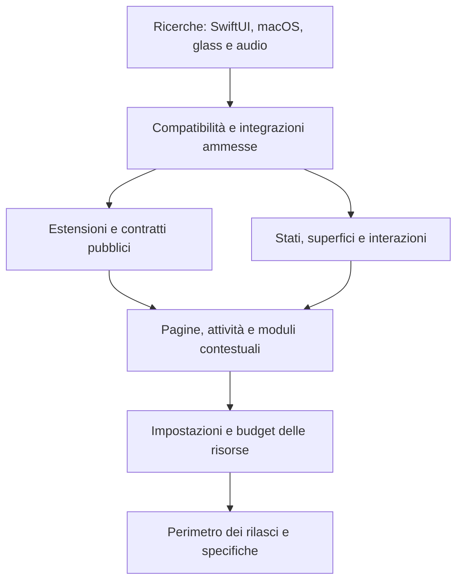

# Piano globale di Cascade

La [mappa del prodotto modulare](../../.scratch/cascade-product/map.md) è il piano canonico. Segue wayfinder: chiarisce le decisioni prima di trasformarle in specifiche e attività di implementazione.

**Aggiornata al 23 settembre 2026:** 68 ticket, 52 risolti, 16 aperti non assegnati; attribuzione RAM al proprietario e profilo progressivo dei provider approvati; integrazione runtime verificata; drag/ricerca resta separata. Gli avanzamenti addon sono collegati dai ticket pertinenti; una decisione approvata non equivale a una prova di piattaforma conclusa.

Ultima prosecuzione: [ricerca launchd](research/2026-09-23-launchd-managed-lifetime.md) conclusa con verifica root; la pista non sblocca la garanzia di uscita. Nessun codice modificato; riavvio verificato della build invariata, quota77%.

Ultima tranche addon: [RAM dei provider](../superpowers/verification/2026-09-23-addon-provider-memory.md), revisioni PASS,1.222 test/115 suite, build firmata da500 input e avvio aggiornato verificato. Quota residua77%; seguito dipendente da prove native sospese, launcher bloccato.

[Collegare i messaggi asset al runtime e al client SDK](../../.scratch/cascade-product/issues/23-asset-message-integration.md) è completato: revisione indipendente PASS, **883 test / 83 suite**, build firmata e riavvio verificato. La [verifica della consegna](../superpowers/verification/2026-09-18-addon-asset-message-integration.md) conserva prove e limiti. La precedente pipeline pi/DeepSeek e l’arresto alla riserva35% sono storici; la prosecuzione usa esclusivamente Codex, con deroga alla riserva richiesta dall’utente.

La nuova richiesta di continuare fino al limite Codex estende il lavoro alle tranche residue del [piano addon](../superpowers/plans/2026-09-10-addon-runtime-completion.md). È completato [Generare un progetto addon SDK compilabile](../../.scratch/cascade-product/issues/24-sdk-source-scaffold.md): [896 test / 84 suite, revisione PASS e consegna firmata](../superpowers/verification/2026-09-18-addon-sdk-scaffold.md). È completato [Osservare le risorse di un processo senza abilitare il launcher](../../.scratch/cascade-product/issues/25-process-resource-observations.md): [929 test / 85 suite, revisione PASS e consegna firmata](../superpowers/verification/2026-09-18-addon-process-metrics.md). È completato [Creare l’esempio Focus con il solo SDK pubblico](../../.scratch/cascade-product/issues/26-standalone-focus-source.md): [37 test, build indipendente e revisione PASS](../superpowers/verification/2026-09-18-standalone-focus-source.md). È completato anche [Mostrare il consumo di un servizio tramite SDK pubblico](../../.scratch/cascade-product/issues/27-service-consumer-source.md): [16 test, build indipendente e revisione PASS](../superpowers/verification/2026-09-18-service-consumer-source.md). È completato anche [Collegare il client storage SDK al percorso a messaggi](../../.scratch/cascade-product/issues/28-storage-message-client.md). L’analisi del requisito sui processi gestiti non ha prodotto una soluzione qualificata: nessuna prova nativa o nuova eccezione viene dichiarata approvata.

Sono implementati contratti/SDK di base, runtime e servizi interni, quote e immagini condivise, storage SwiftData, salvataggio/ripristino e percorsi interni a messaggi per storage e asset. Restano launcher/trasporto nativi, collegamento al ciclo e alla presentazione dell’app, migrazione dei widget, completamento degli esempi e della parità SDK e installazione/distribuzione con addon reali. I test del package non chiudono questi requisiti.

Wayfinder è l'indice delle **decisioni**. Il knowledge graph dei simboli è un servizio distinto: la consultazione del 14 settembre ha restituito `project not found or not indexed` per Cascade. Questo aggiornamento non esegue indicizzazione del codice.

- [Frontiera delle decisioni](frontier.md): punto di ingresso alle questioni disponibili e a quelle bloccate.
- [Verifica del riallineamento](context/2026-09-14-map-sync.md): controlli della mappa e impedimento al riavvio odierno.
- [Base del progetto](context/project-baseline.md): requisiti ricevuti e stato verificato del codice.
- [Vocabolario di prodotto](../../CONTEXT.md): termini usati nei ticket.
- [Convenzioni del tracker](../agents/issue-tracker.md): claim, dipendenze e risoluzioni.

Le ricerche sono disponibili separatamente: [estensioni SwiftUI](research/swiftui-extensions.md), [integrazioni macOS](research/macos-integrations.md), [Sapphire e FineTune](research/sapphire-finetune.md). Sono letture di documentazione e sorgenti, non prove runtime.

## Percorso della pianificazione

1. Accertare fattibilità di estensioni SwiftUI, integrazioni macOS, glass e audio.
2. Concordare compatibilità e formato delle estensioni; definire contratti e superfici.
3. Definire griglia, attività simultanee, contesto e comportamento dei moduli richiesti.
4. Concordare impostazioni, input, display, budget e recupero dai guasti.
5. Ordinare i rilasci e consegnare i requisiti alle specifiche dei sottosistemi.

Questa sequenza esprime dipendenze decisionali, non una stima temporale. Per il sottosistema addon l'ordine operativo è ora nel piano esecutivo collegato sopra. I ticket aperti riportano le decisioni approvate e restano aperti dove mancano altre scelte o prove; i risultati delle ricerche non sostituiscono le preferenze dell'utente.

Il diagramma è una sintesi; le dipendenze complete sono nei metadati dei ticket.

## Aree dell'app da specificare

La tabella orienta la lettura dei ticket; i confini definitivi sono da concordare nelle decisioni collegate.

| Area | Responsabilità da chiarire | Ticket |
| --- | --- | --- |
| Motore del notch | Geometria, hover e feedback aptico, nero/glass, transizioni, input e focus. Evoluzione di CascadeKit. | [Superfici](../../.scratch/cascade-product/issues/07-notch-surfaces.md), [Display e input](../../.scratch/cascade-product/issues/14-displays-input.md) |
| Estensioni e SDK | Discovery, UI SwiftUI, installazione, identità, compatibilità, azioni e lifecycle. | [Installazione e isolamento](../../.scratch/cascade-product/issues/05-extension-distribution.md), [Contratti pubblici](../../.scratch/cascade-product/issues/06-public-contract.md) |
| Attività e contesto | Attività compatte e simultanee, notifiche, priorità e selezione della superficie pertinente. | [Priorità e contesto](../../.scratch/cascade-product/issues/08-context-arbitration.md) |
| Composizione | Pagine, griglia, dimensioni dei widget, riordino e persistenza. | [Griglia e pagine](../../.scratch/cascade-product/issues/09-grid-pages.md) |
| Moduli iniziali | Media, notifiche delle altre app, Bluetooth, ripiano file, Spotlight e gestione audio. | [Media e attività](../../.scratch/cascade-product/issues/18-media-live-activities.md), [Notifiche](../../.scratch/cascade-product/issues/11-notification-experience.md), [Ripiano](../../.scratch/cascade-product/issues/10-file-shelf.md), [Spotlight](../../.scratch/cascade-product/issues/12-spotlight-experience.md), [Audio](../../.scratch/cascade-product/issues/13-audio-experience.md) |
| Preferenze | Aspetto e dimensioni per display, attività e schermate contestuali, integrazioni e accessibilità. | [Impostazioni](../../.scratch/cascade-product/issues/15-settings-experience.md) |
| Qualità e distribuzione | Misure di risorse e latenza, recupero dai guasti, compatibilità macOS, release e Homebrew. | [Budget](../../.scratch/cascade-product/issues/16-resource-contract.md), [Compatibilità](../../.scratch/cascade-product/issues/04-platform-policy.md), [Rilasci](../../.scratch/cascade-product/issues/17-delivery-roadmap.md) |

L'architettura addon separa la vista nascosta dal servizio ancora necessario: pubblicazioni, lavoro e scene hanno durate distinte e concessioni revocabili. P2 e P3 ne verificano gli effetti reali, compresa la sorgente che segnala eventi senza widget espanso. Le specifiche di nuove funzioni, come l'audio instradato, devono usare questo modello senza considerarsi già implementate.

## Fonti delle skill

Wayfinder è installata in `/Users/c4v4h/.codex/skills/wayfinder/SKILL.md`. Le sue skill complementari non erano installate: sono state lette dalla fonte originale, senza installare o modificare plugin globali:

- [grilling](https://github.com/mattpocock/skills/blob/main/skills/productivity/grilling/SKILL.md)
- [domain-modeling](https://github.com/mattpocock/skills/blob/main/skills/engineering/domain-modeling/SKILL.md)
- [research](https://github.com/mattpocock/skills/blob/main/skills/engineering/research/SKILL.md)
- [tracker local-markdown](https://github.com/mattpocock/skills/blob/main/skills/engineering/setup-matt-pocock-skills/issue-tracker-local.md)

Prima dei ticket di prototipo sarà necessario leggere anche la skill prototype dalla stessa raccolta; non è stata usata in questa sessione.

È completato [Gestire il ciclo SDK delle invocazioni ai servizi](../../.scratch/cascade-product/issues/29-service-invocation-lifecycle.md), senza introdurre contratti di trasporto o sottoscrizione non definiti.

È completato [Definire e implementare i messaggi dedicati alle invocazioni dei servizi](../../.scratch/cascade-product/issues/30-service-invocation-frames.md); la negoziazione del runtime resta invariata.

È completato [Collegare le invocazioni dei servizi al runtime e allo scambio SDK](../../.scratch/cascade-product/issues/31-service-invocation-host.md), con compatibilità legacy e attivazione solo del percorso interno completo.

È completato [Verificare indipendentemente le unità delle metriche CPU](../../.scratch/cascade-product/issues/32-process-cpu-calibration.md), diagnostica sul solo processo della prova e senza controllo nativo degli addon.

[Contratti di sottoscrizione](../../.scratch/cascade-product/issues/33-service-subscription-frames.md): revisione PASS, integrazione e consegna completate; 1048 test / 94 suite.

È completato [Completare client servizi, sottoscrizioni e aggiornamenti](../../.scratch/cascade-product/issues/34-service-subscriptions-host-sdk.md):1084 test/96 suite, revisione finale, Release e consegna firmata con riavvio verificato. Protocollo1.4 condizionato all’assembly completo; gate nativi aperti.

In parallelo: [Verificare i confini pubblici dell’SDK e degli esempi](../../.scratch/cascade-product/issues/35-sdk-boundary-check.md), controllo sorgente consegnato e revisionato. Il successivo [controllo obbligatorio nella build](../../.scratch/cascade-product/issues/37-required-sdk-build-check.md) è consegnato: quattro fixture e revisione PASS, controllo positivo prima della build firmata reale.

[Modello offline del bootstrap](../../.scratch/cascade-product/issues/39-bootstrap-abort-offline.md): completato con31 test, replay root e revisione PASS. Il gate nativo resta invariato; nessuna osservazione sintetica vale come prova fisica.

Ripresa del19settembre con Ponytail e tetto20% settimanale Codex: [bootstrap C](../../.scratch/cascade-product/issues/40-bootstrap-abort-c.md) consegnato come candidato compilato e testato nella logica, con revisione root; esperimento nativo separato.

[Contatore del prototipo RemoteUI](../../.scratch/cascade-product/issues/41-remote-scene-counter.md): incremento sorgente completato il20settembre, check locale e build firmata separata; interazione nativa e launcher non qualificati.

Completati nello stesso ciclo i due incrementi di callback: [provider](../../.scratch/cascade-product/issues/42-counter-provider-lifecycle.md) e [host](../../.scratch/cascade-product/issues/43-counter-host-lifecycle.md), con regressioni riprodotte, tre check e build firmata separata. La policy sulle nuove integrazioni è risolta: API pubbliche predefinite ed eccezioni private decise singolarmente.

[StandaloneClock sorgente](../../.scratch/cascade-product/issues/44-standalone-clock-source.md): build indipendente,3 test Swift,21 test checker e5 fixture build PASS, revisione root e riavvio verificati. Non chiude C6. Le [decisioni sulle superfici](context/2026-09-20-notch-surfaces-checkpoint.md) sono concluse: campo Spotlight originale e dimensioni native approvati, con verifica locale di focus, calcolo e ripristino. Il seguito riguarda le priorità tra drag e ricerca; la qualifica generale resta distinta.

[Campionatore addon interno](../../.scratch/cascade-product/issues/45-process-metrics-coordinator.md):47 test metriche,1.098 test package/97 suite, revisioni e build firmata con riavvio PASS. La successiva [scelta sul burst CPU](../../.scratch/cascade-product/issues/46-addon-cpu-burst-policy.md) approva il credito condiviso 100 ms con ricarica 5 ms/s.

[Credito CPU condiviso e osservazioni comuni](../superpowers/verification/2026-09-20-addon-cpu-credit.md): implementazione Terra/Sol medium, revisioni root e indipendenti PASS, 71 test mirati e 1.122 test completi in 99 suite. Build ufficiale firmata e riavvio PID 25071 verificati. Quella tranche si è fermata alla [definizione delle violazioni CPU distinte](../../.scratch/cascade-product/issues/49-addon-cpu-violation-counting.md), con budget residuo 92%; launcher bloccato invariato.

[Violazioni CPU e salute del runtime](../superpowers/verification/2026-09-21-addon-cpu-violations.md), 21 settembre: decisione sul conteggio approvata e due ticket implementati da Terra/Sol medium, con revisioni root e indipendenti PASS. 100 test mirati, 1.135 test completi/101 suite, build firmata e riavvio PID 32112 verificati. Quella tranche si era fermata a [la riduzione dei nuovi lavori](../../.scratch/cascade-product/issues/52-addon-cpu-reduced-admission.md); residuo 90%, launcher bloccato e sanzioni non ancora attivate.

[Ammissione CPU e scadenze comuni](../superpowers/verification/2026-09-21-addon-cpu-admission.md): due ticket implementati con Sol/Terra medium e revisioni root/indipendenti PASS.1.153 test/104 suite, build ufficiale firmata da487 input verificati e avvio stabile PID42941; Cascade era già chiusa prima dell’avvio. Residuo settimanale87%. Prossima scelta: [attribuzione CPU dei servizi ai consumatori](../../.scratch/cascade-product/issues/55-addon-delegated-cpu-attribution.md). Launcher bloccato.

[Contabilità CPU delegata](../superpowers/verification/2026-09-22-addon-delegated-cpu.md): formula conservativa approvata e coordinatore implementato daSol medium, revisioni root/Sol indipendente PASS.126 test mirati,1.161 test completi/105 suite, build ufficiale firmata da488 input verificati e riavvio PID46952. Budget residuo86%. Il collegamento al broker attende [la scelta sulle catene di servizi](../../.scratch/cascade-product/issues/57-addon-transitive-cpu-attribution.md); launcher bloccato.
