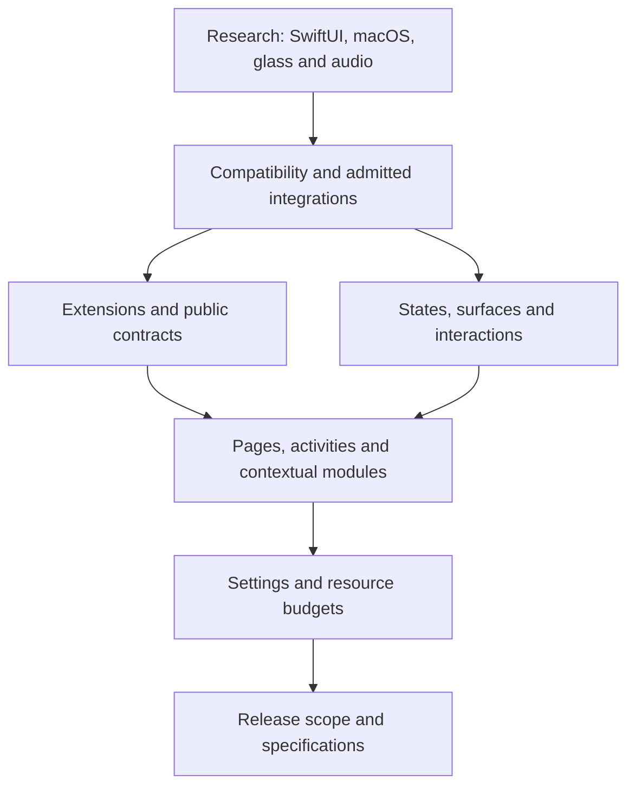

# Cascade global plan

> **Superseded record.** The [plugin engine spec](../superpowers/specs/2026-09-29-plugin-engine-design.md) of 29 September 2026 supersedes the addon platform this plan tracks and raised the deployment floor to macOS 15; the addon runtime, its SDK, `cascade-addon` and `CascadePresentation` were deleted on 2 October 2026. Every page in this folder, `context/` and `research/` included, is a dated record and is not kept current.

The [modular product map](../../.scratch/cascade-product/map.md) is the canonical plan. It follows wayfinder: it clarifies decisions before turning them into specifications and implementation tasks.

**Updated as of 23 September 2026:** 68 tickets, 52 resolved, 16 open and unassigned; RAM attribution to the owner and the progressive provider profile approved; runtime integration verified; drag/search stays separate. Addon progress is linked from the relevant tickets; an approved decision is not the same as a completed platform proof.

Latest continuation: [launchd research](research/2026-09-23-launchd-managed-lifetime.md) concluded with root verification; the lead does not unlock the exit guarantee. No code changed; verified relaunch of the unchanged build, quota 77%.

Latest addon tranche: [provider RAM](../superpowers/verification/2026-09-23-addon-provider-memory.md), reviews PASS, 1,222 tests/115 suites, signed build from 500 inputs and updated launch verified. Remaining quota 77%; follow-up depends on suspended native proofs, launcher blocked.

[Connect asset messages to the runtime and the SDK client](../../.scratch/cascade-product/issues/23-asset-message-integration.md) is complete: independent review PASS, **883 tests / 83 suites**, signed build and verified relaunch. The [delivery verification](../superpowers/verification/2026-09-18-addon-asset-message-integration.md) keeps the evidence and the limits. The earlier pi/DeepSeek pipeline and the stop at the 35% reserve are historical; the continuation uses Codex exclusively, with a waiver of the reserve requested by the user.

The new request to continue up to the Codex limit extends the work to the remaining tranches of the [addon plan](../superpowers/plans/2026-09-10-addon-runtime-completion.md). [Generate a compilable addon SDK project](../../.scratch/cascade-product/issues/24-sdk-source-scaffold.md) is complete: [896 tests / 84 suites, review PASS and signed delivery](../superpowers/verification/2026-09-18-addon-sdk-scaffold.md). [Observe a process's resources without enabling the launcher](../../.scratch/cascade-product/issues/25-process-resource-observations.md) is complete: [929 tests / 85 suites, review PASS and signed delivery](../superpowers/verification/2026-09-18-addon-process-metrics.md). [Create the Focus example with the public SDK only](../../.scratch/cascade-product/issues/26-standalone-focus-source.md) is complete: [37 tests, independent build and review PASS](../superpowers/verification/2026-09-18-standalone-focus-source.md). [Show the consumption of a service through the public SDK](../../.scratch/cascade-product/issues/27-service-consumer-source.md) is also complete: [16 tests, independent build and review PASS](../superpowers/verification/2026-09-18-service-consumer-source.md). [Connect the SDK storage client to the message path](../../.scratch/cascade-product/issues/28-storage-message-client.md) is also complete. The analysis of the managed-process requirement did not produce a qualified solution: no native proof or new exception is declared approved.

Base contracts/SDK, runtime and internal services, quotas and shared images, SwiftData storage, save/restore and internal message paths for storage and assets are implemented. Still remaining: native launcher/transport, connection to the app's lifecycle and presentation, widget migration, completion of the examples and of SDK parity, and installation/distribution with real addons. The package tests do not close these requirements.

Wayfinder is the index of **decisions**. The symbol knowledge graph is a separate service: the query of 14 September returned `project not found or not indexed` for Cascade. This update does not index the code.

- [Decision frontier](frontier.md): entry point to the available questions and to the blocked ones.
- [Realignment check](context/2026-09-14-map-sync.md): map checks and the obstacle to today's relaunch.
- [Project baseline](context/project-baseline.md): requirements received and verified state of the code.
- [Product vocabulary](../../CONTEXT.md): terms used in the tickets.
- [Tracker conventions](../agents/issue-tracker.md): claims, dependencies and resolutions.

The research notes are available separately: [SwiftUI extensions](research/swiftui-extensions.md), [macOS integrations](research/macos-integrations.md), [Sapphire and FineTune](research/sapphire-finetune.md). They are readings of documentation and sources, not runtime proofs.

## Planning path

1. Establish the feasibility of SwiftUI extensions, macOS integrations, glass and audio.
2. Agree on compatibility and the extension format; define contracts and surfaces.
3. Define the grid, simultaneous activities, context and the behavior of the requested modules.
4. Agree on settings, input, displays, budgets and failure recovery.
5. Order the releases and hand the requirements over to the subsystem specifications.

This sequence expresses decision dependencies, not a time estimate. For the addon subsystem the operational order is now in the execution plan linked above. The open tickets record the approved decisions and stay open where other choices or proofs are missing; the research results do not replace the user's preferences.

The diagram is a summary; the complete dependencies are in the ticket metadata.

## App areas to specify

The table guides the reading of the tickets; the final boundaries are to be agreed in the linked decisions.

| Area | Responsibilities to clarify | Tickets |
| --- | --- | --- |
| Notch engine | Geometry, hover and haptic feedback, black/glass, transitions, input and focus. Evolution of CascadeKit. | [Surfaces](../../.scratch/cascade-product/issues/07-notch-surfaces.md), [Displays and input](../../.scratch/cascade-product/issues/14-displays-input.md) |
| Extensions and SDK | Discovery, SwiftUI UI, installation, identity, compatibility, actions and lifecycle. | [Installation and isolation](../../.scratch/cascade-product/issues/05-extension-distribution.md), [Public contracts](../../.scratch/cascade-product/issues/06-public-contract.md) |
| Activities and context | Compact and simultaneous activities, notifications, priorities and selection of the relevant surface. | [Priorities and context](../../.scratch/cascade-product/issues/08-context-arbitration.md) |
| Composition | Pages, grid, widget sizes, reordering and persistence. | [Grid and pages](../../.scratch/cascade-product/issues/09-grid-pages.md) |
| Initial modules | Media, notifications from other apps, Bluetooth, file shelf, Spotlight and audio management. | [Media and activities](../../.scratch/cascade-product/issues/18-media-live-activities.md), [Notifications](../../.scratch/cascade-product/issues/11-notification-experience.md), [Shelf](../../.scratch/cascade-product/issues/10-file-shelf.md), [Spotlight](../../.scratch/cascade-product/issues/12-spotlight-experience.md), [Audio](../../.scratch/cascade-product/issues/13-audio-experience.md) |
| Preferences | Appearance and sizes per display, activities and contextual screens, integrations and accessibility. | [Settings](../../.scratch/cascade-product/issues/15-settings-experience.md) |
| Quality and distribution | Resource and latency measurements, failure recovery, macOS compatibility, releases and Homebrew. | [Budget](../../.scratch/cascade-product/issues/16-resource-contract.md), [Compatibility](../../.scratch/cascade-product/issues/04-platform-policy.md), [Releases](../../.scratch/cascade-product/issues/17-delivery-roadmap.md) |

The addon architecture separates the hidden view from the service that is still needed: publications, work and scenes have distinct lifetimes and revocable grants. P2 and P3 verify their real effects, including the source that signals events without an expanded widget. Specifications of new features, such as routed audio, must use this model without considering themselves already implemented.

## Skill sources

Wayfinder is installed at `/Users/c4v4h/.codex/skills/wayfinder/SKILL.md`. Its companion skills were not installed: they were read from the original source, without installing or modifying global plugins:

- [grilling](https://github.com/mattpocock/skills/blob/main/skills/productivity/grilling/SKILL.md)
- [domain-modeling](https://github.com/mattpocock/skills/blob/main/skills/engineering/domain-modeling/SKILL.md)
- [research](https://github.com/mattpocock/skills/blob/main/skills/engineering/research/SKILL.md)
- [local-markdown tracker](https://github.com/mattpocock/skills/blob/main/skills/engineering/setup-matt-pocock-skills/issue-tracker-local.md)

Before the prototype tickets, the prototype skill from the same collection will also have to be read; it was not used in this session.

[Manage the SDK lifecycle of service invocations](../../.scratch/cascade-product/issues/29-service-invocation-lifecycle.md) is complete, without introducing undefined transport or subscription contracts.

[Define and implement the messages dedicated to service invocations](../../.scratch/cascade-product/issues/30-service-invocation-frames.md) is complete; the runtime negotiation stays unchanged.

[Connect service invocations to the runtime and to the SDK exchange](../../.scratch/cascade-product/issues/31-service-invocation-host.md) is complete, with legacy compatibility and activation of the complete internal path only.

[Independently verify the units of the CPU metrics](../../.scratch/cascade-product/issues/32-process-cpu-calibration.md) is complete, with diagnostics on the test's own process only and without native control of the addons.

[Subscription contracts](../../.scratch/cascade-product/issues/33-service-subscription-frames.md): review PASS, integration and delivery completed; 1048 tests / 94 suites.

[Complete the service client, subscriptions and updates](../../.scratch/cascade-product/issues/34-service-subscriptions-host-sdk.md) is complete: 1084 tests/96 suites, final review, Release and signed delivery with verified relaunch. Protocol 1.4 conditional on the complete assembly; native gates open.

In parallel: [Verify the public boundaries of the SDK and of the examples](../../.scratch/cascade-product/issues/35-sdk-boundary-check.md), source check delivered and reviewed. The subsequent [mandatory check in the build](../../.scratch/cascade-product/issues/37-required-sdk-build-check.md) is delivered: four fixtures and review PASS, positive check before the real signed build.

[Offline bootstrap model](../../.scratch/cascade-product/issues/39-bootstrap-abort-offline.md): completed with 31 tests, root replay and review PASS. The native gate stays unchanged; no synthetic observation counts as physical proof.

Resumption of 19 September with Ponytail and a 20% weekly Codex ceiling: [C bootstrap](../../.scratch/cascade-product/issues/40-bootstrap-abort-c.md) delivered as a candidate compiled and tested in its logic, with root review; native experiment separate.

[RemoteUI prototype counter](../../.scratch/cascade-product/issues/41-remote-scene-counter.md): source increment completed on 20 September, local check and separate signed build; native interaction and launcher not qualified.

The two callback increments were completed in the same cycle: [provider](../../.scratch/cascade-product/issues/42-counter-provider-lifecycle.md) and [host](../../.scratch/cascade-product/issues/43-counter-host-lifecycle.md), with reproduced regressions, three checks and a separate signed build. The policy on new integrations is resolved: public APIs by default and private exceptions decided one by one.

[StandaloneClock source](../../.scratch/cascade-product/issues/44-standalone-clock-source.md): independent build, 3 Swift tests, 21 checker tests and 5 build fixtures PASS, root review and relaunch verified. It does not close C6. The [surface decisions](context/2026-09-20-notch-surfaces-checkpoint.md) are concluded: original Spotlight field and native sizes approved, with local verification of focus, calculation and restore. The follow-up concerns the priorities between drag and search; the general qualification stays separate.

[Internal addon sampler](../../.scratch/cascade-product/issues/45-process-metrics-coordinator.md): 47 metrics tests, 1,098 package tests/97 suites, reviews and signed build with relaunch PASS. The subsequent [choice on the CPU burst](../../.scratch/cascade-product/issues/46-addon-cpu-burst-policy.md) approves the shared 100 ms credit with a 5 ms/s refill.

[Shared CPU credit and common observations](../superpowers/verification/2026-09-20-addon-cpu-credit.md): Terra/Sol medium implementation, root and independent reviews PASS, 71 focused tests and 1,122 full tests in 99 suites. Official signed build and relaunch PID 25071 verified. That tranche stopped at the [definition of distinct CPU violations](../../.scratch/cascade-product/issues/49-addon-cpu-violation-counting.md), with 92% remaining budget; launcher blocked, unchanged.

[CPU violations and runtime health](../superpowers/verification/2026-09-21-addon-cpu-violations.md), 21 September: decision on the counting approved and two tickets implemented by Terra/Sol medium, with root and independent reviews PASS. 100 focused tests, 1,135 full tests/101 suites, signed build and relaunch PID 32112 verified. That tranche had stopped at [the reduction of new work](../../.scratch/cascade-product/issues/52-addon-cpu-reduced-admission.md); 90% remaining, launcher blocked and sanctions not yet activated.

[CPU admission and common deadlines](../superpowers/verification/2026-09-21-addon-cpu-admission.md): two tickets implemented with Sol/Terra medium and root/independent reviews PASS. 1,153 tests/104 suites, official signed build from 487 verified inputs and stable launch PID 42941; Cascade was already closed before the launch. Weekly remainder 87%. Next choice: [CPU attribution of services to consumers](../../.scratch/cascade-product/issues/55-addon-delegated-cpu-attribution.md). Launcher blocked.

[Delegated CPU accounting](../superpowers/verification/2026-09-22-addon-delegated-cpu.md): conservative formula approved and coordinator implemented by Sol medium, root and independent Sol reviews PASS. 126 focused tests, 1,161 full tests/105 suites, official signed build from 488 verified inputs and relaunch PID 46952. Remaining budget 86%. The connection to the broker waits on [the choice on service chains](../../.scratch/cascade-product/issues/57-addon-transitive-cpu-attribution.md); launcher blocked.
